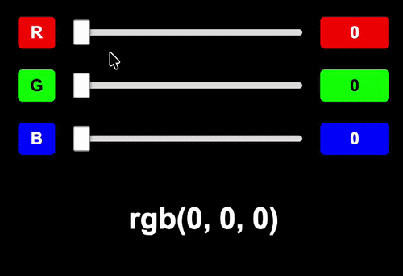

## Mostrar uma imagem

A imagem que vais enviar será composta por 64 quadrados coloridos chamados **pixels**. Os pixeis estão dispostos numa grelha de 8 x 8. Cada pixel pode ter uma cor diferente. Ao escolher cuidadosamente as cores, é possível criar uma imagem. Eis um exemplo de uma baleia criada com diferentes tons de azul sobre um fundo preto.

<p style="border-left: solid; border-width:10px; border-color: #0faeb0; background-color: aliceblue; padding: 10px;">
Uma <span style="color: #0faeb0">**matriz LED**</span> é uma grelha de LEDs que podem ser controlados individualmente ou como um grupo para criar diferentes efeitos de iluminação. A matriz LED do Sense HAT possui 64 LEDs dispostos numa grelha de 8 x 8. Os LEDs podem ser programados para produzir uma ampla gama de cores.
</p>


Repara que cada quadrado está identificado com um código que representa uma cor específica. Nesta imagem são utilizadas 3 cores:
+ c = preto
+ f = Azul oceano
+ g = Azul céu


--- task ---

Abre o [Projeto Inicial Missão Zero](https://missions.astro-pi.org/pt/mz/code_submissions/){:target="_blank"}.

Irás ver que algumas linhas de código foram adicionadas para ti automaticamente.

Este código liga-se ao Astro Pi e garante que o ecrã LED do Astro Pi seja visto na orientação correta e configura o sensor de cor. Deixa o código lá, porque irás precisar.

--- code ---
---
language: python
filename: main.py
line_numbers: false
line_number_start: 1
line_highlights: 
---
# Importar as bibliotecas
from sense_hat import SenseHat
from time import sleep

# Configurar o Sense HAT
sense = SenseHat()
sense.set_rotation(270, False)

# Configurar o sensor de cor
sense.color.gain = 60 # Definir a sensibilidade do sensor
sense.color.integration_cycles = 64 # O intervalo em que a leitura será feita

--- /code ---


--- /task ---

### Cores RGB

As cores podem ser criadas com diferentes proporções de vermelho, verde e azul. Podes descobrir mais sobre as cores RGB aqui:



A matriz de LED é uma grelha de 8 x 8. Cada LED na grelha pode ser definido para uma cor diferente. Podemos utilizar as letras de A a Z, como nomes de variáveis, para representar 24 cores diferentes. Cada cor tem um valor para o vermelho, o verde e o azul.

--- collapse ---

---
title: Lista de Variáveis de Cores
---


```python
a = (255, 255, 255) # Branco
b = (171, 171, 171) # Cinzento
c = (0, 0, 0) # Preto
d = (25, 25, 113) # Azul Marinho
e = (0, 0, 255) # Azul Puro
f = (36, 128, 200) # Azul Oceano
g = (0, 204, 255) # Azul Céu
h = (86, 255, 255) # Ciano Elétrico
j = (0, 255, 0) # Verde Puro
k = (46, 139, 33) # Verde Folha
l = (57, 97, 17) # Verde Azeitona
m = (30, 65, 6) # Verde Floresta
n = (126, 88, 25) # Castanho Terra
o = (179, 96, 65) # Castanho Terracota
p = (180, 34, 34) # Vermelho Tijolo
q = (255, 0, 0) # Vermelho Puro
r = (232, 118, 5) # Laranja
s = (241, 231, 100) # Amarelo Pálido
t = (255, 255, 0) # Amarelo Puro
u = (255, 209, 209) # Rosa Pálido
v = (255, 177, 177) # Rosa Blush
w = (249, 169, 255) # Rosa Claro
y = (248, 97, 255) # Magenta
z = (220, 53, 232) # Roxo

```

--- /collapse ---

### Escolhe uma imagem

--- task ---

**Escolhe:** Das opções abaixo, escolhe uma imagem para exibir. O Python armazena as informações de uma imagem numa lista. O código para cada imagem inclui as variáveis de cor usadas e a lista.

Tu irás precisar de **copiar** todo o código da imagem escolhida e **colá-lo** no teu projeto abaixo da linha que diz `# Adicionar variáveis de cor e imagem`.

--- collapse ---

---
title: Baleia
---


Criado pela Equipa Naicom, Itália

```python
c = (0, 0, 0)       # Preto
f = (36, 128, 200)  # Azul Oceano
g = (0, 204, 255)   # Azul Céu

imagem = [
c, g, c, g, c, c, c, c,
c, c, g, c, c, f, f, f,
c, f, f, f, c, c, f, a,
f, f, c, f, f, c, f, c,
f, f, f, f, f, c, f, c,
g, f, f, f, f, f, f, c,
g, g, g, g, g, g, c, c,
c, g, g, g, g, c, c, c]

```

--- /collapse ---


--- collapse ---

---
title: Limão
---


Criado pela equipa g4lemoni, Grécia

```python
c = (0, 0, 0)       # Preto
k = (46, 139, 33)   # Verde Folha
t = (255, 255, 0)   # Amarelo Puro

imagem = [
c, c, c, k, k, c, c, c,
c, c, k, c, k, c, c, c,
c, k, c, t, t, c, c, c,
c, c, t, t, t, t, c, c,
c, c, t, t, t, t, c, c,
c, c, t, t, t, t, c, c,
c, c, t, t, t, t, c, c,
c, c, c, t, t, c, c, c]

```

--- /collapse ---

--- collapse ---
---
title: Porco
---


Criado por Gary, Reino Unido

```python
a = (255, 255, 255) # Branco
v = (255, 177, 177) # Rosa Blush
y = (248, 97, 255)  # Magenta
o = (179, 96, 65)   # Castanho Terracota
c = (0, 0, 0)       # Preto

imagem = [
a, a, y, a, a, y, a, a,
a, y, y, y, y, y, y, a,
a, y, c, y, c, y, y, y,
v, v, v, v, v, y, y, y,
v, o, v, o, v, y, y, y,
v, v, v, v, v, y, y, y,
a, y, y, y, y, y, y, y,
a, a, y, a, a, a, y, a]

```

--- /collapse ---


--- collapse ---
---
title: Tempestade
---


Criado por equipa hop2p023, Espanha

```python

c = (0, 0, 0)       # Preto
f = (36, 128, 200)  # Azul Oceano
g = (0, 204, 255)   # Azul Céu
t = (255, 255, 0)   # Amarelo Puro

imagem = [
c, c, c, c, c, c, c, c,
c, c, f, f, f, f, c, c,
c, f, f, f, f, f, f, c,
c, g, c, g, t, g, c, c,
c, c, c, t, t, c, c, c,
c, c, t, t, c, c, c, c,
c, c, g, c, c, c, c, g,
c, g, c, c, c, c, c, c]


```

--- /collapse ---

--- collapse ---
---
title: Pato
---


Criado por Peter, Irlanda

```python

c = (0, 0, 0) # Preto
l = (57, 97, 17)    # Verde Azeitona
m = (30, 65, 6)     # Verde Floresta
r = (232, 118, 5)   # Laranja
a = (255, 255, 255) # Branco
b = (171, 171, 171) # Cinzento

imagem = [
c, l, l, c, c, c, c, c,
r, r, m, c, c, c, c, c,
c, l, l, c, c, c, c, c,
c, a, a, l, a, a, c, c,
c, l, l, a, a, a, b, a,
c, a, a, b, b, b, a, a,
c, c, a, a, a, a, c, c,
c, c, c, r, c, r, c, c]

```

--- /collapse ---

--- collapse ---
---
title: Sapo
---


Criado por equipa Jmeno, República Checa

```python

a = (255, 255, 255) # Branco
b = (171, 171, 171) # Cinzento
c = (0, 0, 0)       # Preto
q = (255, 0, 0)     # Vermelho Puro
j = (0, 255, 0)     # Verde Puro
k = (46, 139, 33)   # Verde Folha
n = (126, 88, 25)   # Castanho Terra

imagem = [
a, a, a, a, a, a, a, a,
a, a, a, a, a, b, a, b,
a, a, a, a, a, a, c, a,
a, a, c, a, c, a, q, a,
a, a, j, j, j, q, a, a,
a, j, j, k, q, a, a, a,
j, k, j, k, k, a, a, a,
k, k, k, j, k, n, n, n]

```

--- /collapse ---

--- collapse ---
---
title: Árvore em Flor
---


Criado por equipa Zssh14, Eslováquia

```python

t = (255, 255, 0)   # Amarelo Puro
g = (0, 204, 255)   # Azul Céu
w = (249, 169, 255) # Rosa Claro
y = (248, 97, 255)  # Magenta
z = (220, 53, 232)  # Roxo
n = (126, 88, 25)   # Castanho Terra
o = (179, 96, 65)   # Castanho Terracota
k = (46, 139, 33)   # Verde Folha

imagem =  [
t, g, g, w, w, y, g, g,
g, g, w, w, y, y, z, g,
g, w, y, z, y, z, z, z,
w, y, z, z, g, n, w, g,
g, g, o, o, n, w, y, z,
g, g, g, g, n, g, g, g,
g, g, g, o, n, n, g, g,
k, k, o, n, n, n, k, k]

```

--- /collapse ---

--- /task ---

--- task ---

**Encontra:** a linha que diz `# Mostrar a imagem` e adiciona uma linha de código para mostrar a tua imagem na matriz de LEDs:

--- code ---
---
language: python
filename: main.py
line_numbers: false
line_number_start: 1
line_highlights: 17, 18
---
c = (0, 0, 0)       # Preto
f = (36, 128, 200)  # Azul Oceano
g = (0, 204, 255)   # Azul Céu

imagem = [
c, g, c, g, c, c, c, c,
c, c, g, c, c, f, f, f,
c, f, f, f, c, c, f, a,
f, f, c, f, f, c, f, c,
f, f, f, f, f, c, f, c,
g, f, f, f, f, f, f, c,
g, g, g, g, g, g, c, c,
c, g, g, g, g, c, c, c]

# Mostrar a imagem
sense.set_pixels(imagem)

--- /code ---

--- /task ---

--- task ---

Pressiona **Executar** no fundo do editor, para veres a tua imagem exibida na matriz de LEDs.

--- /task ---

--- task ---

**Depurar**

O meu código tem um erro de sintaxe:

- Verifica se o teu código corresponde ao respetivo código nos exemplos acima
- Verifica se indentaste o código na tua lista
- Verifica se a tua lista está entre `[` e `]`
- Verifica se cada variável de cor na lista é separada por uma vírgula

A minha imagem não aparece:

- Verifica se o teu `sense.set_pixels(imagem)` não está indentado

--- /task ---


--- task --- 

**Guarda o teu progresso**

Agora que exibiste uma imagem, podes guardar o teu programa no projeto Inicio de Missão ao inserir o teu nome de equipa, os nomes dos elementos da equipa e o código de sala de aula que te foi dado. Podes recarregar o teu programa em qualquer dispositivo com conexão à Internet ao inserir o nome da tua equipa e o código de sala de aula.


--- /task --- 

