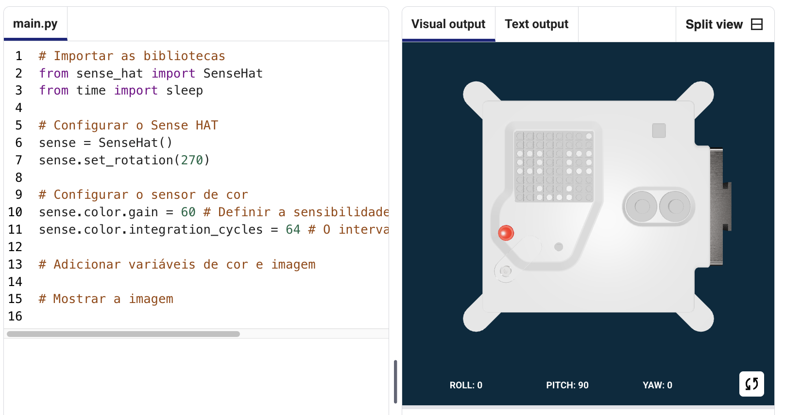

## Mostrar uma imagem

A matriz de LED do Astro Pi pode mostrar cores. Neste passo, irás mostrar imagens da natureza na matriz LED do Astro Pi.

<p style="border-left: solid; border-width:10px; border-color: #0faeb0; background-color: aliceblue; padding: 10px;">
Uma <span style="color: #0faeb0">**matriz LED**</span> é uma grelha de LEDs que podem ser controlados individualmente ou como um grupo para criar diferentes efeitos de iluminação. A matriz LED do Sense HAT possui 64 LEDs dispostos numa grelha de 8 x 8. Os LEDs podem ser programados para produzir uma ampla gama de cores.
</p>


--- task ---

Abre o [Projeto Inicial Missão Zero](https://missions.astro-pi.org/mz/code_submissions/){:target="_blank"}.

Irás ver que algumas linhas de código foram adicionadas para ti automaticamente.

Este código liga-se ao Astro Pi e garante que o ecrã LED do Astro Pi seja visto na orientação correta e configura o sensor de cor. Deixa o código lá, porque irás precisar.

--- code ---
---
language: python filename: main.py line_numbers: false line_number_start: 1
line_highlights:
---
# Importar as bibliotecas
from sense_hat import SenseHat from time import sleep

# Configurar o Sense HAT
sense = SenseHat() sense.set_rotation(270)

# Configurar o sensor de cor
sense.color.gain = 60 # Set the sensitivity of the sensor sense.color.integration_cycles = 64 # The interval at which the reading will be taken

--- /code ---



--- /task ---

### Cores RGB

As cores podem ser criadas usando diferentes proporções de vermelho, verde e azul. Podes descobrir mais sobre as cores RGB aqui:

[[[generic-theory-simple-colours]]]

A matriz de LED é uma grelha de 8 x 8. Cada LED na grelha pode ser definido para uma cor diferente. Aqui está uma lista de variáveis para 24 cores diferentes. Cada cor tem um valor para vermelho, verde e azul:

[[[ambient-colours]]]

### Escolhe uma imagem

--- task ---

**Escolhe:** Das opções abaixo, escolhe uma imagem para exibir. O Python armazena as informações de uma imagem numa lista. O código para cada imagem inclui as variáveis de cor usadas e a lista.

Tu irás precisar de **copiar** todo o código da imagem escolhida e **colá-lo** no teu projeto abaixo da linha que diz `# Adicionar variáveis de cor e imagem`.

--- collapse ---

---
title: Fish
---


Created by team chalka, Poland

```python
z = (153, 50, 204) # DarkOrchid
q = (255, 255, 0) # Yellow
d = (51, 153, 255) # blue
c = (0, 0, 0) # Black

image = [
d, d, z, d, d, d, d, d,
d, d, d, z, z, d, d, d,
z, d, q, q, q, q, d, d,
z, z, q, q, q, c, q, d,
z, z, z, q, q, q, q, d,
z, z, q, q, q, q, q, d,
z, d, q, z, z, q, d, d,
d, d, d, z, d, d, d, d]

```

--- /collapse ---


--- collapse ---

---
title: Walrus
---


Created by team Walrus, Finland

```python
h = (0, 255, 255) # Cyan
c = (0, 0, 0) # Black
s = (139, 69, 19) # SaddleBrown
a = (255, 255, 255) # White
r = (184, 134, 11) # DarkGoldenrod

image = [
h, h, h, h, h, h, h, h,
h, h, s, s, s, h, h, h,
h, s, s, s, s, s, h, h,
h, s, c, s, c, s, s, s,
h, r, r, r, r, r, s, s,
h, h, a, s, a, s, s, s,
h, h, a, s, a, s, s, s,
r, r, s, s, s, s, s, s]

```

--- /collapse ---

--- collapse ---
---
title: Paxi
---


Created by team tony_pi, Italy

```python
v = (255, 0, 0) # Red
m = (34, 139, 34) # ForestGreen
c = (0, 0, 0) # Black 
e = (100, 149, 237) # CornflowerBlue
l = (0, 255, 0) # Green

image = [
    c, v, m, c, c, m, v, c,
    c, c, v, v, v, v, c, c,
    c, v, c, e, l, e, v, c,
    c, v, c, l, l, l, v, c,
    c, v, c, l, c, l, v, c,
    c, c, v, v, v, v, c, c,
    c, c, l, c, c, l, c, c,
    c, m, m, c, c, m, m, c]

```

--- /collapse ---


--- collapse ---
---
title: Dog
---


Created by team ptpr_07, Spain

```python

c = (0, 0, 0) # Black
r = (184, 134, 11) # DarkGoldenrod
s = (139, 69, 19) # SaddleBrown
y = (255, 20, 147) # DeepPink

image = [
    c, r, r, c, c, r, r, c,
    c, r, s, s, s, s, r, c,
    c, r, c, s, s, c, r, c,
    c, s, s, s, s, s, s, c,
    c, s, s, s, s, s, s, c,
    c, s, s, c, c, s, s, c,
    c, c, s, y, y, s, c, c,
    c, c, c, y, y, c, c, c]


```

--- /collapse ---

--- collapse ---
---
title: Chameleon
---


Created by team The_ETs, United Kingdom

```python

c = (0, 0, 0) # Black
s = (139, 69, 19) # SaddleBrown
a = (255, 255, 255) # White
v = (255, 0, 0) # Red
t = (255, 140, 0) # DarkOrange
q = (255, 255, 0) # Yellow
m = (34, 139, 34) # ForestGreen
h = (0, 255, 255) # Cyan
z = (153, 50, 204) # DarkOrchid
y = (255, 20, 147) # DeepPink

image = [
    a, a, v, v, t, a, a, a,
    a, v, v, t, t, q, a, a,
    v, c, t, t, q, q, m, a,
    v, t, t, q, q, m, m, h,
    s, s, q, s, s, m, s, h,
    a, a, a, a, a, a, a, z,
    a, a, a, a, y, a, a, z,
    a, a, a, a, a, y, z, a]

```

--- /collapse ---

--- collapse ---
---
title: Kite
---


Created by team Val, Greece

```python

c = (0, 0, 0) # Black
m = (34, 139, 34) # ForestGreen
v = (255, 0, 0) # Red
q = (255, 255, 0) # Yellow
e = (0, 0, 205) # MediumBlue
h = (0, 255, 255) # Cyan

image = [
    h, h, h, h, h, h, h, h, 
    h, h, h, e, e, v, v, h, 
    h, h, h, e, e, v, v, h, 
    h, h, h, q, q, m, m, h, 
    h, h, h, q, q, m, m, h,
    h, h, c, h, h, h, h, h, 
    h, c, h, h, h, h, h, h, 
    c, h, h, h, h, h, h, h]

```

--- /collapse ---

--- collapse ---
---
title: Chicken
---


Created by team Slepicky, Czechia

```python

v = (255, 0, 0) # Red
c = (0, 0, 0) # Black
b = (105, 105, 105) # DimGray
q = (255, 255, 0) # Yellow
r = (184, 134, 11) # DarkGoldenrod

image =  [
    c, c, v, v, v, c, c, c,
    c, v, b, b, r, c, c, r,
    c, b, c, b, b, c, r, b,
    q, r, b, b, b, b, b, r,
    c, v, b, b, b, b, r, b,
    c, v, b, r, r, r, b, r,
    c, c, c, r, b, q, r, c,
    c, c, c, c, q, q, c, c]

```

--- /collapse ---

--- /task ---

--- task ---

**Encontra:** a linha que diz `# Mostrar a imagem` e adiciona uma linha de código para mostrar a tua imagem na matriz de LEDs:

--- code ---
---
language: python filename: main.py line_numbers: false line_number_start: 1
line_highlights: 18, 19
---
z = (153, 50, 204) # DarkOrchid q = (255, 255, 0) # Yellow d = (51, 153, 255) # blue c = (0, 0, 0) # Black

image = [ d, d, z, d, d, d, d, d, d, d, d, z, z, d, d, d, z, d, q, q, q, q, d, d, z, z, q, q, q, c, q, d, z, z, z, q, q, q, q, d, z, z, q, q, q, q, q, d, z, d, q, z, z, q, d, d, d, d, d, z, d, d, d, d]

# Mostrar a imagem
sense.set_pixels(image)

--- /code ---

--- /task ---

--- task ---

Pressiona **Executar** no fundo do editor, para veres a tua imagem exibida na matriz de LEDs.

--- /task ---

--- task ---

**Depurar**

O meu código tem um erro de sintaxe:

- Verifica se o teu código corresponde ao respetivo código nos exemplos acima
- Verifica se indentaste o código na tua lista
- Verifica se a tua lista está entre `[` e `]`
- Verifica se cada variável de cor na lista é separada por uma vírgula

A minha imagem não aparece:

- Verifica se o teu `sense.set_pixels(imagem)` não está indentado

--- /task ---


--- task ---

**Guarda o teu progresso**

Agora que exibiste uma imagem, podes guardar o teu programa no projeto Inicio de Missão ao inserir o teu nome de equipa, os nomes dos elementos da equipa e o código de sala de aula que te foi dado. Podes recarregar o teu programa em qualquer dispositivo com conexão à Internet ao inserir o nome da tua equipa e o código de sala de aula.


--- /task --- 
