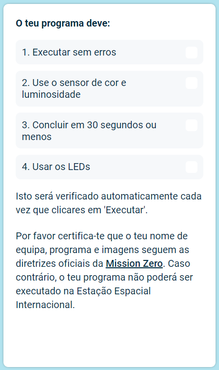
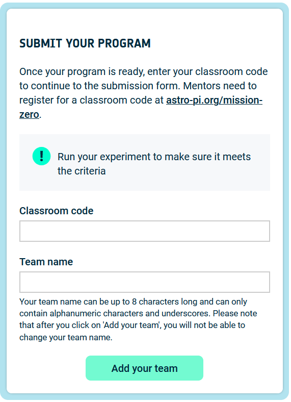

## Envia a tua participação

Podes entrar no desafio [Astro Pi Missão Zero](https://astro-pi.org/mission-zero){:target="_blank"}, usando o código que tu escreveste.

Existem algumas regras que o teu código precisa de seguir para que possas submetê-lo para ser executado na Estação Espacial Internacional. Se o teu código as seguir, as regras na parte inferior do **emulador Sense HAT** irão acender a verde quando executar o programa.

**Dica:** Testa o teu código com algumas configurações de cores diferentes (usando o seletor) para garantir que seja sempre executado corretamente.

Por favor, certifica-te de que a tua entrada segue as [diretrizes oficiais](https://astro-pi.org/mission-zero/guidelines){:target="_blank"} para a Missão Zero. Se não seguir as diretrizes, o teu programa não poderá ser executado na Estação Espacial Internacional.

Por favor não incluas nenhum dos seguintes no nome ou código da tua equipa:

+ Qualquer coisa que possa ser interpretada como sendo de natureza ilegal, política ou sensível
+ Bandeiras, pois podem ser consideradas politicamente sensíveis
+ Qualquer coisa que faça referência a desagradável ou dano para outra pessoa
+ Dados pessoais como números de telefone, redes sociais e endereços de e-mail
+ Imagens obscenas
+ Caracteres especiais ou emojis
+ Linguagem imprópria ou palavrões

--- task ---

Introduz o código da tua turma e nome da equipa no respetivo campo na parte inferior - o teu professor dir-te-á qual é o código.

**Notas para mentores** podem ser encontradas no passo [Introdução](https://projects.raspberrypi.org/en/projects/astro-pi-mission-zero/0).

--- /task ---

--- task ---

Pressiona o botão **Adicione a sua equipa** para inserir o teu código. Por favor, de notar que um programa não pode ser alterado assim que for enviado.

O teu mentor receberá um email para confirmar a inscrição.

--- /task ---

--- task ---

Se quiseres, podes partilhar o link para o teu código nas redes sociais para dizer às pessoas que o código que escreveste vai ser executado no espaço!

--- /task ---
