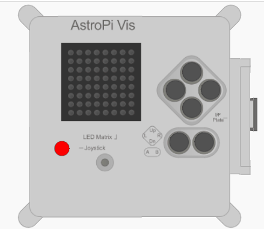

## Medir a temperatura

O sensor de temperatura no Astro Pi pode medir a temperatura do ar ao seu redor, uma funcionalidade útil para ajudar-te a recolher dados sobre as condições no espaço.



O Astro Pi mede a temperatura na Estação Espacial em graus Celsius (&deg;C). Visto que as temperaturas no espaço variam muito mais do que aquelas na terra, o Astro Pi pode medir temperaturas desde os -40 graus Celsius até aos +120 graus Celsius.

Parte da tua missão é contribuir para o dia-a-dia da tripulação a bordo da Estação Espacial, por isso informa-os que a temperatura a bordo da estação espacial está dentro da escala normal, isso irá tranquilizá-los.

--- collapse ---
---
title: Qual é a temperatura?
---
A temperatura é a medida do quão quente algo está. Talvez já tenhas tido a tua temperatura medida com um termómetro numa visita ao médico.

 *By Menchi [CC-BY-SA-3.0](http://creativecommons.org/licenses/by-sa/3.0/){:target="_blank"} via Wikimedia Commons*

Para ser mais exato, a temperatura é uma medida da quantidade de energia térmica de uma substância. Como sabes um cubo de gelo é sólido, mas à medida que aquece, isto é, ao absorver a energia do calor do seu meio ambiente, ele funde-se e torna-se líquido. Isso acontece quando uma substância absorve ou perde suficiente energia térmica, a substância muda de estado, por exemplo, ela passa de sólida a líquida.

--- /collapse ---

--- task ---

Adiciona este código para obter uma leitura da temperatura:

```python
temp = sense.get_temperature()
```

Este código vai medir a temperatura atual e armazenar o valor medido na variável `temp`.

--- /task ---

--- task ---

A temperatura é registada com bastante precisão, ou seja, o valor armazenado terá um grande número de casas decimais. Se quiseres podes arredondar o valor para qualquer número de casas decimais. No exemplo, arredondámos para uma casa decimal, mas para um nível diferente de precisão, altera o número `1` para o número de casas decimais que gostarias de ver.

```python
temp = round( sense.get_temperature(), 1 )
```

--- /task ---

--- task ---

Para visualizar a temperatura atual como uma mensagem no ecrã, adiciona este código:

```python
sense.show_message( str(temp) )
```

A parte `str()` converte a temperatura de um número para texto para que o Astro Pi possa exibi-lo.

--- /task ---

--- task ---

Também podes visualizar a temperatura como parte de outra mensagem unindo as partes da mensagem com o sinal `+`.

```python
sense.show_message( "It is " + str(temp) + " degrees" )
```

--- /task ---

O verdadeiro Astro Pi irá medir a temperatura ao seu redor, mas podes mover o controlo de deslize de temperatura no emulador Sense HAT para simular mudanças de temperatura e testar o teu código.


**Nota:** Deves estar curioso para saber por que é que o controlo de deslize de temperatura exibe a temperatura como um número inteiro, mas a leitura obtida é um decimal. O emulador simula a pequena imprecisão do sensor real, por isso, a medição da temperatura que vês pode ser muito maior ou menor do que o valor que definiste com o controle de deslize.