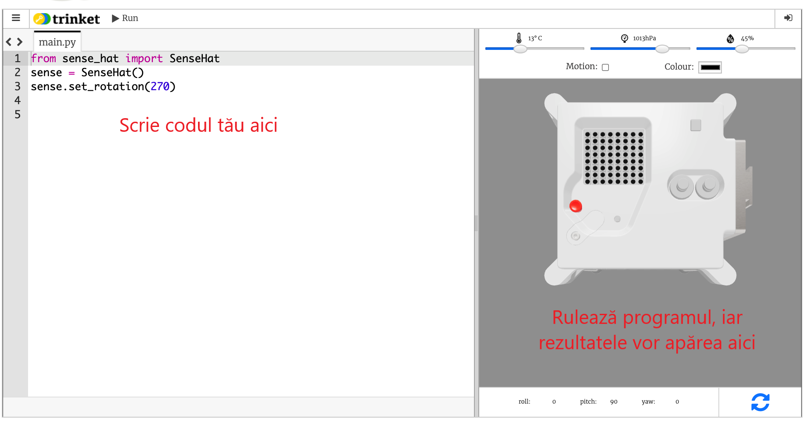

## Ce este Astro Pi?

Astro Pi este un calculator Raspberry Pi încapsulat într-o carcasă special concepută pentru condițiile din spațiu. De asemenea, are o placă de circuite adițională numită Sense HAT, creată special pentru misiunea Astro Pi. The Sense HAT has a joystick; an LED display; and sensors for recording the lighting conditions, temperature, humidity, pressure, colour, and orientation.

Iată o unitate originală Mark I Astro Pi de pe Stația Spațială Internațională care rulează programe scrise de elevi. Codul tău va rula în cele din urmă pe o nouă versiune de calculatoare Astro Pi!

<iframe width="560" height="315" src="https://www.youtube.com/embed/4ykbAJeGPMM" frameborder="0" allow="accelerometer; autoplay; encrypted-media; gyroscope; picture-in-picture" allowfullscreen></iframe>>

Pentru această misiune, vei folosi emulatorul Sense HAT. Emulatorul este o parte din software care simulează toate funcțiile Astro Pi în browserul tău web.
<mark>change screenshot of emulator</mark> 

There are a few differences between the real and the emulated Sense HAT:
<mark>CHeck this is still correct</mark>
- Pe emulator poți seta singur temperatura, presiunea și umiditatea folosind glisoare, în timp ce în realitate Sense HAT din Astro Pi utilizează senzori pentru a măsura acești parametri în mediul său.

- Poți folosi mouse-ul pentru a da click și a trage Sense HAT-ul emulat pentru a-l muta și roti, simulând schimbări în orientarea sa; adevăratul Astro Pi (și Sense HAT-ul său) se poate mișca în lumea reală, iar senzorii de orientare ai Sense HAT detectează când și cum s-a mutat.
