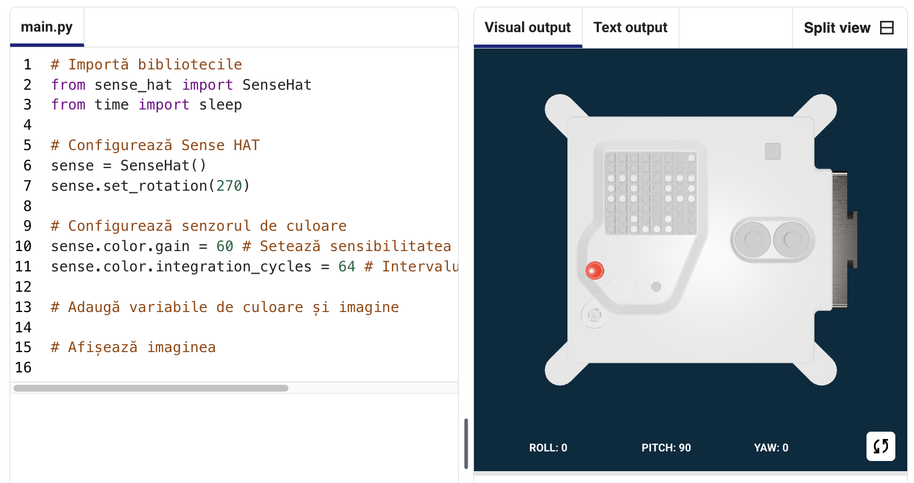
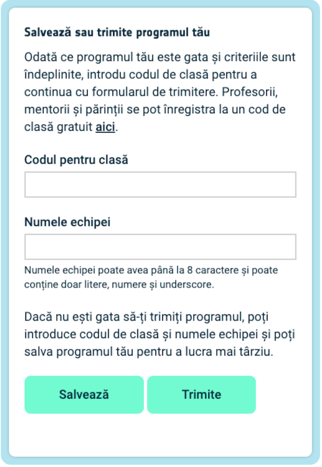

## Afișează o imagine

Matricea LED a Astro Pi poate afișa culori. În acest pas, vei afișa imagini din natură pe matricea LED a Astro Pi.

<p style="border-left: solid; border-width:10px; border-color: #0faeb0; background-color: aliceblue; padding: 10px;">
O <span style="color: #0faeb0">**matrice LED**</span> este o grilă de LED-uri care poate fi controlată individual sau de un grup pentru a crea diferite efecte de iluminat. Matricea LED de pe Sense HAT are 64 de LED-uri afișate într-o grilă de 8 x 8. LED-urile pot fi programate pentru a produce o gamă largă de culori.
</p>


--- task ---

Deschide proiectul [Mission Zero starter](https://missions.astro-pi.org/ro/mz/code_submissions/){:target="_blank"}.

Vei vedea că au fost adăugate automat pentru tine câteva linii de cod.

Acest cod se conectează la Astro Pi, se asigură că afișajul LED al lui Astro Pi este afișat corect și setează senzorul de culoare. Lasă codul acolo, pentru că vei avea nevoie de el.

--- code ---
---
language: python
filename: main.py
line_numbers: false
line_number_start: 1
line_highlights: 
---
# Importă bibliotecile
from sense_hat import SenseHat
from time import sleep

# Configurează Sense HAT
sense = SenseHat()
sense.set_rotation(270)

# Configurează senzorul de culoare
sense.color.gain = 60 # Setează sensibilitatea senzorului
sense.color.integration_cycles = 64 # Intervalul la care va avea loc citirea

--- /code ---



--- /task ---

### Culori RGB

Culorile pot fi create folosind diferite proporții de roșu, verde și albastru. Poți afla mai multe despre culorile RGB aici:

[[[generic-theory-simple-colours]]]

Matricea LED este o grilă de 8 x 8. Fiecare LED din grilă poate fi setat la o culoare diferită. Aici este o listă de variabile pentru 24 de culori diferite. Fiecare culoare are o valoare pentru roşu, verde şi albastru:

[[[ambient-colours]]]

### Alege o imagine

--- task ---

**Alege:** Alege o imagine pentru a fi afișată din opțiunile de mai jos. Python stochează informația pentru o imagine într-o listă. Codul pentru fiecare imagine include variabilele de culoare folosite şi lista.

Va trebui să **copiezi** tot codul pentru imaginea aleasă, apoi **lipește-l** în proiect sub linia care spune `# Adăugă variabilele de culoare și imaginea`.

--- collapse ---

---
title: Pește
---


Creat de echipa chalka, Polonia

```python
z = (153, 50, 204) # OrhideeÎntunecată
q = (255, 255, 0) # Galben
d = (51, 153, 255) # Albastru
c = (0, 0, 0) # Negru

imagine = [
d, d, z, d, d, d, d,
d, d, d, z, z, d, d,
z, d, q, q, q, d, d,
z, z, q, q, q, c, q, d,
z, z, z, q, q, q, d,
z, z, q, q, q, q, q, d,
z, d, q, z, z, q, d, d,
d, d, d, z, d, d, d, d]

```

--- /collapse ---


--- collapse ---

---
title: Morsă
---


Creat de echipa Walrus, Finlanda

```python
h = (0, 255, 255) # Turcoaz
c = (0, 0, 0) # Negru
s = (139, 69, 19) # SaddleBrown
a = (255, 255, 255) # Alb
r = (184, 134, 11) # DarkGoldenrod

imagine = [
h, h, h, h, h, h, h, h,
h, h, s, s, s, h, h, h,
h, s, s, s, s, s, h, h,
h, s, c, s, c, s, s, s,
h, r, r, r, r, r, s, s,
h, h, a, s, a, s, s, s,
h, h, a, s, a, s, s, s,
r, r, s, s, s, s, s, s]

```

--- /collapse ---

--- collapse ---
---
title: Paxi
---


Creat de echipa tony_pi, Italia

```python
v = (255, 0, 0) # Roșu
m = (34, 139, 34) # Verde pădure
c = (0, 0, 0) # Negru 
e = (100, 149, 237) # Floarea de colțAlbastru
l = (0, 255, 0) # Verde

imagine = [
    c, v, m, c, c, m, v, c,
    c, c, v, v, v, v, c, c,
    c, v, c, e, l, e, v, c,
    c, v, c, l, l, l, v, c,
    c, v, c, l, c, l, v, c,
    c, c, v, v, v, v, c, c,
    c, c, l, c, c, l, c, c,
    c, m, m, c, c, m, m, c]

```

--- /collapse ---


--- collapse ---
---
title: Câine
---


Creat de echipa ptpr_07, Spania

```python

c = (0, 0, 0) # Negru
r = (184, 134, 11) # DarkGoldenrod
s = (139, 69, 19) # SaddleBrown
y = (255, 20, 147) # Roz intens

imagine = [
    c, r, r, c, c, r, r, c,
    c, r, s, s, s, s, r, c,
    c, r, c, s, s, c, r, c,
    c, s, s, s, s, s, s, c,
    c, s, s, s, s, s, s, c,
    c, s, s, c, c, s, s, c,
    c, c, s, y, y, s, c, c,
    c, c, c, y, y, c, c, c]


```

--- /collapse ---

--- collapse ---
---
title: Cameleon
---


Creat de echipa The_ETs, Marea Britanie

```python

c = (0, 0, 0) # Negru
s = (139, 69, 19) # SaddleBrown
a = (255, 255, 255) # Alb
v = (255, 0, 0) # Roșu
t = (255, 140, 0) # Portocaliu închis
q = (255, 255, 0) # Galben
m = (34, 139, 34) # Verde pădure
h = (0, 255, 255) # Turcoaz
z = (153, 50, 204) # OrhideeÎntunecată
y = (255, 20, 147) # Roz intens

imagine = [
    a, a, v, v, t, a, a, a,
    a, v, v, t, t, q, a, a,
    v, c, t, t, q, q, m, a,
    v, t, t, q, q, m, m, h,
    s, s, q, s, s, m, s, h,
    a, a, a, a, a, a, a, z,
    a, a, a, a, y, a, a, z,
    a, a, a, a, a, y, z, a]

```

--- /collapse ---

--- collapse ---
---
title: Zmeu
---


Creat de echipa Val, Grecia

```python

c = (0, 0, 0) # Negru
m = (34, 139, 34) # Verde pădure
v = (255, 0, 0) # Roșu
q = (255, 255, 0) # Galben
e = (0, 0, 205) # Albastru mediu
h = (0, 255, 255) # Turcoaz

imagine = [
    h, h, h, h, h, h, h, h, 
    h, h, h, e, e, v, v, h, 
    h, h, h, e, e, v, v, h, 
    h, h, h, q, q, m, m, h, 
    h, h, h, q, q, m, m, h,
    h, h, c, h, h, h, h, h, 
    h, c, h, h, h, h, h, h, 
    c, h, h, h, h, h, h, h]

```

--- /collapse ---

--- collapse ---
---
title: Pui
---


Creat de echipa Slepicky, Cehia

```python

v = (255, 0, 0) # Roșu
c = (0, 0, 0) # Negru
b = (105, 105, 105) # GriȘters
q = (255, 255, 0) # Galben
r = (184, 134, 11) # DarkGoldenrod

imagine = [
    c, c, v, v, v, c, c, c,
    c, v, b, b, r, c, c, r,
    c, b, c, b, b, c, r, b,
    q, r, b, b, b, b, b, r,
    c, v, b, b, b, b, r, b,
    c, v, b, r, r, r, b, r,
    c, c, c, r, b, q, r, c,
    c, c, c, c, q, q, c, c]

```

--- /collapse ---

--- /task ---

--- task ---

**Găsește:** linia care spune `# Afișează imaginea` și adaugă o linie de cod pentru a afișa imaginea ta pe matricea LED:

--- code ---
---
language: python
filename: main.py
line_numbers: false
line_number_start: 1
line_highlights: 18, 19
---
z = (153, 50, 204) # OrhideeÎntunecată
q = (255, 255, 0) # Galben
d = (51, 153, 255) # Albastru
c = (0, 0, 0) # Negru

imagine = [
d, d, z, d, d, d, d, d,
d, d, d, z, z, d, d, d,
z, d, q, q, q, q, d, d,
z, z, q, q, q, c, q, d,
z, z, z, q, q, q, q, d,
z, z, q, q, q, q, q, d,
z, d, q, z, z, q, d, d,
d, d, d, z, d, d, d, d]

# Afișează imaginea 
sense.set_pixels(imagine)

--- /code ---

--- /task ---

--- task ---

Apasă **Rulează** în partea de jos a editorului, pentru a vedea imaginea afișată pe matricea LED.

--- /task ---

--- task ---

**Debug**

Codul meu are o eroare de sintaxă:

- Verifică dacă codul tău se potrivește cu codul din exemplele de mai sus
- Verifică dacă ai indentat codul din lista ta
- Verifică dacă lista ta este înconjurată de `[` și `]`
- Verifică dacă fiecare variabilă de culoare din listă este separată de virgulă

Imaginea mea nu apare:

- Verifică dacă `sense.set_pixels(imagine)` nu este indentat

--- /task ---


--- task ---

**Salvează-ți progresul**

Acum că ai afișat o imagine, poți salva programul tău în proiectul Mission Starter introducând numele echipei tale, numele membrilor echipei şi codul de clasă care vi s-a dat. Poți reîncărca programul tău pe orice dispozitiv cu o conexiune la internet prin introducerea numelui echipei și a codului de clasă.



--- /task --- 
