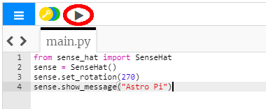

## Afișează un mesaj

--- task ---

Deschide [emulatorul Sense HAT](https://trinket.io/mission-zero){:target="_blank"} pentru proiectul Mission Zero.

Vei vedea că au fost adăugate automat pentru tine trei linii de cod:

```python
from sense_hat import SenseHat
sense = SenseHat()
sense.set_rotation(270)
```


Acest cod se conectează la Astro Pi și se asigură că afișajul LED al lui Astro Pi este afișat corect. Lasă codul acolo, pentru că vei avea nevoie de el.

--- /task ---

--- task ---

Poate ai putea lăsa un salut prietenos pentru astronauții de la ISS care lucrează lângă Astro Pi? Să derulam un mesaj pe ecran.

Adaugă acest rând sub celelalte linii de cod:

```python
sense.show_message("Astro Pi")
```

--- /task ---

--- task ---

Apasă pe butonul **Run** și urmărește cum mesajul `Astro Pi` se derulează pe ecranul LED.



--- /task ---


Pentru a afișa un alt mesaj, poți scrie orice dorești între ghilimele (`""`).

--- collapse ---
---
title: Ce caractere pot fi folosite?
---

Sense HAT poate afișa numai setul de caractere Latin 1, adică numai următoarele caractere vor fi disponibile. Alte caractere se vor afișa ca și `?`.

    +-*/!"#$><0123456789.=)(
    
    ABCDEFGHIJKLMNOPQRSTUVWXYZ
    
    abcdefghijklmnopqrstuvwxyz
    
    ?,;:|@%[&_']\~
    

--- /collapse ---

--- task ---

De asemenea, poți schimba viteza derulării mesajului pe ecran. Adaugă un `scroll_speed` la linia de cod pe care o ai deja, după cum urmează:

```python
sense.show_message("Astro Pi", scroll_speed=0.05)
```

Viteza implicită a mesajului este `0.1`. Introducerea unui număr mai mic face ca mesajul să se deruleze mai repede, iar unul mai mare face ca mesajul să se deruleze mai lent.

--- /task ---