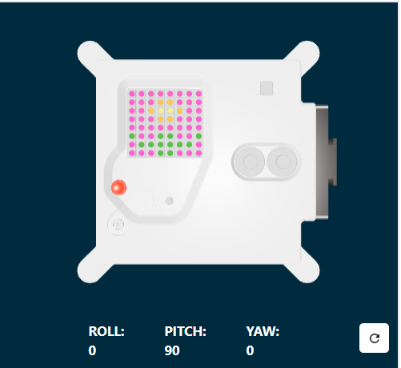

## Simte o culoare

În acest pas, vei configura senzorul luminozității culorii și îl vei folosi pentru a detecta cantitatea de roșu, verde și albastru care ajunge la senzor. Această culoare va fi apoi folosită pentru a colora în imaginea aleasă. Un astronaut care se apropie de senzor într-o cămașă albastră ar vedea o imagine diferită de un astronaut într-o cămașă roșie.

Indiferent de imaginea pe care ai ales-o, fundalul folosește variabila `c` care este setată la negru.

--- task ---

Utilizează senzorul de culoare pentru a colora fundalul.

Adaugă cod înainte de lista ta de imagini pentru a obține culoarea de la senzor și a schimba variabila de culoare `c` de fundal pentru a utiliza culoarea simțită de către senzorul de culoare Sense HAT în loc de negru.

**Sfat:** Nu trebuie să tastezi comentariile care încep cu '#' (sunt acolo pentru a explica codul).

--- code ---
---
language: python
filename: main.py
line_numbers: false
line_number_start: 1
line_highlights: 9-10
---
# Adaugă variabile de culoare și imagine

c = (0, 0, 0) # Negru
m = (34, 139, 34) # Verde pădure
q = (255, 255, 0) # Galben
t = (255, 140, 0) # Portocaliu închis
y = (255, 20, 147) # Roz intens

rgb = sense.color # obține culoarea de la senzor
c = (rgb.red, rgb.green, rgb.blue) # utilizează culoarea de la senzor

imagine = [
  c, c, y, y, y, y, c, c,
  c, y, y, t, t, y, y, c,
  y, y, t, q, q, t, y, y,
  c, y, y, t, t, y, y, c,
  c, c, y, y, y, y, c, c,
  m, c, c, m, m, c, c, m,
  c, m, m, m, m, m, m, c,
  c, c, c, m, m, c, c, c]

--- /code ---

--- /task ---

--- task ---

**Test:** Mută glisorul de culori la o culoare aleasă de tine și apoi **execută** codul tău. Culoarea de fundal se va schimba. Repetați acest test din nou cu o nouă culoare.

**Sfat:** Va trebui să apeși pe 'Rulează' de fiecare dată când schimbi culoarea.

--- /task ---

## Repetă programul tău

Programul Astro Pi Mission Zero poate rula până la 30 de secunde. Vei folosi acest timp pentru a verifica în mod repetat senzorul de culoare şi a actualiza imaginea.

Codul tău va folosi o buclă `for` pentru a rula de 28 de ori. De **fiecare** dată va:
+ detecta cea mai recentă culoare
+ actualiza culoarea de fundal a imaginii
+ face pauză o secundă

--- task ---

**Găsește** linia de cod `rgb = sense.color`.

**Adaugă** codul deasupra lui pentru a configura bucla `for` să facă `28` de repetări.

--- code ---
---
language: python
filename: main.py
line_numbers: false
line_number_start: 1
line_highlights: 1
---
for i in range(28):
rgb = sense.color # obține culoarea de la senzor
c = (rgb.red, rgb.green, rgb.blue)

imagine = [
  c, c, y, y, y, y, c, c,
  c, y, y, t, t, y, y, c,
  y, y, t, q, q, t, y, y,
  c, y, y, t, t, y, y, c,
  c, c, y, y, y, y, c, c,
  m, c, c, m, m, c, c, m,
  c, m, m, m, m, m, m, c,
  c, c, c, m, m, c, c, c]

--- /code ---

--- /task ---

--- task ---

Acum trebuie să indentezi tot codul de sub bucla `for` astfel încât să fie **în interiorul** buclei `for`.

**Sfat:** Pentru a indenta mai multe linii, evidențiază liniile pe care vrei să le indentezi, apoi apasă tasta <kbd>Tab</kbd> de pe tastatură (de obicei deasupra tastei <kbd>Caps Lock</kbd> de pe tastatură).

--- code ---
---
language: python
filename: main.py
line_numbers: false
line_number_start: 1
line_highlights: 2 - 17
---
for i in range(28):
  rgb = sense.color # obține culoarea de la senzor
  c = (rgb.red, rgb.green, rgb.blue)

  imagine = [
    c, c, y, y, y, y, c, c,
    c, y, y, t, t, y, y, c,
    y, y, t, q, q, t, y, y,
    c, y, y, t, t, y, y, c,
    c, c, y, y, y, y, c, c,
    m, c, c, m, m, c, c, m,
    c, m, m, m, m, m, m, c,
    c, c, c, m, m, c, c, c]
    
  # Afișează imaginea

  sense.set_pixels(imagine)

--- /code ---

--- /task ---

--- task ---

În partea de jos a codului tău, adaugă un `sleep` de o secundă în interiorul buclei tale:

--- code ---
---
language: python
filename: main.py
line_numbers: false
line_number_start: 1 
line_highlights: 4
---
  # Afișează imaginea

  sense.set_pixels(imagine)
  sleep(1)  
  
--- /code ---

**Sfat:** Asigură-te că această linie de cod este indentată în cadrul buclei `for`.

--- /task ---

--- task ---

**Test:** Execută codul și schimbă selectorul de culori de mai multe ori pe măsură ce proiectul rulează. Verifică dacă imaginea se actualizează pentru a utiliza culoarea detectată la următoarea sa execuție.

Imaginea va înceta să se actualizeze atunci când bucla se termină astfel încât programul să nu ruleze mai mult de 30 de secunde.

--- /task ---

--- task ---

**Debug**

Codul meu are o eroare de sintaxă sau nu rulează conform așteptărilor:

- Verifică dacă codul tău se potrivește cu codul din exemplele de mai sus
- Verifică dacă ai indentat codul din bucla ta `for`
- Verifică dacă lista ta este înconjurată de `[` și `]`
- Verifică dacă fiecare variabilă de culoare din listă este separată de virgulă

Codul meu rulează mai mult de 30 de secunde:

- Redu numărul de rulări din bucla for, de la 28 la 25 sau chiar 20.
- Scade durata sleep-ului, de la 1 secundă la 0,5 secunde.

--- /task ---

--- task ---

Adaugă `sense.clear()` la sfârșitul codului tău pentru a șterge imaginea de la sfârșitul buclei tale. Acest lucru te va ajuta să vezi când animația s-a terminat de executat.

**Sfat:** Asigură-te că **nu** indentezi linia de cod `sense.clear()` deoarece vrei ca aceasta să ruleze o singură dată la sfârșitul animației.

--- code ---
---
language: python
filename: main.py
line_numbers: false
line_number_start: 1 
line_highlights: 6
---
  # Afișează imaginea

  sense.set_pixels(imagine)
  sleep(1) 
  
sense.clear()

--- /code ---

--- /task ---

--- task ---

**Test:** Rulează codul din nou. După ce proiectul a terminat de rulat, matricea LED se va șterge și se vor face toate luminile negre (oprite).

--- /task ---

--- task ---

**Debug**

Matricea LED devine neagră la fiecare secundă:

- Verifică dacă nu ai indentat codul `sense.clear()` din cadrul buclei tale `for`

--- /task ---

--- task ---

Adaugă cod pentru a șterge matricea LED-urilor la o culoare la alegerea ta. Creează o variabilă numită `x` pentru a stoca noua ta culoare.

Poți să amesteci propria culoare sau să folosești valorile din lista de culori pentru a crea noua ta culoare `x`.

[[[generic-theory-simple-colours]]] 
[[[ambient-colours]]]

--- code ---
---
language: python
filename: main.py
line_numbers: false
line_number_start: 1 
line_highlights: 6-7
---
  # Afișează imaginea

  sense.set_pixels(imagine)
  sleep(1) 

x = (178, 34, 34)  # alege-ți propriile valori roșu, verde, albastru între 0 - 255
sense.clear(x)

--- /code ---

--- /task ---

--- task ---

**Test:** Rulează codul din nou. După terminarea proiectului, matricea LED se va șterge după culoarea aleasă. Poți schimba apoi testa culoarea ori de câte ori vrei.

--- /task ---

--- task ---

--- collapse ---

---
title: Exemplu de cod completat
---

--- code ---
---
language: python
filename: main.py
line_numbers: false
---
# Importă bibliotecile
from sense_hat import SenseHat
from time import sleep

# Configurează Sense HAT
sense = SenseHat()
sense.set_rotation(270)

# Configurează senzorul de culoare
sense.color.gain = 60 # Setează sensibilitatea senzorului
sense.color.integration_cycles = 64 # Intervalul la care va avea loc citirea

# Adaugă variabile de culoare și imagine

c = (0, 0, 0) # Negru
m = (34, 139, 34) # Verde pădure
q = (255, 255, 0) # Galben
t = (255, 140, 0) # Portocaliu închis
y = (255, 20, 147) # Roz intens

for i in range(28):
  rgb = sense.color # obține culoarea de la senzor
  c = (rgb.red, rgb.green, rgb.blue)

  imagine = [
    c, c, y, y, y, y, c, c,
    c, y, y, t, t, y, y, c,
    y, y, t, q, q, t, y, y,
    c, y, y, t, t, y, y, c,
    c, c, y, y, y, y, c, c,
    m, c, c, m, m, c, c, m,
    c, m, m, m, m, m, m, c,
    c, c, c, m, m, c, c, c]

  # Afișează imaginea

  sense.set_pixels(imagine)
  sleep(1)

x = (178, 34, 34)  # alege-ți propriile valori roșu, verde, albastru între 0 - 255
sense.clear(x)

--- /code ---

--- /collapse ---

--- /task ---
