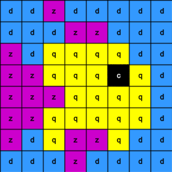

## Detectează o culoare

În acest pas, vei configura senzorul luminozității culorii și îl vei folosi pentru a detecta cantitatea de roșu, verde și albastru care ajunge la senzor. Această culoare va fi apoi folosită pentru a colora în imaginea aleasă. Un astronaut care se apropie de senzor într-o cămașă albastră ar vedea o imagine diferită de un astronaut într-o cămașă roșie.

Indiferent de imaginea pe care ai ales-o, fundalul folosește variabila `c` care este setată la negru.

--- task ---

Utilizează senzorul de culoare pentru a colora fundalul.

Adaugă cod înainte de lista ta de imagini pentru a obține culoarea de la senzor și a schimba variabila de culoare `c` de fundal pentru a utiliza culoarea simțită de către senzorul de culoare Sense HAT în loc de negru.

**Sfat:** Nu trebuie să tastezi comentariile care încep cu '#' (sunt acolo pentru a explica codul).

--- code ---
---
language: python filename: main.py line_numbers: false line_number_start: 1
line_highlights: 9, 10
---

# Adaugă variabile de culoare și imagine

z = (204, 0, 204) # magenta q = (255, 255, 0) # yellow d = (51, 153, 255) # blue c = (0, 0, 0) # black

rgb = sense.color # get the colour from the sensor c = (rgb.red, rgb.green, rgb.blue) # use the sensed colour

image = [ d, d, z, d, d, d, d, d, d, d, d, z, z, d, d, d, z, d, q, q, q, q, d, d, z, z, q, q, q, c, q, d, z, z, z, q, q, q, q, d, z, z, q, q, q, q, q, d, z, d, q, z, z, q, d, d, d, d, d, z, d, d, d, d]

--- /code ---

--- /task ---

--- task ---

**Test:** Mută glisorul de culori la o culoare aleasă de tine și apoi **execută** codul tău. Culoarea de fundal se va schimba. Repetați acest test din nou cu o nouă culoare.

**Sfat:** Va trebui să apeși pe 'Rulează' de fiecare dată când schimbi culoarea.

--- /task ---

## Repetă programul tău

Programul Astro Pi Mission Zero poate rula până la 30 de secunde. Vei folosi acest timp pentru a verifica în mod repetat senzorul de culoare şi a actualiza imaginea.

Codul tău va folosi o buclă `for` pentru a rula de 28 de ori. De **fiecare** dată va:
+ detecta cea mai recentă culoare
+ actualiza culoarea de fundal a imaginii
+ face pauză o secundă

--- task ---

**Găsește** linia de cod `rgb = sense.color`.

**Adaugă** codul deasupra lui pentru a configura bucla `for` să facă `28` de repetări.

--- code ---
---
language: python filename: main.py line_numbers: false line_number_start: 1
line_highlights: 2
---

for i in range(28): rgb = sense.color # get the colour from the sensor c = (rgb.red, rgb.green, rgb.blue)

image = [ d, d, z, d, d, d, d, d, d, d, d, z, z, d, d, d, z, d, q, q, q, q, d, d, z, z, q, q, q, c, q, d, z, z, z, q, q, q, q, d, z, z, q, q, q, q, q, d, z, d, q, z, z, q, d, d, d, d, d, z, d, d, d, d]

--- /code ---

--- /task ---

--- task ---

Acum trebuie să indentezi tot codul de sub bucla `for` astfel încât să fie **în interiorul** buclei `for`.

**Sfat:** Pentru a indenta mai multe linii, evidențiază liniile pe care vrei să le indentezi, apoi apasă tasta <kbd>Tab</kbd> de pe tastatură (de obicei deasupra tastei <kbd>Caps Lock</kbd> de pe tastatură).

--- code ---
---
language: python filename: main.py line_numbers: false line_number_start: 1
line_highlights: 3, 4, 5, 6, 7, 8, 9, 10, 11, 12, 13, 14, 15, 16, 17, 18
---

for i in range(28): rgb = sense.color # get the colour from the sensor c = (rgb.red, rgb.green, rgb.blue)

  image = [ d, d, z, d, d, d, d, d, d, d, d, z, z, d, d, d, z, d, q, q, q, q, d, d, z, z, q, q, q, c, q, d, z, z, z, q, q, q, q, d, z, z, q, q, q, q, q, d, z, d, q, z, z, q, d, d, d, d, d, z, d, d, d, d]

  # Display the image

  sense.set_pixels(image)

--- /code ---

--- /task ---

--- task ---

În partea de jos a codului tău, adaugă un `sleep` de o secundă în interiorul buclei tale:

--- code ---
---
language: python filename: main.py line_numbers: false line_number_start: 1
line_highlights: 5
---

  # Display the image

  sense.set_pixels(image) sleep(1)

--- /code ---

**Sfat:** Asigură-te că această linie de cod este indentată în cadrul buclei `for`.

--- /task ---

--- task ---

**Test:** Execută codul și schimbă selectorul de culori de mai multe ori pe măsură ce proiectul rulează. Verifică dacă imaginea se actualizează pentru a utiliza culoarea detectată la următoarea sa execuție.

Imaginea va înceta să se actualizeze atunci când bucla se termină astfel încât programul să nu ruleze mai mult de 30 de secunde.

--- /task ---

--- task ---

**Debug**

Codul meu are o eroare de sintaxă sau nu rulează conform așteptărilor:

- Verifică dacă codul tău se potrivește cu codul din exemplele de mai sus
- Verifică dacă ai indentat codul din bucla ta `for`
- Verifică dacă lista ta este înconjurată de `[` și `]`
- Verifică dacă fiecare variabilă de culoare din listă este separată de virgulă

Codul meu rulează mai mult de 30 de secunde:

- Redu numărul de rulări din bucla for, de la 28 la 25 sau chiar 20.
- Scade durata sleep-ului, de la 1 secundă la 0,5 secunde.

--- /task ---

--- task ---

Adaugă `sense.clear()` la sfârșitul codului tău pentru a șterge imaginea de la sfârșitul buclei tale. Acest lucru te va ajuta să vezi când animația s-a terminat de executat.

**Sfat:** Asigură-te că **nu** indentezi linia de cod `sense.clear()` deoarece vrei ca aceasta să ruleze o singură dată la sfârșitul animației.

--- code ---
---
language: python filename: main.py line_numbers: false line_number_start: 1
line_highlights: 7
---

  # Display the image

  sense.set_pixels(image) sleep(1)

sense.clear()

--- /code ---

--- /task ---

--- task ---

**Test:** Rulează codul din nou. După ce proiectul a terminat de rulat, matricea LED se va șterge și se vor face toate luminile negre (oprite).

--- /task ---

--- task ---

**Debug**

Matricea LED devine neagră la fiecare secundă:

- Verifică dacă nu ai indentat codul `sense.clear()` din cadrul buclei tale `for`

--- /task ---

--- task ---

Adaugă cod pentru a șterge matricea LED-urilor la o culoare la alegerea ta. Creează o variabilă numită `x` pentru a stoca noua ta culoare.

Poți să amesteci propria culoare sau să folosești valorile din lista de culori pentru a crea noua ta culoare `x`.

\[[[generic-theory-simple-colours]]\] \[[[ambient-colours\]]]

--- code ---
---
language: python filename: main.py line_numbers: false line_number_start: 1
line_highlights: 7, 8
---

  # Display the image

  sense.set_pixels(image) sleep(1)

x = (178, 34, 34)  # choose your own red, green, blue values between 0 - 255 sense.clear(x)

--- /code ---

--- /task ---

--- task ---

**Test:** Rulează codul din nou. După terminarea proiectului, matricea LED se va șterge după culoarea aleasă. Poți schimba apoi testa culoarea ori de câte ori vrei.

--- /task ---

--- task ---

**Salvează-ți progresul**

Poți salva programul tău în proiectul Mission Starter introducând numele echipei, numele membrilor echipei și codul de clasă care ți-a fost dat. Poți reîncărca programul tău pe orice dispozitiv cu o conexiune la internet prin introducerea numelui echipei și a codului de clasă.

--- /task ---

--- task ---

--- collapse ---

---
title: Exemplu de cod completat
---

--- code ---
---
language: python filename: main.py
line_numbers: false
---
# Import the libraries
from sense_hat import SenseHat from time import sleep

# Set up the Sense HAT
sense = SenseHat() sense.set_rotation(270)

# Set up the colour sensor
sense.color.gain = 60 # Set the sensitivity of the sensor sense.color.integration_cycles = 64 # The interval at which the reading will be taken

# Add colour variables and image

z = (204, 0, 204) # magenta q = (255, 255, 0) # yellow d = (51, 153, 255) # blue c = (0, 0, 0) # black

for i in range(28): rgb = sense.color # get the colour from the sensor c = (rgb.red, rgb.green, rgb.blue)

  image = [ d, d, z, d, d, d, d, d, d, d, d, z, z, d, d, d, z, d, q, q, q, q, d, d, z, z, q, q, q, c, q, d, z, z, z, q, q, q, q, d, z, z, q, q, q, q, q, d, z, d, q, z, z, q, d, d, d, d, d, z, d, d, d, d]

  # Display the image

  sense.set_pixels(image) sleep(1)

x = (178, 34, 34)  # choose your own red, green, blue values between 0 - 255 sense.clear(x)

--- /code ---

--- /collapse ---

--- /task ---
