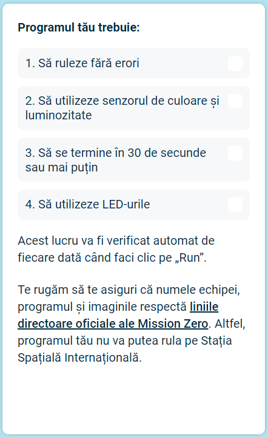

## Trimite programul tău

Acum poți participa la provocarea [Astro Pi Mission Zero](https://astro-pi.org/mission-zero){:target="_blank"}, folosind codul pe care l-ai scris.

Există câteva reguli pe care codul tău trebuie să le respecte, astfel încât să îl poți trimite pentru a fi rulat pe Stația Spațială Internațională. Dacă codul tău le respectă, regulile din partea de jos a emulatorului **Sense HAT** se vor aprinde în verde atunci când rulezi programul.

**Sfat:** Testează-ți codul cu câteva setări diferite de culori (folosind selectorul) pentru a te asigura că acesta rulează întotdeauna corect.

Te rugăm să te asiguri că intrarea ta respectă [recomandările oficiale](https://astro-pi.org/mission-zero/guidelines){:target="_blank"} pentru Mission Zero. Dacă nu urmează instrucțiunile, programul tău nu va putea rula pe Stația Spațială Internațională.

Te rugăm să nu incluzi nimic din următoarele în numele sau codul echipei:

+ Orice ar putea fi interpretat ca fiind ilegal, politic sau sensibil
+ Steaguri, deoarece pot fi considerate sensibile din punct de vedere politic
+ Orice se referă la o neplăcere sau vătămare a unei alte persoane
+ Date cu caracter personal, cum ar fi numerele de telefon, handle-urile rețelelor sociale și adresele de e-mail
+ Imagini obscene
+ Caractere speciale sau emojis
+ Limbaj vulgar sau înjurături

--- task ---

Introdu codul de clasă și numele echipei în căsuța de jos — mentorul îți va spune care este codul tău.

**Notele pentru mentori** pot fi găsite în pasul [Introducere](https://projects.raspberrypi.org/en/projects/astro-pi-mission-zero/0).

--- /task ---

--- task ---

Apasă butonul **Adaugă echipa** pentru a trimite codul tău. Un program nu poate fi schimbat după ce a fost trimis.

Mentorul tău va primi un e-mail pentru a-ți confirma intrarea.

--- /task ---

--- task ---

Dacă vrei, poți distribui linkul cu codul tău pe social media pentru a le spune tuturor că există cod scris de tine care va fi rulat în spațiu!

--- /task ---
