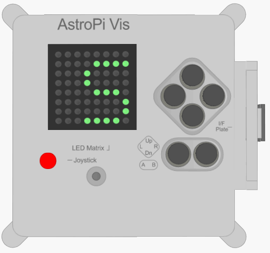

## Măsoară umiditatea

Senzorul de umiditate din Astro Pi poate măsura temperatura aerului în jurul acestuia, o funcție utilă care te ajută să obții date despre condițiile din spațiu.



Astro Pi măsoară umiditatea în cadrul ISS în procentajul concentrației de apă din aer.

O parte din misiunea ta este să contribui la viața de zi cu zi a echipajului de la bordul ISS, informându-i astfel că umiditatea la bordul stației spațiale se află într-un interval normal, fapt ce îi va liniști.

[[[generic-theory-what-is-humidity]]]

\--- task \---

Adaugă acest cod pentru a măsura umiditatea:

```python
temp = sense.humidity
```

\--- /collapse \---

\--- /task \---

\--- task \---

Umiditatea este înregistrată foarte precis, adică valoarea stocată va avea un număr mare de zecimale. Poți rotunji valoarea la orice număr de zecimale. În exemplul dat, am rotunjit la o zecimală, dar pentru un alt nivel de precizie, schimbă numărul `1` la numărul de zecimale pe care dorești să le vezi.

```python
temp = round( sense.humidity 1 )
```

\--- /task \---

\--- task \---

Pentru a afișa umiditatea curentă ca mesaj derulant pe afișaj, adaugă această linie de cod:

```python
sense.show_message( str(humid) )
```

Partea `str()` convertește umiditatea dintr-un caracter numeric în caracter text astfel încât Astro Pi să o poată afișa.

\--- /task \---

\--- task \---

De asemenea, poți afișa umiditatea ca parte a unui alt mesaj prin îmbinarea părților mesajului tau împreună cu un `+`.

```python
sense.show_message( "Umiditatea este de " + str(temp) + "%" )
```

\--- /task \---

Un Astro Pi real va măsura umiditatea din jurul său, dar poți muta sliderul de umiditate de pe emulatorul Sense HAT pentru a simula schimbări de umiditate și pentru a testa codul tău.


**Notă:** S-ar putea să te întrebi de ce sliderul de umiditate afișează umiditatea ca număr întreg, dar citirea pe care o primești este un număr cu zecimale. Emulatorul simulează o ușoară inexactitate a senzorului real, astfel încât umiditatea măsurată pe care o vezi poate fi puțin mai mică sau mai mare decât valoarea pe care ai setat-o cu ajutorul sliderului.