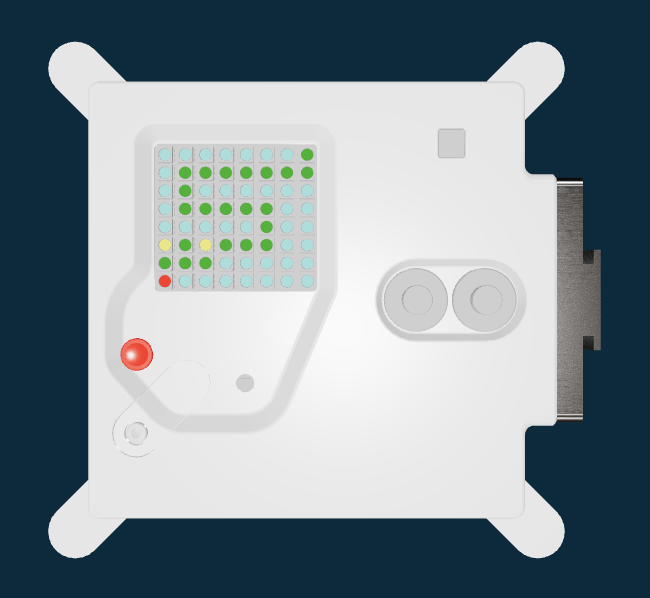

## Čo urobíš

Naprogramuješ počítač Astro Pi tak, aby zobrazoval farebný obrázok. Keď tvoj program úspešne prejde oficiálnymi kontrolami kódu, bude spustený na počítači Astro Pi na Medzinárodnej vesmírnej stanici (ISS), aby ho astronauti mohli sledovať pri plnení svojich každodenných úloh.

V tomto projekte sa dozvieš o počítači Astro Pi a o tom, ako ho ovládať. Tvojou úlohou bude:

+ Navrhnúť a zobraziť obrázok na počítači Astro Pi
+ Pomocou senzora zistiť farbu a jasu svetla na palube ISS a zmeniť obrázok
+ Vytvoriť jednoduchú animáciu (voliteľné)

Tu je príklad typu programu, ktorý by sa mohol spustiť na Astro Pi vo vesmíre.

### Budeš potrebovať

Svoj program napíšeš a otestuješ vo webovom prehliadači, ako je napríklad Google Chrome. Nepotrebuješ skutočný počítač Astro Pi.

### Kritériá pre Astro Pi Mission Zero

Every project that meets the [rules](https://astro-pi.org/mission-zero/eligibility){:target="_blank"} will receive 'Flight Status' to run on the International Space Station! If you succeed then you will also receive a special certificate that shows exactly where the ISS was as your program ran in space.

--- collapse ---
---
title: Poznámky pre mentorov
---

Mission Zero is suitable for beginners to programming and is recommended for young people people aged 9 - 16 years old. It can be completed in a single 60-minute session on any computer with internet access. Nie je potrebný žiadny špeciálny hardvér ani predchádzajúce znalosti programovania. Všetko sa dá urobiť vo webovom prehliadači.

 Misson Zero can be done individually or in teams of up to 4 people.

Prečítajte si [oficiálne pokyny](https://astro-pi.org/mission-zero/guidelines) pre Mission Zero.

--- /collapse ---
