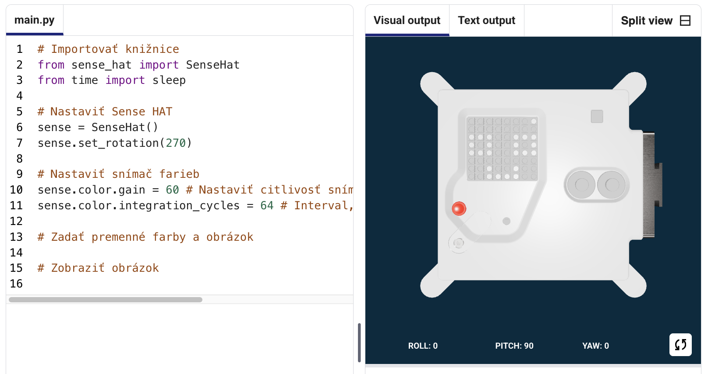

## Zobrazenie obrázka

LED matrica počítača Astro Pi dokáže zobrazovať farby. V tomto kroku zobrazíš obrázky z prírody na LED matrici počítača Astro Pi.

<p style="border-left: solid; border-width:10px; border-color: #0faeb0; background-color: aliceblue; padding: 10px;">
<span style="color: #0faeb0">**LED matrica**</span> je mriežka LED diód, ktoré možno ovládať jednotlivo alebo ako skupinu a vytvárať tak rôzne svetelné efekty. LED matrica na module Sense HAT má 64 LED diód zobrazených v mriežke 8 x 8. LED diódy môžu byť naprogramované tak, aby produkovali širokú škálu farieb.
</p>


--- task ---

Otvor [úvodný projekt Mission Zero](https://missions.astro-pi.org/sk/mz/code_submissions/){:target="_blank"}.

Automaticky sa ti pridá niekoľko riadkov kódu.

Tento kód sa pripája k počítaču Astro Pi, zaisťuje, že sa LED displej počítača Astro Pi zobrazuje správnym smerom, a nastavuje snímač farieb. Tento kód tam nechaj, pretože ho budeš potrebovať.

--- code ---
---
language: python filename: main.py line_numbers: false line_number_start: 1
line_highlights:
---
# Importujte knižnice
from sense_hat import SenseHat from time import sleep

# Nastavte Sense HAT
sense = SenseHat() sense.set_rotation(270)

# Nastavte snímač farieb
sense.color.gain = 60 # Set the sensitivity of the sensor sense.color.integration_cycles = 64 # The interval at which the reading will be taken

--- /code ---



--- /task ---

### RGB farby

Farby môžu byť vytvorené pomocou rôznych pomerov červenej, zelenej a modrej. Viac informácií o RGB farbách nájdeš tu:

[[[generic-theory-simple-colours]]]

LED matrica je mriežka 8 x 8. Každá LED dióda na mriežke môže byť nastavená na inú farbu. Tu je zoznam premenných pre 24 rôznych farieb. Každá farba má hodnotu pre červenú, zelenú a modrú:

[[[ambient-colours]]]

### Vyber obrázok

--- task ---

**Vyber:** Z možností nižšie vyber obrázok, ktorý sa má zobraziť. Program Python uloží informácie o obrázku do zoznamu. Kód pre každý obrázok obsahuje použité farebné premenné a zoznam.

Budeš musieť **skopírovať** celý kód pre zvolený obrázok a potom ho **prilepiť** do svojho projektu pod riadok s textom `# Pridajte farebné premenné a obrázok`.

--- collapse ---

---
title: Ryba
---


Autor: tím chalka, Poľsko

```python
z = (153, 50, 204) # Tmavoorchideová
q = (255, 255, 0) # Žltá
d = (51, 153, 255) # Modrá
c = (0, 0, 0) # Čierna

obrazok = [
d, d, z, d, d, d, d, d,
d, d, d, z, z, d, d, d,
z, d, q, q, q, q, d, d,
z, z, q, q, q, c, q, d,
z, z, z, q, q, q, q, d,
z, z, q, q, q, q, q, d,
z, d, q, z, z, q, d, d,
d, d, d, z, d, d, d, d]

```

--- /collapse ---


--- collapse ---

---
title: Mrož
---


Autor: tím Walrus, Fínsko

```python
h = (0, 255, 255) # Azúrová
c = (0, 0, 0) # Čierna
s = (139, 69, 19) # Sedlová hnedá
a = (255, 255, 255) # Biela
r = (184, 134, 11) # Tmavožltá

obrazok = [
h, h, h, h, h, h, h, h,
h, h, s, s, s, h, h, h,
h, s, s, s, s, s, h, h,
h, s, c, s, c, s, s, s,
h, r, r, r, r, r, s, s,
h, h, a, s, a, s, s, s,
h, h, a, s, a, s, s, s,
r, r, s, s, s, s, s, s]

```

--- /collapse ---

--- collapse ---
---
title: Paxi
---


Autor: tím tony_pi, Taliansko

```python
v = (255, 0, 0) # Červená
m = (34, 139, 34) # Sýtozelená
c = (0, 0, 0) # Čierna
e = (100, 149, 237) # Nevädzová modrá
l = (0, 255, 0) # Zelená

obrazok = [
    c, v, m, c, c, m, v, c,
    c, c, v, v, v, v, c, c,
    c, v, c, e, l, e, v, c,
    c, v, c, l, l, l, v, c,
    c, v, c, l, c, l, v, c,
    c, c, v, v, v, v, c, c,
    c, c, l, c, c, l, c, c,
    c, m, m, c, c, m, m, c]

```

--- /collapse ---


--- collapse ---
---
title: Pes
---


Autor: tím ptpr_07, Španielsko

```python

c = (0, 0, 0) # Čierna
r = (184, 134, 11) # Tmavožltá
s = (139, 69, 19) # Sedlová hnedá
y = (255, 20, 147) # Tmavoružová

obrazok = [
    c, r, r, c, c, r, r, c,
    c, r, s, s, s, s, r, c,
    c, r, c, s, s, c, r, c,
    c, s, s, s, s, s, s, c,
    c, s, s, s, s, s, s, c,
    c, s, s, c, c, s, s, c,
    c, c, s, y, y, s, c, c,
    c, c, c, y, y, c, c, c]


```

--- /collapse ---

--- collapse ---
---
Názov: Chameleón
---


Autor: tím The_ETs, Spojené kráľovstvo

```python

c = (0, 0, 0) # Čierna
s = (139, 69, 19) # Sedlová hnedá
a = (255, 255, 255) # Biela
v = (255, 0, 0) # Červená
t = (255, 140, 0) # Tmavooranžová
q = (255, 255, 0) # Žltá
m = (34, 139, 34) # Sýtozelená
h = (0, 255, 255) # Azúrová
z = (153, 50, 204) # Tmavoorchideová
y = (255, 20, 147) # Tmavoružová

obrazok = [
    a, a, v, v, t, a, a, a,
    a, v, v, t, t, q, a, a,
    v, c, t, t, q, q, m, a,
    v, t, t, q, q, m, m, h,
    s, s, q, s, s, m, s, h,
    a, a, a, a, a, a, a, z,
    a, a, a, a, y, a, a, z,
    a, a, a, a, a, y, z, a]

```

--- /collapse ---

--- collapse ---
---
title: Šarkan
---


Autor: tím Val, Grécko

```python

c = (0, 0, 0) # Čierna
m = (34, 139, 34) # Sýtozelená
v = (255, 0, 0) # Červená
q = (255, 255, 0) # Žltá
e = (0, 0, 205) # Stredne modrá
h = (0, 255, 255) # Azúrová

obrazok = [
    h, h, h, h, h, h, h, h, 
    h, h, h, e, e, v, v, h, 
    h, h, h, e, e, v, v, h, 
    h, h, h, q, q, m, m, h, 
    h, h, h, q, q, m, m, h,
    h, h, c, h, h, h, h, h, 
    h, c, h, h, h, h, h, h, 
    c, h, h, h, h, h, h, h]

```

--- /collapse ---

--- collapse ---
---
title: Kuriatko
---


Autor: tím Slepičky, Česko

```python

v = (255, 0, 0) # Červená
c = (0, 0, 0) # Čierna
b = (105, 105, 105) # Tmavosivá
q = (255, 255, 0) # Žltá
r = (184, 134, 11) # Tmavožltá

obrazok =  [
    c, c, v, v, v, c, c, c,
    c, v, b, b, r, c, c, r,
    c, b, c, b, b, c, r, b,
    q, r, b, b, b, b, b, r,
    c, v, b, b, b, b, r, b,
    c, v, b, r, r, r, b, r,
    c, c, c, r, b, q, r, c,
    c, c, c, c, q, q, c, c]

```

--- /collapse ---

--- /task ---

--- task ---

**Nájdite:** riadok s textom `# Zobraziť obrázok` a pridajte riadok kódu na zobrazenie obrázka na LED matrici:

--- code ---
---
language: python filename: main.py line_numbers: false line_number_start: 1
line_highlights: 18, 19
---
z = (153, 50, 204) # Tmavoorchideová q = (255, 255, 0) # Žltá d = (51, 153, 255) # Modrá c = (0, 0, 0) # Čierna

image = [ d, d, z, d, d, d, d, d, d, d, d, z, z, d, d, d, z, d, q, q, q, q, d, d, z, z, q, q, q, c, q, d, z, z, z, q, q, q, q, d, z, z, q, q, q, q, q, d, z, d, q, z, z, q, d, d, d, d, d, z, d, d, d, d]

# Zobraziť obrázok
sense.set_pixels(image)

--- /code ---

--- /task ---

--- task ---

Stlačením tlačidla **Spustiť** v dolnej časti editora zobrazíte obrázok zobrazený na LED matrici.

--- /task ---

--- task ---

**Ladenie**

Môj kód má chybu syntaxe:

- Skontroluj, či sa kód zhoduje s kódom v príkladoch vyššie
- Skontroluj, či máš kód vo svojom zozname odsadený
- Skontroluj, či je zoznam uzavretý v znakoch `[` a `]`
- Skontroluj, či sú jednotlivé farebné premenné v zozname oddelené čiarkou

Môj obrázok sa nezobrazuje:

- Skontroluj, či riadok `sense.set_pixels(image)` nie je odsadený

--- /task ---


--- task ---

**Ukladaj si priebeh**

Po zobrazení obrázka si môžeš svoj program uložiť do projektu Mission Starter zadaním názvu tímu, mien členov tímu a kódu triedy, ktorý si dostal/-a. Svoj program môžeš znova načítať na akomkoľvek zariadení s internetovým pripojením zadaním názvu tímu a kódu triedy.


--- /task --- 
