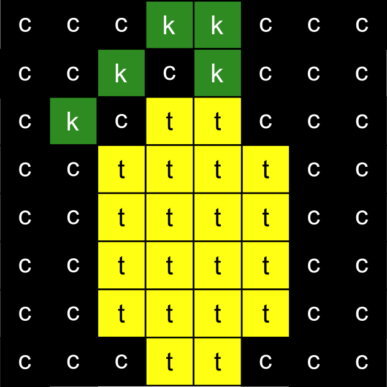

## Zobrazenie obrázka

The image you display will be made from 64 coloured squares called **pixels**. The pixels are arranged in an 8 x 8 grid. Each pixel can be a different colour. By choosing the colours carefully, you can create a picture. Here is an example of a whale made using different shades of blue on a black background.

<p style="border-left: solid; border-width:10px; border-color: #0faeb0; background-color: aliceblue; padding: 10px;">
<span style="color: #0faeb0">**LED matrica**</span> je mriežka LED diód, ktoré možno ovládať jednotlivo alebo ako skupinu a vytvárať tak rôzne svetelné efekty. LED matrica na module Sense HAT má 64 LED diód zobrazených v mriežke 8 x 8. LED diódy môžu byť naprogramované tak, aby produkovali širokú škálu farieb.
</p>


Notice that each square is labelled with a code to represent a particular colour. In this image 3 colours are used:
+ c = black
+ f = Ocean blue
+ g = Sky blue


--- task ---

Otvor [úvodný projekt Mission Zero](https://missions.astro-pi.org/sk/mz/code_submissions/){:target="_blank"}.

Automaticky sa ti pridá niekoľko riadkov kódu.

Tento kód sa pripája k počítaču Astro Pi, zaisťuje, že sa LED displej počítača Astro Pi zobrazuje správnym smerom, a nastavuje snímač farieb. Tento kód tam nechaj, pretože ho budeš potrebovať.

--- code ---
---
language: python filename: main.py line_numbers: false line_number_start: 1
line_highlights:
---
# Import the libraries
from sense_hat import SenseHat from time import sleep

# Set up the Sense HAT
sense = SenseHat() sense.set_rotation(270)

# Set up the colour sensor
sense.color.gain = 60 # Set the sensitivity of the sensor sense.color.integration_cycles = 64 # The interval at which the reading will be taken

--- /code ---


--- /task ---

### RGB farby

Farby môžu byť vytvorené pomocou rôznych pomerov červenej, zelenej a modrej. Viac informácií o RGB farbách nájdeš tu:


LED matrica je mriežka 8 x 8. Každá LED dióda na mriežke môže byť nastavená na inú farbu. We can use the letters a to z as the names of variables to represent 24 different colours. Each colour has a value for red, green, and blue.

--- collapse ---

---
title: List of Colour Variables
---


```python
a = (255, 255, 255) # White
b = (171, 171, 171) # Grey
c = (0, 0, 0)       # Black
d = (25, 25, 113)   # Navy Blue
e = (0, 0, 255)     # Pure Blue
f = (36, 128, 200)  # Ocean Blue
g = (0, 204, 255)   # Sky Blue
h = (86, 255, 255)  # Electric Cyan
j = (0, 255, 0)     # Pure Green
k = (46, 139, 33)   # Leaf Green
l = (57, 97, 17)    # Olive Green
m = (30, 65, 6)     # Forest Green
n = (126, 88, 25)   # Earth Brown
o = (179, 96, 65)   # Terracotta Brown
p = (180, 34, 34)   # Brick Red
q = (255, 0, 0)     # Pure Red
r = (232, 118, 5)   # Orange
s = (241, 231, 100) # Pale Yellow
t = (255, 255, 0)   # Pure Yellow
u = (255, 209, 209) # Pale Pink
v = (255, 177, 177) # Blush Pink
w = (249, 169, 255) # Light Pink
y = (248, 97, 255)  # Magenta
z = (220, 53, 232)  # Purple

```

--- /collapse ---

### Vyber obrázok

--- task ---

**Vyber:** Z možností nižšie vyber obrázok, ktorý sa má zobraziť. Program Python uloží informácie o obrázku do zoznamu. Kód pre každý obrázok obsahuje použité farebné premenné a zoznam.

Budeš musieť **skopírovať** celý kód pre zvolený obrázok a potom ho **prilepiť** do svojho projektu pod riadok s textom `# Pridajte farebné premenné a obrázok`.

--- collapse ---

---
title: Whale
---


Created by Team Naicom, Italy

```python
c = (0, 0, 0)       # Black
f = (36, 128, 200)  # Ocean Blue
g = (0, 204, 255)   # Sky Blue

image = [
c, g, c, g, c, c, c, c,
c, c, g, c, c, f, f, f,
c, f, f, f, c, c, f, a,
f, f, c, f, f, c, f, c,
f, f, f, f, f, c, f, c,
g, f, f, f, f, f, f, c,
g, g, g, g, g, g, c, c,
c, g, g, g, g, c, c, c]

```

--- /collapse ---


--- collapse ---

---
title: Lemon
---



Created by team g4lemoni, Greece

```python
c = (0, 0, 0)       # Black
k = (46, 139, 33)   # Leaf Green
t = (255, 255, 0)   # Pure Yellow

image = [
c, c, c, k, k, c, c, c,
c, c, k, c, k, c, c, c,
c, k, c, t, t, c, c, c,
c, c, t, t, t, t, c, c,
c, c, t, t, t, t, c, c,
c, c, t, t, t, t, c, c,
c, c, t, t, t, t, c, c,
c, c, c, t, t, c, c, c]

```

--- /collapse ---

--- collapse ---
---
title: Pig
---


Created by Gary, United Kingdom

```python
a = (255, 255, 255) # White
v = (255, 177, 177) # Blush Pink
y = (248, 97, 255)  # Magenta
o = (179, 96, 65)   # Terracotta Brown
c = (0, 0, 0)       # Black

image = [
a, a, y, a, a, y, a, a,
a, y, y, y, y, y, y, a,
a, y, c, y, c, y, y, y,
v, v, v, v, v, y, y, y,
v, o, v, o, v, y, y, y,
v, v, v, v, v, y, y, y,
a, y, y, y, y, y, y, y,
a, a, y, a, a, a, y, a]

```

--- /collapse ---


--- collapse ---
---
title: Storm
---


Created by team hop2p023, Spain

```python

c = (0, 0, 0)       # Black
f = (36, 128, 200)  # Ocean Blue
g = (0, 204, 255)   # Sky Blue
t = (255, 255, 0)   # Pure Yellow

image = [
c, c, c, c, c, c, c, c,
c, c, f, f, f, f, c, c,
c, f, f, f, f, f, f, c,
c, g, c, g, t, g, c, c,
c, c, c, t, t, c, c, c,
c, c, t, t, c, c, c, c,
c, c, g, c, c, c, c, g,
c, g, c, c, c, c, c, c]


```

--- /collapse ---

--- collapse ---
---
title: Duck
---


Created by Peter, Ireland

```python

c = (0, 0, 0) # Black
l = (57, 97, 17)    # Olive Green
m = (30, 65, 6)     # Forest Green
r = (232, 118, 5)   # Orange
a = (255, 255, 255) # White
b = (171, 171, 171) # Grey

image = [
c, l, l, c, c, c, c, c,
r, r, m, c, c, c, c, c,
c, l, l, c, c, c, c, c,
c, a, a, l, a, a, c, c,
c, l, l, a, a, a, b, a,
c, a, a, b, b, b, a, a,
c, c, a, a, a, a, c, c,
c, c, c, r, c, r, c, c]

```

--- /collapse ---

--- collapse ---
---
title: Frog
---


Created by team Jmeno, Czech Republic

```python

a = (255, 255, 255) # White
b = (171, 171, 171) # Grey
c = (0, 0, 0)       # Black
q = (255, 0, 0)     # Pure Red
j = (0, 255, 0)     # Pure Green
k = (46, 139, 33)   # Leaf Green
n = (126, 88, 25)   # Earth Brown

image = [
a, a, a, a, a, a, a, a,
a, a, a, a, a, b, a, b,
a, a, a, a, a, a, c, a,
a, a, c, a, c, a, q, a,
a, a, j, j, j, q, a, a,
a, j, j, k, q, a, a, a,
j, k, j, k, k, a, a, a,
k, k, k, j, k, n, n, n]

```

--- /collapse ---

--- collapse ---
---
title: Blossom Tree
---


Created by team Zssh14, Slovakia

```python

t = (255, 255, 0)   # Pure Yellow
g = (0, 204, 255)   # Sky Blue
w = (249, 169, 255) # Light Pink
y = (248, 97, 255)  # Magenta
z = (220, 53, 232)  # Purple
n = (126, 88, 25)   # Earth Brown
o = (179, 96, 65)   # Terracotta Brown
k = (46, 139, 33)   # Leaf Green

image =  [
t, g, g, w, w, y, g, g,
g, g, w, w, y, y, z, g,
g, w, y, z, y, z, z, z,
w, y, z, z, g, n, w, g,
g, g, o, o, n, w, y, z,
g, g, g, g, n, g, g, g,
g, g, g, o, n, n, g, g,
k, k, o, n, n, n, k, k]

```

--- /collapse ---

--- /task ---

--- task ---

**Nájdite:** riadok s textom `# Zobraziť obrázok` a pridajte riadok kódu na zobrazenie obrázka na LED matrici:

--- code ---
---
language: python filename: main.py line_numbers: false line_number_start: 1
line_highlights: 17, 18
---
c = (0, 0, 0)       # Black f = (36, 128, 200)  # Ocean Blue g = (0, 204, 255)   # Sky Blue

image = [ c, g, c, g, c, c, c, c, c, c, g, c, c, f, f, f, c, f, f, f, c, c, f, a, f, f, c, f, f, c, f, c, f, f, f, f, f, c, f, c, g, f, f, f, f, f, f, c, g, g, g, g, g, g, c, c, c, g, g, g, g, c, c, c]

# Zobraziť obrázok
sense.set_pixels(image)

--- /code ---

--- /task ---

--- task ---

Stlačením tlačidla **Spustiť** v dolnej časti editora zobrazíte obrázok zobrazený na LED matrici.

--- /task ---

--- task ---

**Ladenie**

Môj kód má chybu syntaxe:

- Skontroluj, či sa kód zhoduje s kódom v príkladoch vyššie
- Skontroluj, či máš kód vo svojom zozname odsadený
- Skontroluj, či je zoznam uzavretý v znakoch `[` a `]`
- Skontroluj, či sú jednotlivé farebné premenné v zozname oddelené čiarkou

Môj obrázok sa nezobrazuje:

- Skontroluj, či riadok `sense.set_pixels(image)` nie je odsadený

--- /task ---


--- task ---

**Ukladaj si priebeh**

Po zobrazení obrázka si môžeš svoj program uložiť do projektu Mission Starter zadaním názvu tímu, mien členov tímu a kódu triedy, ktorý si dostal/-a. Svoj program môžeš znova načítať na akomkoľvek zariadení s internetovým pripojením zadaním názvu tímu a kódu triedy.


--- /task --- 
