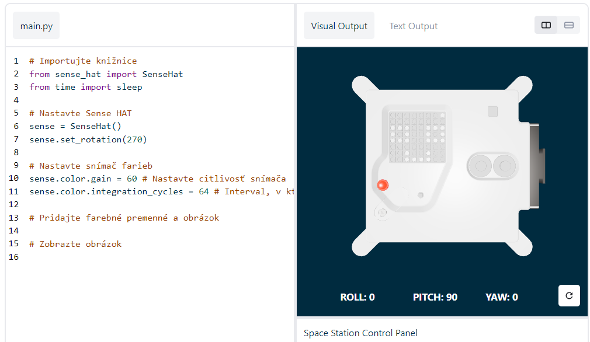

## Zobraziť obrázok

Matrica LED Astro Pi môže zobrazovať farby. V tomto kroku zobrazíte obrázky z prírody na LED matrici Astro Pi.

<p style="border-left: solid; border-width:10px; border-color: #0faeb0; background-color: aliceblue; padding: 10px;">
<span style="color: #0faeb0">**LED matrica**</span> je mriežka LED diód, ktoré možno ovládať jednotlivo alebo ako skupinu a vytvárať tak rôzne svetelné efekty. Matrica LED na Sense HAT má 64 LED zobrazených v mriežke 8 x 8. LED diódy môžu byť naprogramované tak, aby produkovali širokú škálu farieb.
</p>


--- task ---

Otvorte [úvodný projekt Mission Zero](http://rpf.io/mzcode){:target="_blank"}.

Uvidíte, že sa vám automaticky pridalo niekoľko riadkov kódu.

Tento kód sa pripája k počítaču Astro Pi, zaisťuje, že sa LED displej Astro Pi zobrazuje správnym smerom a nastavuje snímač farieb. Tento kód nechajte na mieste, pretože ho budete potrebovať.

--- code ---
---
language: python filename: main.py line_numbers: false line_number_start: 1
line_highlights:
---
# Importujte knižnice
from sense_hat import SenseHat from time import sleep

# Nastavte Sense HAT
sense = SenseHat() sense.set_rotation(270)

# Nastavte snímač farieb
sense.color.gain = 60 # Set the sensitivity of the sensor sense.color.integration_cycles = 64 # The interval at which the reading will be taken

--- /code ---



--- /task ---

### RGB farby

Farby môžu byť vytvorené pomocou rôznych pomerov červenej, zelenej a modrej. O farbách RGB sa môžete dozvedieť tu:

[[[generic-theory-simple-colours]]]

Matrica LED je mriežka 8 x 8. Každá LED na mriežke môže byť nastavená na inú farbu. Tu je zoznam premenných pre 24 rôznych farieb. Každá farba má hodnotu pre červenú, zelenú a modrú:

[[[ambient-colours]]]

### Vyberte obrázok

--- task ---

**Vyberte:** z možností nižšie vyberte obrázok, ktorý sa má zobraziť. Program Python uloží informácie o obrázku do zoznamu. Kód pre každý obrázok obsahuje použité farebné premenné a zoznam.

Budete musieť **skopírovať** celý kód pre zvolený obrázok a potom ho **prilepiť** do svojho projektu pod riadok ktorý znie `# Add colour variables and image (Pridať farebné premenné a obrázok)`.

--- collapse ---

---
title: Fox
---


Created by team i_pupi, Italy

```python
c = (0, 0, 0) # Black
a = (255, 255, 255) # white
t = (255, 140, 0) # dark orange

image = [
t, a, t, c, c, t, a, t,
t, a, t, c, c, t, a, t,
t, t, t, t, t, t, t, t,
t, a, c, t, t, c, a, t,
t, t, t, t, t, t, t, t,
a, a, a, c, c, a, a, a,
c, a, a, a, a, a, a, c,
c, c, a, a, a, a, c, c]
```

--- /collapse ---


--- collapse ---

---
title: Elephant
---


Created by team ILiFanT, Finland

```python
c = (0, 0, 0) # Black
b = (105, 105, 105) # dark grey
a = (255, 255, 255) # white

image = [
    c, c, c, c, c, c, c, c,
    c, b, b, b, c, c, c, c,
    c, b, c, b, c, c, b, b,
    c, b, c, c, c, b, b, b,
    c, b, b, c, c, b, c, b,
    c, b, b, b, b, b, b, b,
    c, c, b, b, a, b, b, b,
    c, c, c, c, a, b, b, b]
```

--- /collapse ---

--- collapse ---
---
title: Cactus
---


Created by team 6TETHASI, The Netherlands

```python
a = (255, 255, 255) # White
c = (0, 0, 0) # Black
n = (154, 205, 50) # YellowGreen
q = (255, 255, 0) # Yellow
t = (255, 140, 0) # DarkOrange

image = [   
  q, q, c, n, c, c, a, c,
  q, c, c, n, c, a, a, a,
  c, n, c, n, c, c, c, c,
  c, n, n, n, c, n, c, c,
  c, a, n, n, n, n, c, c,
  a, a, a, n, c, a, a, a,
  c, c, c, n, a, a, a, c,
  t, t, t, t, t, t, t, t]

```

--- /collapse ---


--- collapse ---
---
title: Krokodíl
---


```python

a = (255, 255, 255) # White
c = (0, 0, 0) # Black
f = (25, 25, 112) # MidnightBlue
m = (34, 139, 34) # ForestGreen

image = [
  m, m, m, m, m, c, c, c,
  m, f, m, f, m, m, m, m,
  m, m, m, m, m, m, m, m,
  m, m, c, a, c, c, c, a,
  m, m, c, c, c ,c ,c ,c,
  m, m, c, c, c, a, c, c,
  m, m, m, m, m, m, m, m,
  m, m, m, m, m, m, m, m]

```

--- /collapse ---

--- collapse ---
---
title: Rainbow
---


Created by team camrus_6, United Kingdom

```python

c = (100, 149, 237) # CornflowerBlue
a = (255, 255, 255) # White
v = (255, 0, 0) # Red
t = (255, 140, 0) # DarkOrange
q = (255, 255, 0) # Yellow
l = (0, 255, 127) # SpringGreen
e = (0, 0, 205) # MediumBlue

rainbow = [
  c, c, c, c, c, c, c, c, 
  v, v, v, v, c, c, c, c,
  t, t, t, t, v, v, c, c,
  q, q, q, q, t, v, c, c,
  l, l, l, l, q, t, v, c,
  e, e, e, l, q, t, v, c,
  c, c, e, a, a, a, a, c,
  c, a, a, a, a, a, a, a
]

```

--- /collapse ---

--- collapse ---
---
title: Dragon
---


Created by team hwplucyr, United Kingdom

```python

b = (105, 105, 105) # DimGray
c = (0, 0, 0) # Black
d = (100, 149, 237) # CornflowerBlue
v = (255, 0, 0) # Red
z = (153, 50, 204) # DarkOrchid

image = [
    c, c, v, c, v, c, c, c,
    c, z, z, z, z, v, c, c,
    z, b, z, b, z, c, c, c,
    z, z, z, z, z, v, c, c,
    c, c, d, d, d, c, c, z,
    c, z, d, z, z, z, z, c,
    c, c, d, d, z, c, c, c,
    c, c, z, c, z, c, c, c]

```

--- /collapse ---

--- /task ---

--- task ---

**Nájdite:** riadok s textom `# Zobraziť obrázok` a pridajte riadok kódu na zobrazenie obrázka na matici LED:

```python
a = (255, 255, 255) # White
c = (0, 0, 0) # Black
f = (25, 25, 112) # MidnightBlue
m = (34, 139, 34) # ForestGreen

image = [
  m, m, m, m, m, c, c, c,
  m, f, m, f, m, m, m, m,
  m, m, m, m, m, m, m, m,
  m, m, c, a, c, c, c, a,
  m, m, c, c, c ,c ,c ,c,
  m, m, c, c, c, a, c, c,
  m, m, m, m, m, m, m, m,
  m, m, m, m, m, m, m, m]

# Display the image 
sense.set_pixels(image)

```

--- /task ---

--- task ---

Stlačením tlačidla **Spustiť** v dolnej časti editora zobrazíte obrázok zobrazený na matici LED.

--- /task ---

--- task ---

**Ladenie**

Môj kód má chybu syntaxe:

- Skontrolujte, či sa váš kód zhoduje s kódom v príkladoch vyššie
- Skontrolujte, či ste odsadili kód vo svojom zozname
- Skontrolujte, či je váš zoznam obklopený znakmi `[` a `]`
- Skontrolujte, či sú jednotlivé farebné premenné v zozname oddelené čiarkou

Môj obrázok sa nezobrazuje:

- Skontrolujte, či váš `sense.set_pixels(image)` nie je odsadený

--- /task ---


--- task ---

**Save your progress**

Now that you have displayed an image, you can save your program on the Mission Starter project by entering your team name, team members' names, and the classroom code given to you. You can reload your program on any device with an internet connection by entering your team name and classroom code.


--- /task --- 
