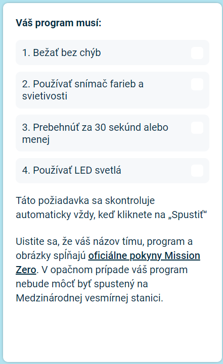

## Odoslanie príspevku

Teraz sa môžete zapojiť do výzvy [Astro Pi Mission Zero](https://astro-pi.org/mission-zero){:target="_blank"} pomocou kódu, ktorý ste napísali.

Existuje niekoľko pravidiel, ktoré musí váš kód dodržiavať, aby ste ho mohli odoslať na spustenie na Medzinárodnej vesmírnej stanici. Ak sa nimi váš kód riadi, pravidlá v spodnej časti **emulátora Sense HAT** sa po spustení programu rozsvietia nazeleno.

**Tip:** otestujte svoj kód pomocou niekoľkých rôznych nastavení farieb (pomocou nástroja na výber), aby ste sa uistili, že vždy funguje správne.

Uistite sa, že váš príspevok spĺňa [oficiálne pokyny](https://astro-pi.org/mission-zero/guidelines){:target="_blank"} pre Mission Zero. Ak váš príspevok nespĺňa pokyny, váš program nebude môcť bežať na Medzinárodnej vesmírnej stanici.

Do názvu alebo kódu tímu nezahŕňajte nič z nasledujúceho:

+ Čokoľvek, čo by sa dalo interpretovať ako nezákonné, politické alebo citlivé
+ Vlajky, keďže ich možno považovať za politicky citlivé
+ Čokoľvek, čo odkazuje na nepríjemnosti alebo ujmu inej osobe
+ Osobné údaje, ako sú telefónne čísla, sociálne médiá a e-mailové adresy
+ Obscénne obrázky
+ Špeciálne znaky alebo emotikony
+ Vulgárny jazyk alebo nadávky

--- task ---

Zadajte kód svojej triedy a názov tímu do poľa v spodnej časti – váš mentor vám povie, aký je váš kód.

**Poznámky pre mentorov** nájdete v kroku [Introduction](https://projects.raspberrypi.org/sk-SK/projects/astro-pi-mission-zero/0).

--- /task ---

--- task ---

Stlačením tlačidla **Pridať tím** zadajte svoj kód. Upozorňujeme, že po odoslaní už program nemožno zmeniť.

Váš mentor dostane e-mail na potvrdenie vášho vstupu.

--- /task ---

--- task ---

Ak chcete, môžete zdieľať odkaz na svoj kód na sociálnych médiách a povedať ľuďom, že kód, ktorý ste napísali, sa spustí vo vesmíre!

--- /task ---
