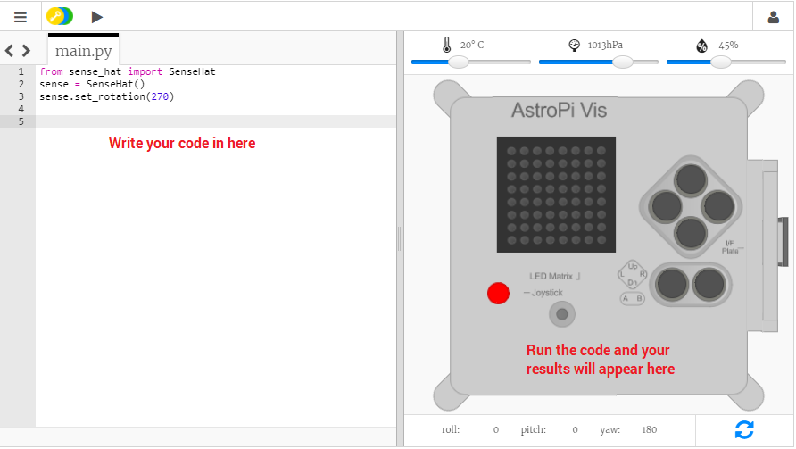

## Kaj je Astro Pi?

Astro Pi je računalnik Raspberry Pi z ohišjem, ki je bilo posebej zasnovano za razmere v vesolju. Ima tudi dodano ploščo, imenovano Sense HAT, izdelano posebej za misijo Astro Pi. Sense HAT ima krmilno palico, zaslon LED in senzorje za odčitavanje temperature, vlažnosti, tlaka in orientacije.

Tukaj je prava enota Astro Pi na Mednarodni vesoljski postaji, ki prikazuje kodo, ki so jo napisali učenci. Tukaj bo sčasoma zagnana tudi vaša koda! 

<iframe src="https://player.vimeo.com/video/172737314" width="640" height="360" frameborder="0" webkitallowfullscreen mozallowfullscreen allowfullscreen mark="crwd-mark"></iframe> 

Pri tej misiji boste uporabljali emulator Sense HAT. Emulator je del programske opreme, ki v vašem spletnem brskalniku simulira vse funkcije Astro Pi.

Obstaja nekaj razlik med pravim in emuliranim Sense HAT:

- Na emulatorju lahko s pomočjo drsnikov sami nastavite temperaturo, tlak in vlažnost, medtem ko pravi Sense HAT v računalniku Astro Pi za merjenje teh parametrov v svojem okolju uporablja senzorje.

- Z miško lahko kliknete in vlečete emuliran Sense HAT in ga s tem premikate in vrtite, s čimer simulirate spremembe v njegovi orientaciji; pravi Astro Pi in njegov Sense HAT se lahko premikata v resničnem svetu, orientacijski senzorji Sense HAT pa zaznajo, kdaj in kako se je računalnik premaknil.