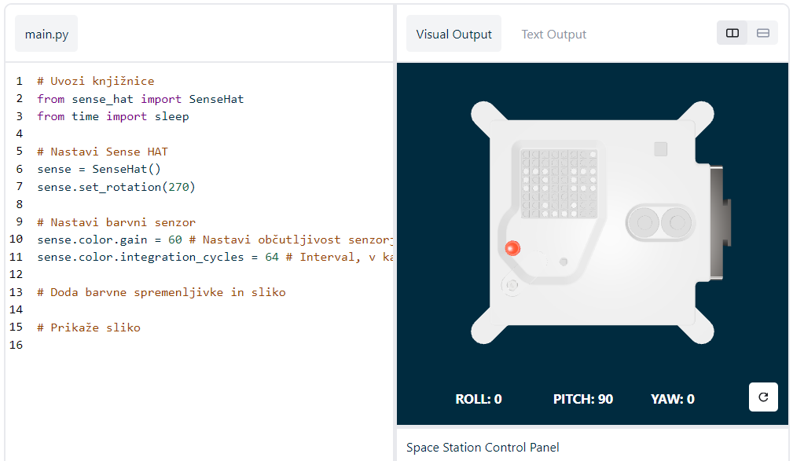

## Prikažite sporočilo

--- task ---

Odprite [emulator Sense HAT](https://trinket.io/mission-zero){:target="_blank"} za projekt Mission Zero.

Opazili boste, da so bile tri vrstice kode dodane samodejno:

```python
from sense_hat import SenseHat
sense = SenseHat()
sense.set_rotation(270)
```



Koda se poveže z računalnikom Astro Pi in poskrbi, da je zaslon LED računalnika Astro Pi prikazan pravilno. Kodo pustite, ker jo boste potrebovali.

--- /task ---

--- task ---

Morda bi lahko pozdravili astronavte na ISS, ki delajo v bližini računalnika Astro Pi? Na zaslonu bomo prikazali premikajoče se sporočilo.

Pod kodo dodajte to vrstico:

```python
sense.show_message("Astro Pi")
```

--- /task ---

--- task ---

Pritisnite gumb **Run** (Zaženi) in si oglejte, kako se sporočilo `Astro Pi` pomika po zaslonu LED.


--- /task ---

Da bi prikazali drugačno sporočilo, lahko med narekovaja (`""`) napišete kar koli drugega.

--- collapse ---
---
title: Katere znake lahko uporabite?
---

Emulator Sense HAT lahko prikaže le komplet znakov Latin 1, kar pomeni, da so na voljo le naslednji znaki. Vsi drugi znaki bodo prikazani kot `?`.

```
+-*/!"#$><0123456789.=)(

ABCDEFGHIJKLMNOPQRSTUVWXYZ

abcdefghijklmnopqrstuvwxyz

?,;:|@%[&_']\~
```

--- /collapse ---

--- task ---

Spremenite lahko tudi hitrost, s katero se sporočilo pomika po zaslonu. Obstoječi kodi dodajte `scroll_speed`, kot je prikazano spodaj:

```python
sense.show_message("Astro Pi", scroll_speed=0.05)
```

Privzeta hitrost sporočila je `0.1`. Če številko zmanjšate, se bo sporočilo pomikalo hitreje, če pa jo povečate, se bo sporočilo pomikalo počasneje.

--- /task ---

### Izberite ime za nove računalnike Astro Pi

--- task --- Računalnike Astro Pi bomo poimenovali po dveh navdihujočih evropskih znanstvenikih. Obstaja na stotine moških in žensk, ki so prispevali k znanosti in tehnologiji; Udeleženci lahko predlagajo svoja imena ali na našem seznamu predlogov izberejo:

[Ada Lovelace](https://en.wikipedia.org/wiki/Ada_Lovelace){:target="_blank"} 
[Alan Turing](https://en.wikipedia.org/wiki/Alan_Turing){:target="_blank"} 
[Caroline Herschel](https://en.wikipedia.org/wiki/Caroline_Herschel){:target="_blank"} 
[Edsger Dijkstra](https://en.wikipedia.org/wiki/Edsger_W._Dijkstra){:target="_blank"} 
[Hedy Lamarr](https://en.wikipedia.org/wiki/Hedy_Lamarr){:target="_blank"} 
[Hypatia](https://en.wikipedia.org/wiki/Hypatia){:target="_blank"} 
[John Edmonstone](https://en.wikipedia.org/wiki/John_Edmonstone){:target="_blank"} 
[Marie Curie](https://en.wikipedia.org/wiki/Marie_Curie){:target="_blank"} 
[Nikola Tesla](https://en.wikipedia.org/wiki/Nikola_Tesla){:target="_blank"} 
[Tycho Brahe](https://en.wikipedia.org/wiki/Tycho_Brahe){:target="_blank"}

Če želite glasovati, začnite svoje sporočilo z besedami "Moje ime naj bo". Če bi na primer želeli glasovati za Ado Lovelace, bi bila vaša koda videti tako:

```python
sense.show_message("My name should be Ada Lovelace")
```

Če želite glasovati, morate sporočilo nujno začeti s temi besedami, sicer vaš glas ne bo upoštevan.

--- /task ---


