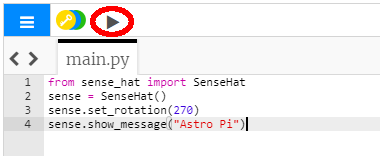

## Prikažite sporočilo

--- task ---

Odprite [emulator Sense HAT](https://trinket.io/mission-zero){:target="_blank"} za projekt Mission Zero.

Opazili boste, da so bile tri vrstice kode dodane samodejno:

```python
from sense_hat import SenseHat
sense = SenseHat()
sense.set_rotation(270)
```


Koda se poveže z računalnikom Astro Pi in poskrbi, da je zaslon LED računalnika Astro Pi prikazan pravilno. Kodo pustite, ker jo boste potrebovali.

--- /task ---

--- task ---

Morda bi lahko pozdravili astronavte na ISS, ki delajo v bližini računalnika Astro Pi? Na zaslonu bomo prikazali premikajoče se sporočilo.

Pod kodo dodajte to vrstico:

```python
sense.show_message("Astro Pi")
```

--- /task ---

--- task ---

Pritisnite gumb **Run** (Zaženi) in si oglejte, kako se sporočilo `Astro Pi` pomika po zaslonu LED.



--- /task ---


Da bi prikazali drugačno sporočilo, lahko med narekovaja (`""`) napišete kar koli drugega.

--- collapse ---
---
title: Katere znake lahko uporabite?
---
Emulator Sense HAT lahko prikaže le komplet znakov Latin 1, kar pomeni, da so na voljo le naslednji znaki. Vsi drugi znaki bodo prikazani kot `?`.

    +-*/!"#$><0123456789.=)(
    
    ABCDEFGHIJKLMNOPQRSTUVWXYZ
    
    abcdefghijklmnopqrstuvwxyz
    
    ?,;:|@%[&_']\~
    

--- /collapse ---

--- task ---

Spremenite lahko tudi hitrost, s katero se sporočilo pomika po zaslonu. Obstoječi kodi dodajte `scroll_speed`, kot je prikazano spodaj:

```python
sense.show_message("Astro Pi", scroll_speed=0.05)
```

Privzeta hitrost sporočila je `0.1`. Če številko zmanjšate, se bo sporočilo pomikalo hitreje, če pa jo povečate, se bo sporočilo pomikalo počasneje.

--- /task ---