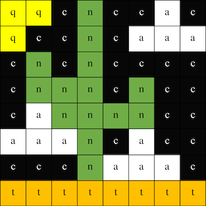

## Prikažite sliko

LED matrika računalnika Astro Pi lahko prikazuje barve. V tem koraku boste prikazali slike iz narave na LED matriki Astro Pi.

<p style="border-left: solid; border-width:10px; border-color: #0faeb0; background-color: aliceblue; padding: 10px;">
<span style="color: #0faeb0">**LED matrika**</span> je mreža LED diod, ki jih je mogoče nadzorovati posamično ali kot skupino za ustvarjanje različnih svetlobnih učinkov. Matrika LED na Sense HAT ima 64 LED, postavljenih v 8x8 mrežo. Te diode je mogoče programirati za ustvarjanje širokega spektra barv.
</p>


--- task ---

Odprite začetni projekt [Mission Zero](http://rpf.io/mzcode){:target="_blank"}.

Opazili boste, da je bilo nekaj vrstic kode dodanih samodejno.

Koda se poveže z računalnikom Astro Pi in poskrbi, da sta zaslon LED in senzor svetlobe računalnika Astro Pi nastavljena pravilno. Kodo pustite, ker jo boste potrebovali.

--- code ---
---
language: python filename: main.py line_numbers: false line_number_start: 1
line_highlights:
---
# Uvozi knjižnice
from sense_hat import SenseHat from time import sleep

# Nastavi Sense HAT
sense = SenseHat() sense.set_rotation(270)

# Nastavi barvni senzor
sense.color.gain = 60 # Set the sensitivity of the sensor sense.color.integration_cycles = 64 # The interval at which the reading will be taken

--- /code ---


--- /task ---

### RGB barve

Barve lahko ustvarite z različnimi razmerji rdeče, zelene in modre. O barvah RGB si lahko preberete tukaj:

[[[generic-theory-simple-colours]]]

LED matrika je 8x8 mreža. Vsako LED na mreži lahko nastavite na drugo barvo. Tukaj je seznam spremenljivk za 24 različnih barv. Vsaka barva ima vrednost za rdečo, zeleno in modro:

[[[ambient-colours]]]

### Izberi sliko

--- task ---

**Izberite:** Med spodnjimi možnostmi izberite sliko za prikaz. Python shrani informacije za sliko na seznam. Koda za vsako sliko v seznamu vsebuje uporabljene barvne spremenljivke.

Vso kodo za izbrano sliko boste morali **kopirati**, nato pa **jo prilepiti** v svoj projekt pod vrstico, ki pravi `# Dodaj barvne spremenljivke in sliko`.

--- collapse ---

---
title: Lisica
---


Ustvarila ekipa i_pupi, Italija

```python
c = (0, 0, 0) # Black
a = (255, 255, 255) # white
t = (255, 140, 0) # dark orange

image = [
t, a, t, c, c, t, a, t,
t, a, t, c, c, t, a, t,
t, t, t, t, t, t, t, t,
t, a, c, t, t, c, a, t,
t, t, t, t, t, t, t, t,
a, a, a, c, c, a, a, a,
c, a, a, a, a, a, a, c,
c, c, a, a, a, a, c, c]
```

--- /collapse ---


--- collapse ---

---
line_numbers: false
---


Ustvarila ekipa ILiFanT, Finska

```python
c = (0, 0, 0) # Black
b = (105, 105, 105) # dark grey
a = (255, 255, 255) # white

image = [
    c, c, c, c, c, c, c, c,
    c, b, b, b, c, c, c, c,
    c, b, c, b, c, c, b, b,
    c, b, c, c, c, b, b, b,
    c, b, b, c, c, b, c, b,
    c, b, b, b, b, b, b, b,
    c, c, b, b, a, b, b, b,
    c, c, c, c, a, b, b, b]
```

--- /collapse ---

--- collapse ---
---
title: Roža
---



Ustvarila ekipa 6TETHASI, Nizozemska

```python
a = (255, 255, 255) # White
c = (0, 0, 0) # Black
n = (154, 205, 50) # YellowGreen
q = (255, 255, 0) # Yellow
t = (255, 140, 0) # DarkOrange

image = [   
  q, q, c, n, c, c, a, c,
  q, c, c, n, c, a, a, a,
  c, n, c, n, c, c, c, c,
  c, n, n, n, c, n, c, c,
  c, a, n, n, n, n, c, c,
  a, a, a, n, c, a, a, a,
  c, c, c, n, a, a, a, c,
  t, t, t, t, t, t, t, t]

```

--- /collapse ---


--- collapse ---
---
title: Krokodil
---


```python

a = (255, 255, 255) # White
c = (0, 0, 0) # Black
f = (25, 25, 112) # MidnightBlue
m = (34, 139, 34) # ForestGreen

image = [
  m, m, m, m, m, c, c, c,
  m, f, m, f, m, m, m, m,
  m, m, m, m, m, m, m, m,
  m, m, c, a, c, c, c, a,
  m, m, c, c, c ,c ,c ,c,
  m, m, c, c, c, a, c, c,
  m, m, m, m, m, m, m, m,
  m, m, m, m, m, m, m, m]

```

--- /collapse ---

--- collapse ---
---
title: Rak
---


Ustvarila ekipa camrus_6, Združeno kraljestvo

```python

c = (100, 149, 237) # CornflowerBlue
a = (255, 255, 255) # White
v = (255, 0, 0) # Red
t = (255, 140, 0) # DarkOrange
q = (255, 255, 0) # Yellow
l = (0, 255, 127) # SpringGreen
e = (0, 0, 205) # MediumBlue

rainbow = [
  c, c, c, c, c, c, c, c, 
  v, v, v, v, c, c, c, c,
  t, t, t, t, v, v, c, c,
  q, q, q, q, t, v, c, c,
  l, l, l, l, q, t, v, c,
  e, e, e, l, q, t, v, c,
  c, c, e, a, a, a, a, c,
  c, a, a, a, a, a, a, a
]

```

--- /collapse ---

--- collapse ---
---
line_numbers: false
---


slika = [ c, a, a, c, a, a, c, c, c, a, c, c, a, c, c, c, c, v, c, c, v, c, c, c, c, v, c, c, v, c, c, c, v, v, v, v, v, c, v, v, v, v, c, c, v, v, v, c, v, v, v, v, v, c, v, v, v, c, v, c, v, c, c, c]

```python

b = (105, 105, 105) # DimGray
c = (0, 0, 0) # Black
d = (100, 149, 237) # CornflowerBlue
v = (255, 0, 0) # Red
z = (153, 50, 204) # DarkOrchid

image = [
    c, c, v, c, v, c, c, c,
    c, z, z, z, z, v, c, c,
    z, b, z, b, z, c, c, c,
    z, z, z, z, z, v, c, c,
    c, c, d, d, d, c, c, z,
    c, z, d, z, z, z, z, c,
    c, c, d, d, z, c, c, c,
    c, c, z, c, z, c, c, c]

```

--- /collapse ---

--- /task ---

--- task ---

**Poiščite:** vrstico, ki pravi `# Prikaži sliko` in dodajte vrstico kode za prikaz vaše slike na matriki LED:

```python
a = (255, 255, 255) # White
c = (0, 0, 0) # Black
f = (25, 25, 112) # MidnightBlue
m = (34, 139, 34) # ForestGreen

image = [
  m, m, m, m, m, c, c, c,
  m, f, m, f, m, m, m, m,
  m, m, m, m, m, m, m, m,
  m, m, c, a, c, c, c, a,
  m, m, c, c, c ,c ,c ,c,
  m, m, c, c, c, a, c, c,
  m, m, m, m, m, m, m, m,
  m, m, m, m, m, m, m, m]

# Display the image 
sense.set_pixels(image)

```

--- /task ---

--- task ---

Pritisnite **Zaženi (Run)** na dnu urejevalnika, da vidite svojo sliko prikazano na matriki LED.

--- /task ---

--- task ---

**Razhroščevanje**

Moja koda ima sintaktično napako:

- Preverite, ali se vaša koda ujema s kodo v zgornjih primerih
- Preverite, ali ste zamaknili kodo na seznamu
- Preverite, ali je vaš seznam obkrožen z `[` in `]`
- Preverite, ali je vsaka barvna spremenljivka na seznamu ločena z vejico

Moja slika se ne prikaže:

- Preverite, ali vaš `sense.set_pixels(slika)` ni zamaknjen

--- /task ---


--- task ---

**Shrani svoj napredek**

Zdaj, ko ste prikazali sliko, lahko shranite svoj program v projekt Mission Starter tako, da vnesete ime svoje ekipe, imena članov ekipe in kodo učilnice, ki ste jo prejeli. Svoj program lahko znova naložite v katero koli napravo z internetno povezavo, tako da vnesete ime ekipe in kodo učilnice.


--- /task --- 
