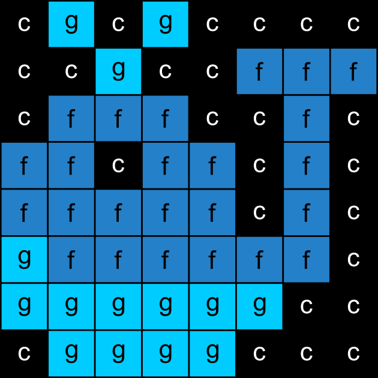
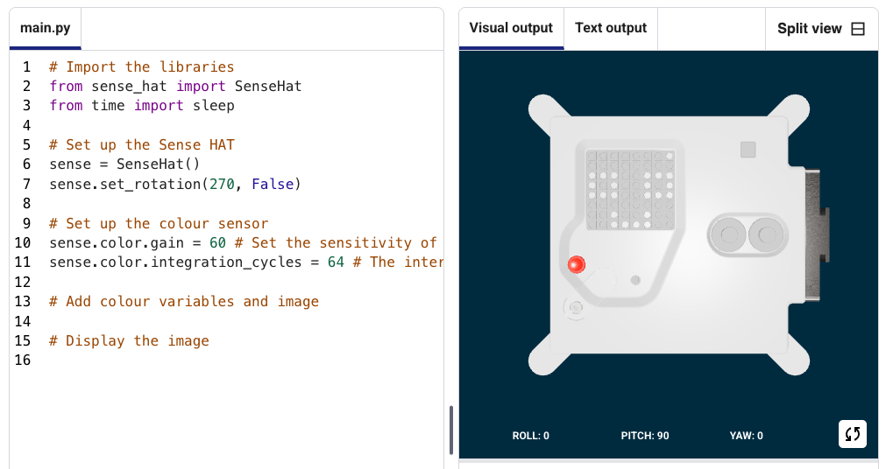

## Prikažite sliko

Slika, ki jo boste prikazali, bo sestavljena iz 64 barvnih kvadratkov, imenovanih **slikovnih pik (pikslov)**. Piksli so razporejeni v 8x8 mreži. Vsak piksel je lahko drugačne barve. Z natančno izbiro barv lahko ustvarite sliko. Tukaj je primer slike kita, ustvarjene iz različnih odtenkov modre na črnem ozadju.

<p style="border-left: solid; border-width:10px; border-color: #0faeb0; background-color: aliceblue; padding: 10px;">
<span style="color: #0faeb0">**LED matrika**</span> je mreža LED diod, ki jih je mogoče nadzorovati posamično ali kot skupino za ustvarjanje različnih svetlobnih učinkov. Matrika LED na Sense HAT ima 64 LED, postavljenih v 8x8 mrežo. Te diode je mogoče programirati za ustvarjanje širokega spektra barv.
</p>



Vsak kvadratek je označen s kodo, ki predstavlja določeno barvo. Na tej sliki so uporabljene tri barve:
+ c = črna
+ f = oceansko modra
+ g = nebesno modra


--- task ---

Odprite začetni projekt [Mission Zero](https://missions.astro-pi.org/mz/code_submissions/){:target="_blank"}.

Opazili boste, da je bilo nekaj vrstic kode dodanih samodejno.

Koda se poveže z računalnikom Astro Pi in poskrbi, da sta zaslon LED in senzor svetlobe računalnika Astro Pi nastavljena pravilno. Kodo pustite, ker jo boste potrebovali.

--- code ---
---
language: python filename: main.py line_numbers: false line_number_start: 1
line_highlights:
---
# Import the libraries
from sense_hat import SenseHat from time import sleep

# Set up the Sense HAT
sense = SenseHat() sense.set_rotation(270)

# Set up the colour sensor
sense.color.gain = 60 # Set the sensitivity of the sensor sense.color.integration_cycles = 64 # The interval at which the reading will be taken

--- /code ---



--- /task ---

### RGB barve

Barve lahko ustvarite z različnimi razmerji rdeče, zelene in modre. O barvah RGB si lahko preberete tukaj:


LED matrika je 8x8 mreža. Vsako LED na mreži lahko nastavite na drugo barvo. Črke od a do z lahko uporabimo kot imena spremenljivk, ki predstavljajo 24 različnih barv. Vsaka barva ima vrednost za rdečo, zeleno in modro.

--- collapse ---

---
title: Seznam barvnih spremenljivk
---


```python
a = (255, 255, 255) # White
b = (171, 171, 171) # Grey
c = (0, 0, 0)       # Black
d = (25, 25, 113)   # Navy Blue
e = (0, 0, 255)     # Pure Blue
f = (36, 128, 200)  # Ocean Blue
g = (0, 204, 255)   # Sky Blue
h = (86, 255, 255)  # Electric Cyan
j = (0, 255, 0)     # Pure Green
k = (46, 139, 33)   # Leaf Green
l = (57, 97, 17)    # Olive Green
m = (30, 65, 6)     # Forest Green
n = (126, 88, 25)   # Earth Brown
o = (179, 96, 65)   # Terracotta Brown
p = (180, 34, 34)   # Brick Red
q = (255, 0, 0)     # Pure Red
r = (232, 118, 5)   # Orange
s = (241, 231, 100) # Pale Yellow
t = (255, 255, 0)   # Pure Yellow
u = (255, 209, 209) # Pale Pink
v = (255, 177, 177) # Blush Pink
w = (249, 169, 255) # Light Pink
y = (248, 97, 255)  # Magenta
z = (220, 53, 232)  # Purple

```

--- /collapse ---

### Izberi sliko

--- task ---

**Izberite:** Med spodnjimi možnostmi izberite sliko za prikaz. Python shrani informacije za sliko na seznam. Koda za vsako sliko v seznamu vsebuje uporabljene barvne spremenljivke.

Vso kodo za izbrano sliko boste morali **kopirati**, nato pa **jo prilepiti** v svoj projekt pod vrstico, ki pravi `# Dodaj barvne spremenljivke in sliko`.

--- collapse ---

---
title: Kit
---


Ustvarila ekipa Naicom, Italija

```python
c = (0, 0, 0)       # Black
f = (36, 128, 200)  # Ocean Blue
g = (0, 204, 255)   # Sky Blue

image = [
c, g, c, g, c, c, c, c,
c, c, g, c, c, f, f, f,
c, f, f, f, c, c, f, a,
f, f, c, f, f, c, f, c,
f, f, f, f, f, c, f, c,
g, f, f, f, f, f, f, c,
g, g, g, g, g, g, c, c,
c, g, g, g, g, c, c, c]

```

--- /collapse ---


--- collapse ---

---
title: Limona
---


Ustvarila ekipa g4lemoni, Grčija

```python
c = (0, 0, 0)       # Black
k = (46, 139, 33)   # Leaf Green
t = (255, 255, 0)   # Pure Yellow

image = [
c, c, c, k, k, c, c, c,
c, c, k, c, k, c, c, c,
c, k, c, t, t, c, c, c,
c, c, t, t, t, t, c, c,
c, c, t, t, t, t, c, c,
c, c, t, t, t, t, c, c,
c, c, t, t, t, t, c, c,
c, c, c, t, t, c, c, c]

```

--- /collapse ---

--- collapse ---
---
title: Pujs
---


Ustvaril Gary, Združeno kraljestvo

```python
a = (255, 255, 255) # White
v = (255, 177, 177) # Blush Pink
y = (248, 97, 255)  # Magenta
o = (179, 96, 65)   # Terracotta Brown
c = (0, 0, 0)       # Black

image = [
a, a, y, a, a, y, a, a,
a, y, y, y, y, y, y, a,
a, y, c, y, c, y, y, y,
v, v, v, v, v, y, y, y,
v, o, v, o, v, y, y, y,
v, v, v, v, v, y, y, y,
a, y, y, y, y, y, y, y,
a, a, y, a, a, a, y, a]

```

--- /collapse ---


--- collapse ---
---
title: Nevihta
---


Ustvarila ekipa hop2p023, Španija

```python

c = (0, 0, 0)       # Black
f = (36, 128, 200)  # Ocean Blue
g = (0, 204, 255)   # Sky Blue
t = (255, 255, 0)   # Pure Yellow

image = [
c, c, c, c, c, c, c, c,
c, c, f, f, f, f, c, c,
c, f, f, f, f, f, f, c,
c, g, c, g, t, g, c, c,
c, c, c, t, t, c, c, c,
c, c, t, t, c, c, c, c,
c, c, g, c, c, c, c, g,
c, g, c, c, c, c, c, c]


```

--- /collapse ---

--- collapse ---
---
title: Raca
---


Ustvaril Peter, Irska

```python

c = (0, 0, 0) # Black
l = (57, 97, 17)    # Olive Green
m = (30, 65, 6)     # Forest Green
r = (232, 118, 5)   # Orange
a = (255, 255, 255) # White
b = (171, 171, 171) # Grey

image = [
c, l, l, c, c, c, c, c,
r, r, m, c, c, c, c, c,
c, l, l, c, c, c, c, c,
c, a, a, l, a, a, c, c,
c, l, l, a, a, a, b, a,
c, a, a, b, b, b, a, a,
c, c, a, a, a, a, c, c,
c, c, c, r, c, r, c, c]

```

--- /collapse ---

--- collapse ---
---
title: Frog
---


Created by team Jmeno, Czech Republic

```python

a = (255, 255, 255) # White
b = (171, 171, 171) # Grey
c = (0, 0, 0)       # Black
q = (255, 0, 0)     # Pure Red
j = (0, 255, 0)     # Pure Green
k = (46, 139, 33)   # Leaf Green
n = (126, 88, 25)   # Earth Brown

image = [
a, a, a, a, a, a, a, a,
a, a, a, a, a, b, a, b,
a, a, a, a, a, a, c, a,
a, a, c, a, c, a, q, a,
a, a, j, j, j, q, a, a,
a, j, j, k, q, a, a, a,
j, k, j, k, k, a, a, a,
k, k, k, j, k, n, n, n]

```

--- /collapse ---

--- collapse ---
---
title: Blossom Tree
---


Created by team Zssh14, Slovakia

```python

t = (255, 255, 0)   # Pure Yellow
g = (0, 204, 255)   # Sky Blue
w = (249, 169, 255) # Light Pink
y = (248, 97, 255)  # Magenta
z = (220, 53, 232)  # Purple
n = (126, 88, 25)   # Earth Brown
o = (179, 96, 65)   # Terracotta Brown
k = (46, 139, 33)   # Leaf Green

image =  [
t, g, g, w, w, y, g, g,
g, g, w, w, y, y, z, g,
g, w, y, z, y, z, z, z,
w, y, z, z, g, n, w, g,
g, g, o, o, n, w, y, z,
g, g, g, g, n, g, g, g,
g, g, g, o, n, n, g, g,
k, k, o, n, n, n, k, k]

```

--- /collapse ---

--- /task ---

--- task ---

**Poiščite** vrstico, ki pravi `# Prikaži sliko` in dodajte vrstico kode za prikaz vaše slike na matriki LED:

--- code ---
---
language: python filename: main.py line_numbers: false line_number_start: 1
line_highlights: 17, 18
---
c = (0, 0, 0)       # Black f = (36, 128, 200)  # Ocean Blue g = (0, 204, 255)   # Sky Blue

image = [ c, g, c, g, c, c, c, c, c, c, g, c, c, f, f, f, c, f, f, f, c, c, f, a, f, f, c, f, f, c, f, c, f, f, f, f, f, c, f, c, g, f, f, f, f, f, f, c, g, g, g, g, g, g, c, c, c, g, g, g, g, c, c, c]

# Prikažite sliko
sense.set_pixels(image)

--- /code ---

--- /task ---

--- task ---

Pritisnite **Zaženi (Run)** na dnu urejevalnika, da vidite svojo sliko prikazano na matriki LED.

--- /task ---

--- task ---

**Razhroščevanje**

Moja koda ima sintaktično napako:

- Preverite, ali se vaša koda ujema s kodo v zgornjih primerih
- Preverite, ali ste zamaknili kodo na seznamu
- Preverite, ali je vaš seznam obkrožen z `[` in `]`
- Preverite, ali je vsaka barvna spremenljivka na seznamu ločena z vejico

Moja slika se ne prikaže:

- Preverite, ali vaš `sense.set_pixels(slika)` ni zamaknjen

--- /task ---


--- task ---

**Shrani svoj napredek**

Zdaj, ko ste prikazali sliko, lahko shranite svoj program v projekt Mission Starter tako, da vnesete ime svoje ekipe, imena članov ekipe in kodo učilnice, ki ste jo prejeli. Svoj program lahko znova naložite v katero koli napravo z internetno povezavo, tako da vnesete ime ekipe in kodo učilnice.


--- /task --- 
