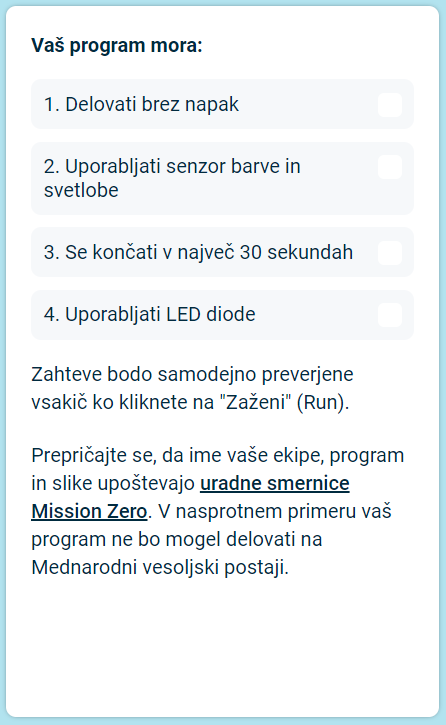

## Pošljite svoj prispevek

Zdaj lahko z uporabo kode, ki ste jo napisali, sodelujete v izzivu [Astro Pi Mission Zero](https://astro-pi.org/sl/mission-zero){:target="_blank"}.

Če želite, da bo prikazana na Mednarodni vesoljski postaji, morate pri pisanju kode upoštevati nekaj pravil. Če jih vaša koda upošteva, bodo pravila na dnu **Sense HAT emulatorja** ob zagonu programa zasvetila zeleno.

**Namig:** Preizkusite kodo z nekaj različnimi nastavitvami barve (z izbirnikom), da zagotovite, da vedno deluje pravilno.

Prepričajte se, da vaš program ustreza [uradnimim smernicam](https://astro-pi.org/sl/mission-zero/guidelines){:target="_blank"} za Mission Zero. V nasprotnem primeru vaš program ne bo mogel delovati na Mednarodni vesoljski postaji.

Prosimo, da v ime ali kodo svoje ekipe ne vključite ničesar od naslednjega:

+ Vse, kar bi si lahko razlagali kot nezakonito, politično ali občutljivo
+ Zastave, saj lahko veljajo za politično občutljive
+ Vse, kar bi lahko bilo neprijetno ali škodilo drugi osebi
+ Osebni podatki, kot so telefonske številke, naslovi družbenih medijev in e-poštni naslovi
+ Nespodobne slike
+ Posebni znaki ali emojiji
+ Nespodoben jezik ali preklinjanje

--- task ---

V polje na dnu vnesite kodo učilnice, ki vam jo bo sporočil vaš mentor, ter ime ekipe.

**Navodila za mentorje** najdete v koraku [Uvod](https://projects.raspberrypi.org/sl-SI/projects/astro-pi-mission-zero/0).

--- /task ---

--- task ---

Za pošiljanje svoje kode kliknite gumb **Dodajte svojo ekipo**. Ko je program oddan, ga ni več mogoče spremeniti.

Vaš učitelj bo prejel elektronsko sporočilo s potrdilom prejema vašega prispevka.

--- /task ---

--- task ---

Če želite, lahko povezavo do svoje kode delite na družbenih omrežjih in tako ljudem poveste, da bo vaša koda zagnana v vesolju!

--- /task ---
