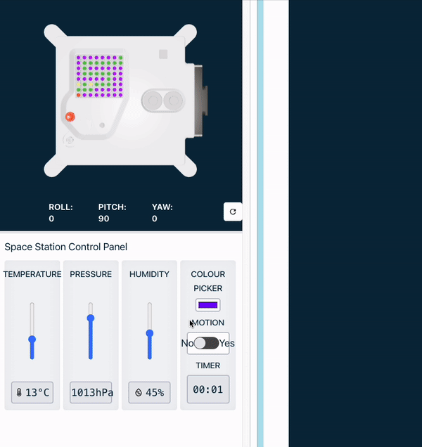

### Mission Zero 2023/24 har nu stängt.

Du kan fortfarande slutföra aktiviteten men kommer inte att kunna skicka in ditt program för att köra på ISS. Nästa omgång av utmaningen kommer att lanseras i september 2024. Kolla sociala medier och registrera dig för nyhetsbrevet på [Astro Pi-webbplatsen](https://astro-pi.org/mission-zero/) för uppdateringar.

Slutför det här projektet för att delta i Astro Pi Mission Zero-utmaningen och få din kod att köra i rymden på en Astro Pi-dator.

## Du kommer göra

Ditt projekt kommer att ställa in bakgrundsfärgen för en bild till den färg som Astro Pi upptäcker. Detta kommer att göra den internationella rymdstationen (ISS) mer färgstark för astronauterna ombord. Din kod kommer att använda färgljussensorn på den nya Mark II Astro Pi-datorns Sense HAT för att få detta att hända.

Här är ett exempel på den typ av program du kan göra för att köra på en Astro Pi i rymden.

### Kriterier för Astro Pi Mission Zero

Du kommer att använda Astro Pi-emulatorn i en webbläsare för att skapa ditt program. Du behöver ingen Astro Pi-dator.

### Kriterier för Astro Pi Mission Zero

**Om ditt projekt uppfyller [kvalificeringskriterierna](https://astro-pi.org/mission-zero/eligibility){:target="_blank"}**kommer ditt avslutade program att köras på den internationella rymdstationen! Du kommer också att få ett särskilt certifikat som visar exakt var ISS var när ditt program körde.

Du kommer att lära dig om Astro Pi enheten och hur man styr den, inklusive hur man:
+ Skapa färg **-variabler** att använda i din bild
+ Designa och visa en bild på Sense HAT
+ Känn ljusets färg ombord på ISS

--- collapse ---
---
title: Anteckningar för mentorer
---

Mission Zero är lämplig för nybörjare till programmering och/eller barn i grundskoleåldern och kan genomföras på en enda 60-minuters session på vilken dator som helst med internetuppkoppling. Ingen speciell hårdvara eller tidigare kodningskunskaper behövs. Allt kan göras i en webbläsare.

Organisera dina ungdomar i lag om en till fyra, och låt oss guida dem genom att skriva ett kort Python-program för att känna av färgen ombord på ISS och skapa en bild som använder den färgen.

Läs de [officiella riktlinjerna](https://astro-pi.org/mission-zero/guidelines){:target="_blank"} för Mission Zero.

--- /collapse ---

