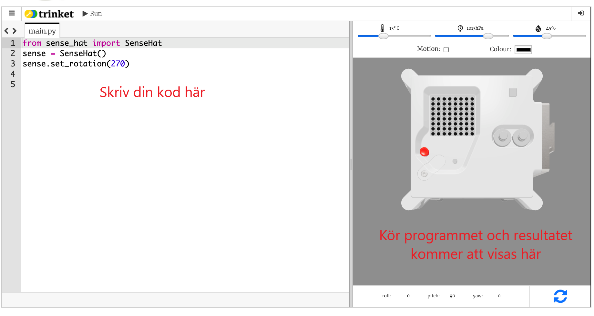

## Vad är en Astro Pi?

En Astro Pi är en Raspberry Pi-dator monterad i en särskilt utformad låda för förutsättningarna i rymden. Den har även ett tilläggskort som heter Sense HAT, som är särskilt utvecklat för Astro Pi-uppdraget. Sense HAT har en joystick, en LED-display och sensorer för inspelning av ljusförhållanden, temperatur, fukt, tryck och orientering.

Här är en ursprunglig Mark I Astro Pi-enhet på den internationella rymdstationen, som kör någon kod skriven av studenter. Din kod kommer så småningom att köras på en ny version av Astro Pi-datorer!

<iframe width="560" height="315" src="https://www.youtube.com/embed/4ykbAJeGPMM" frameborder="0" allow="accelerometer; autoplay; encrypted-media; gyroscope; picture-in-picture" allowfullscreen mark="crwd-mark"></iframe>>

För detta uppdrag kommer du att använda Sense HAT-emulatorn. Emulatorn är ett program som simulerar alla funktioner i Astro Pi i din webbläsare.

Det finns några skillnader mellan den verkliga och den emulerade Sense HAT:

- I emulatorn kan du ställa in temperaturen, trycket och luftfuktigheten själv genom att använda skjutreglage, medan den riktiga Sense HAT i Astro Pi använder sensorer för att mäta dessa parametrar i omgivningen.

- Du kan använda musen för att klicka och dra i Sense HAT-emulatorn för att flytta och rotera den, för att simulera ändringar i dess riktning. Den riktiga Astro Pi (och dess Sense HAT) kan flytta sig i den riktiga världen, och riktningssensorerna i Sense HAT detekterar när och hur den flyttades.
