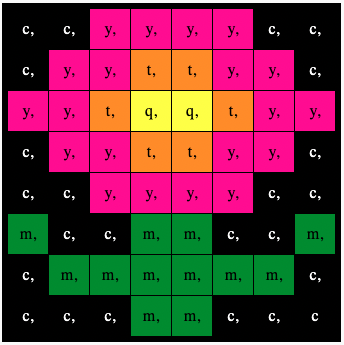

## Visa en bild

Astro Pis LED-matris kan visa färger. I det här steget kommer du att visa bilder från naturen på Astro Pis LED-matris.

En **LED-matris** är ett rutnät av lysdioder som kan styras individuellt eller som en grupp för att skapa olika ljuseffekter. LED-matrisen på Sense HAT har 64 lysdioder som visas i ett 8 x 8 rutnät. Lysdioderna kan programmeras för att producera ett brett spektrum av färger.

--- task ---

Öppna startprojektet [Mission Zero](http://rpf.io/mzcode){:target="_blank"}.

Du kommer att se att några rader kod har lagts till för dig automatiskt.

Den här koden ansluter till Astro Pi, ser till att Astro Pis LED-display visas på rätt sätt och ställer in färgsensorn. Lämna kvar koden där, för du kommer att behöva den.

--- code ---
---
language: python 
filename: main.py 
line_numbers: false 
line_number_start: 1
line_highlights:
---
# Importera biblioteken
from sense_hat import SenseHat 
from time import sleep

# Ställ in Sense HAT
sense = SenseHat() 
sense.set_rotation(270)

# Ställ in färgsensorn
sense.color.gain = 60 # Ställ in sensorns känslighet 
sense.color.integration_cycles = 64 # Intervallet med vilket avläsningen kommer att ske

--- /code ---

--- /task ---

### RGB-färger

Färger kan skapas med olika proportioner av rött, grönt och blått. Du kan läsa mer om RGB färger här:

[[[generic-theory-simple-colours]]]

LED-matrisen är ett 8 x 8 rutnät. Varje lysdiod på nätet kan ställas in på olika färger. Här är en lista med variabler för 24 olika färger. Varje färg har ett värde för rött, grönt och blått:

[[[ambient-colours]]]

### Välj en bild

--- task ---

**Välj:** Välj en bild att visa från alternativen nedan. Python lagrar informationen för en bild i en lista. Koden för varje bild inkluderar de färgvariabler som används och listan.

Du måste **kopiera** hela koden för din valda bild och sedan **klistra in** den i ditt projekt under raden som säger `# Lägg till färgvariabler och bild`.

--- collapse ---

---
title: Kyckling
---

--- code ---
---
language: python 
filename: main.py
line_numbers: false
---
a = (255, 255, 255) # Vit 
c = (0, 0, 0) # Svart 
e = (0, 0, 205) # MediumBlå 
q = (255, 255, 0) # Gul 
t = (255, 140, 0) # MörkOrange 
w = (255, 192, 203) # Rosa

bild = [
  c, c, c, q, q, q, c, c,
  c, c, t, q, e, q, c, c,
  c, c, c, q, q, q, c, c,
  c, w, w, w, w, w, w, c,
  c, w, a, a, a, a, w, c,
  c, w, a, a, a, a, w, c,
  c, c, w, a, a, w, c, c,
  c, c, c, w, w, c, c, c]

--- /code ---

--- /collapse ---

--- collapse ---

---
title: Blomma
---

--- code ---
---
language: python 
filename: main.py
line_numbers: false
---
c = (0, 0, 0) # Svart 
m = (34, 139, 34) # Skogsgrön 
q = (255, 255, 0) # Gul 
t = (255, 140, 0) # MörkOrange 
y = (255, 20, 147) # DeepPink

bild = [
  c, c, y, y, y, y, c, c,
  c, y, y, t, t, y, y, c,
  y, y, t, q, q, t, y, y,
  c, y, y, t, t, y, y, c,
  c, c, y, y, y, y, c, c,
  m, c, c, m, m, c, c, m,
  c, m, m, m, m, m, m, c,
  c, c, c, m, m, c, c, c]

--- /code ---

--- /collapse ---

--- collapse ---
---
title: Krabba
---

--- code ---
---
language: python 
filename: main.py
line_numbers: false
---
a = (255, 255, 255) # Vit 
c = (0, 0, 0) # Svart 
v = (255, 0, 0) # Röd

bild = [
  c, a, a, c, a, a, c, c,
  c, a, c, c, a, c, c, c,
  c, v, c, c, v, c, c, c,
  c, v, c, c, v, c, c, c,
  v, v, v, v, v, c, v, v,
  v, v, c, c, v, v, v, c,
  v, v, v, v, v, c, v, v,
  v, c, v, c, v, c, c, c]

--- /code ---

--- /collapse ---

--- collapse ---
---
title: Krokodil
---

--- code ---
---
language: python 
filename: main.py
line_numbers: false
---
a = (255, 255, 255) # Vit 
c = (0, 0, 0) # Svart 
f = (25, 25, 112) # Midnattsblå 
m = (34, 139, 34) # Skogsgrön

bild = [
  m, m, m, m, m, c, c, c,
  m, f, m, f, m, m, m, m,
  m, m, m, m, m, m, m, m,
  m, m, c, a, c, c, c, a,
  m, m, c, c, c ,c ,c ,c,
  m, m, c, c, c, a, c, c,
  m, m, m, m, m, m, m, m,
  m, m, m, m, m, m, m, m]

--- /code ---

--- /collapse ---

--- collapse ---
---
title: Orm
---

--- code ---
---
language: python 
filename: main.py
line_numbers: false
---
 c = (0, 0, 0) # Svart 
 m = (34, 139, 34) # Skogsgrön 
 q = (255, 255, 0) # Gul 
 v = (255, 0, 0) # Röd

bild = [
  c, c, c, c, c, c, c, m,
  c, m, m, m, m, m, m, m,
  c, m, c, c, c, c, c, c,
  c, m, m, m, m, m, c, c,
  c, c, c, c, c, m, c, c,
  q, m, q, m, m, m, c, c,
  m, m, m, c, c, c, c, c,
  v, c, c, c, c, c, c, c]

--- /code ---

--- /collapse ---

--- collapse ---
---
title: Groda
---

--- code ---
---
language: python 
filename: main.py 
line_numbers: false 
line_number_start:
line_highlights:
---
c = (0, 0, 0) # Svart 
m = (34, 139, 34) # Skogsgrön 
q = (255, 255, 0) # Gul 
v = (255, 0, 0) # Röd

bild = [
  c, m, m, m, c, m, m, m,
  c, m, q, m, c, m, q, m,
  m, m, m, m, m, m, m, m,
  m, v, v, v, v, v, v, v,
  m, m, m, m, m, m, m, m,
  m, m, m, m, m, m, m, m,
  m, m, m, m, m, m, m, m,
  m, m, c, m, m, m, c, m]

--- /code ---

--- /collapse ---

--- /task ---

--- task ---

**Hitta:** raden som säger `# Visa bilden` och lägg till en kodrad för att visa din bild på LED-matrisen:

--- code ---
---
language: python 
filename: main.py 
line_numbers: false 
line_number_start: 1
line_highlights: 12
---
bild = [
  c, c, c, q, q, q, c, c,
  c, c, t, q, e, q, c, c,
  c, c, c, q, q, q, c, c,
  c, w, w, w, w, w, w, c,
  c, w, a, a, a, a, w, c,
  c, w, a, a, a, a, w, c,
  c, c, w, a, a, w, c, c,
  c, c, c, w, w, c, c, c]

# Visa bilden
sense.set_pixels(bild)

--- /code ---

--- /task ---

--- task ---

Tryck på **Kör** längst ner i editorn för att se din bild visas på LED-matrisen.

--- /task ---

--- task ---

**Felsökning**

Min kod har ett syntaxfel:

- Kontrollera att din kod matchar koden i exemplen ovan
- Kontrollera att du har dragit in koden i din lista
- Kontrollera att din lista är omgiven av `[` och `]`
- Kontrollera att varje färgvariabel i listan är avgränsad med ett kommatecken

Min bild visas inte:

- Kontrollera att din `sense.set_pixels(bild)` inte är indragen

--- /task ---

