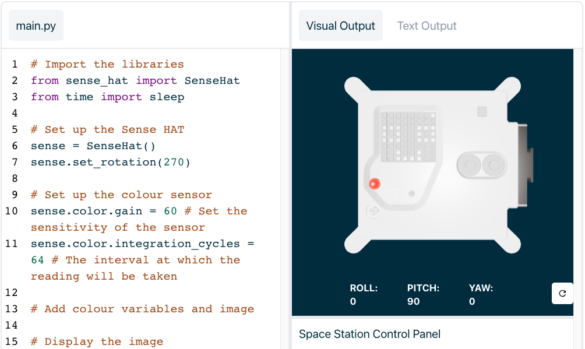

## Visa ett meddelande och välj ett namn för de nya Astro Pi -datorerna

--- task ---

Öppna [Sense HAT-emulatorn](https://trinket.io/mission-zero){:target="_blank"} för projektet Mission Zero.

Du kommer att se tre rader kod som har lagts till åt dig automatiskt:

```python
from sense_hat import SenseHat
sense = SenseHat()
sense.set_rotation(270)
```



Den här koden ansluter till Astro Pi och ser till att LED-displayen i Astro PI visas åt rätt håll. Lämna kvar koden där, för du kommer att behöva den.

--- /task ---

--- task ---

Du kanske kan skicka en trevlig hälsning till astronauterna på ISS som arbetar i närheten av Astro Pi? Låt oss rulla meddelandet över displayen.

Lägg till den här raden under de andra kodraderna:

```python
sense.show_message("Astro Pi")
```

--- /task ---

--- task ---

Tryck på knappen **Run** (Kör) och se meddelandet `Astro Pi` rullar över LED-displayen.


--- /task ---


För att visa ett annat meddelande, kan du skriva vad du vill mellan citationstecknen (`""`).

--- collapse ---

---
title: Vilka tecken går att använda?
---

Sense HAT kan bara visa teckenuppsättningen Latin 1, vilket betyder att endast följande tecken är tillgängliga. Övriga tecken kommer att visas som ett `?`.

```
+-*/!"#$><0123456789.=)(

ABCDEFGHIJKLMNOPQRSTUVWXYZ

abcdefghijklmnopqrstuvwxyz

?,;:|@%[&_']\~
```

--- /collapse ---

--- task ---

Du kan också ändra hastigheten på meddelandet som rullar över skärmen. Lägg till `scroll_speed` på raden i den kod som du redan har skrivit, så här:

```python
sense.show_message("Astro Pi", scroll_speed=0.05)
```

Meddelandets standardhastighet är ` 0.1 `. Om du väljer ett mindre tal rullar meddelandet snabbare och väljer du ett större gör det att meddelandet rullar långsammare.

--- /task ---

### Välj ett namn för de nya Astro Pi-datorerna

--- task --- Vi kommer att namnge Astro Pi-datorerna efter två inspirerande europeiska forskare. Det finns hundratals män och kvinnor som har bidragit till vetenskap och teknik, och deltagarna kan föreslå sina egna namn eller välja från vår lista med förslag:


[Ada Lovelace](https://en.wikipedia.org/wiki/Ada_Lovelace){:target="_blank"} 
[Alan Turing](https://en.wikipedia.org/wiki/Alan_Turing){:target="_blank"} 
[Caroline Herschel](https://en.wikipedia.org/wiki/Caroline_Herschel){:target="_blank"} 
[Edsgar Dijkstra](https://en.wikipedia.org/wiki/Edsger_W._Dijkstra){:target="_blank"} 
[Hedy Lamarr](https://en.wikipedia.org/wiki/Hedy_Lamarr){:target="_blank"} 
[Hypatia](https://en.wikipedia.org/wiki/Hypatia){:target="_blank"} 
[John Edmonstone](https://en.wikipedia.org/wiki/John_Edmonstone){:target="_blank"} 
[Marie Curie](https://en.wikipedia.org/wiki/Marie_Curie){:target="_blank"} 
[Nikola Tesla](https://en.wikipedia.org/wiki/Nikola_Tesla){:target="_blank"} 
[Tycho Brahe](https://en.wikipedia.org/wiki/Tycho_Brahe){:target="_blank"}

För att rösta, börja ditt meddelande med orden "Mitt namn borde vara". Om du till exempel vill rösta på Ada Lovelace skulle din kod se ut så här:

```python
sense.show_message("My name should be Ada Lovelace")
```

Om du vill rösta måste ditt meddelande ** börja med dessa ord, annars kommer vi inte automatiskt att kunna räkna ditt bidrag.

--- /task ---


