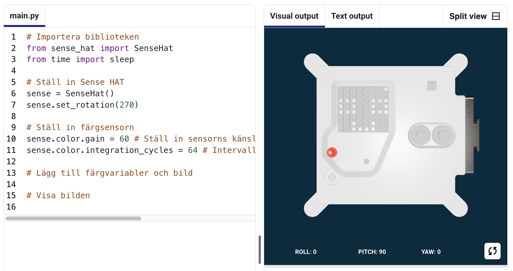

## Visa en bild

Bilden du visar kommer att bestå av 64 färgade rutor som kallas **pixlar**. Pixlarna är arrangerade i ett 8 x 8 rutnät. Varje pixel kan ha en olika färg. Genom att noggrant välja färgerna kan du skapa en bild. Här är ett exempel på en val gjord med olika nyanser av blått mot svart bakgrund.

<p style="border-left: solid; border-width:10px; border-color: #0faeb0; background-color: aliceblue; padding: 10px;">
En <span style="color: #0faeb0">**LED-matris**</span> är ett rutnät av lysdioder som kan styras individuellt eller som en grupp för att skapa olika ljuseffekter. LED-matrisen på Sense HAT har 64 lysdioder som visas i ett 8 x 8 rutnät. Lysdioderna kan programmeras för att producera ett brett spektrum av färger.
</p>


Observera att varje ruta är märkt med en kod som representerar en viss färg. I den här bilden används 3 färger:
+ c = Svart
+ f = Havsblå
+ g = Himmelsblå


--- task ---

Öppna [startprojektet Mission Zero](https://missions.astro-pi.org/sv/mz/code_submissions/){:target="_blank"}.

Du kommer att se att några rader kod har lagts till för dig automatiskt.

Den här koden ansluter till Astro Pi, ser till att Astro Pis LED-display visas på rätt sätt och ställer in färgsensorn. Lämna kvar koden där, för du kommer att behöva den.

--- code ---
---
language: python
filename: main.py
line_numbers: false
line_number_start: 1
line_highlights: 
---
# Importera biblioteken
from sense_hat import SenseHat
from time import sleep

# Ställ in Sense HAT
sense = SenseHat()
sense.set_rotation(270)

# Ställ in färgsensorn
sense.color.gain = 60 # Ställ in sensorns känslighet
sense.color.integration_cycles = 64 # Intervallet med vilket avläsningen kommer att ske

--- /code ---



--- /task ---

### RGB-färger

Färger kan skapas med olika proportioner av rött, grönt och blått. Du kan läsa mer om RGB färger här:


LED-matrisen är ett 8 x 8 rutnät. Varje lysdiod på nätet kan ställas in på olika färger. Vi kan använda bokstäverna a till z som namn på variabler för att representera 24 olika färger. Varje färg har ett värde för rött, grönt och blått.

--- collapse ---

---
title: Lista över färgvariabler
---


```python
a = (255, 255, 255) # Vit
b = (171, 171, 171) # Grå
c = (0, 0, 0) # Svart
d = (25, 25, 113) # Marinblå
e = (0, 0, 255) # Ren blå
f = (36, 128, 200) # Havsblå
g = (0, 204, 255) # Himmelsblå
h = (86, 255, 255) # Elektrisk cyan
j = (0, 255, 0) # Ren grön
k = (46, 139, 33) # Bladgrön
l = (57, 97, 17) # Olivgrön
m = (30, 65, 6) # Skogsgrön
n = (126, 88, 25) # Jordbrun
o = (179, 96, 65) # Terrakottabrun
p = (180, 34, 34) # Tegelröd
q = (255, 0, 0) # Ren röd
r = (232, 118, 5) # Orange
s = (241, 231, 100) # Ljusgul
t = (255, 255, 0) # Ren gul
u = (255, 209, 209) # Ljusrosa
v = (255, 177, 177) # Rosig rosa
w = (249, 169, 255) # Ljusrosa
y = (248, 97, 255) # Magenta
z = (220, 53, 232) # Lila

```

--- /collapse ---

### Välj en bild

--- task ---

**Välj:** Välj en bild att visa från alternativen nedan. Python lagrar informationen för en bild i en lista. Koden för varje bild inkluderar de färgvariabler som används och listan.

Du måste **kopiera** hela koden för din valda bild och sedan **klistra in** den i ditt projekt under raden som säger `# Lägg till färgvariabler och bild`.

--- collapse ---

---
title: Val
---


Skapad av Team Naicom, Italien

```python
c = (0, 0, 0)       # Svart
f = (36, 128, 200)  # Havsblå
g = (0, 204, 255)   # Himmelsblå

bild = [
c, g, c, g, c, c, c, c,
c, c, g, c, c, f, f, f,
c, f, f, f, c, c, f, a,
f, f, c, f, f, c, f, c,
f, f, f, f, f, c, f, c,
g, f, f, f, f, f, f, c,
g, g, g, g, g, g, c, c,
c, g, g, g, g, c, c, c]

```

--- /collapse ---


--- collapse ---

---
title: Citron
---


Skapad av team g4lemoni, Grekland

```python
c = (0, 0, 0)       # Svart
k = (46, 139, 33)   # Bladgrön
t = (255, 255, 0)   # Ren gul

bild = [
c, c, c, k, k, c, c, c,
c, c, k, c, k, c, c, c,
c, k, c, t, t, c, c, c,
c, c, t, t, t, t, c, c,
c, c, t, t, t, t, c, c,
c, c, t, t, t, t, c, c,
c, c, t, t, t, t, c, c,
c, c, c, t, t, c, c, c]

```

--- /collapse ---

--- collapse ---
---
title: Gris
---


Skapad av Gary, Storbritannien

```python
a = (255, 255, 255) # Vit
v = (255, 177, 177) # Rosig rosa
y = (248, 97, 255)  # Magenta
o = (179, 96, 65)   # Terrakottabrun
c = (0, 0, 0)       # Svart

bild = [
a, a, y, a, a, y, a, a,
a, y, y, y, y, y, y, a,
a, y, c, y, c, y, y, y,
v, v, v, v, v, y, y, y,
v, o, v, o, v, y, y, y,
v, v, v, v, v, y, y, y,
a, y, y, y, y, y, y, y,
a, a, y, a, a, a, y, a]

```

--- /collapse ---


--- collapse ---
---
title: Storm
---


Skapad av team hop2p023, Spanien

```python

c = (0, 0, 0)       # Svart
f = (36, 128, 200)  # Havsblå
g = (0, 204, 255)   # Himmelsblå
t = (255, 255, 0)   # Ren gul

bild = [
c, c, c, c, c, c, c, c,
c, c, f, f, f, f, c, c,
c, f, f, f, f, f, f, c,
c, g, c, g, t, g, c, c,
c, c, c, t, t, c, c, c,
c, c, t, t, c, c, c, c,
c, c, g, c, c, c, c, g,
c, g, c, c, c, c, c, c]


```

--- /collapse ---

--- collapse ---
---
title: Anka
---


Skapad av Peter, Irland

```python

c = (0, 0, 0) # Svart
l = (57, 97, 17)    # Olivgrön
m = (30, 65, 6)     # Skogsgrön
r = (232, 118, 5)   # Orange
a = (255, 255, 255) # Vit
b = (171, 171, 171) # Grå

bild = [
c, l, l, c, c, c, c, c,
r, r, m, c, c, c, c, c,
c, l, l, c, c, c, c, c,
c, a, a, l, a, a, c, c,
c, l, l, a, a, a, b, a,
c, a, a, b, b, b, a, a,
c, c, a, a, a, a, c, c,
c, c, c, r, c, r, c, c]

```

--- /collapse ---

--- collapse ---
---
title: Groda
---


Skapad av team Jmeno, Tjeckien

```python

a = (255, 255, 255) # Vit
b = (171, 171, 171) # Grå
c = (0, 0, 0)       # Svart
q = (255, 0, 0)     # Ren röd
j = (0, 255, 0)     # Ren grön
k = (46, 139, 33)   # Bladgrön
n = (126, 88, 25)   # Jordbrun

bild = [
a, a, a, a, a, a, a, a,
a, a, a, a, a, b, a, b,
a, a, a, a, a, a, c, a,
a, a, c, a, c, a, q, a,
a, a, j, j, j, q, a, a,
a, j, j, k, q, a, a, a,
j, k, j, k, k, a, a, a,
k, k, k, j, k, n, n, n]

```

--- /collapse ---

--- collapse ---
---
title: Blomstrande träd
---


Skapad av team Zssh14, Slovakien

```python

t = (255, 255, 0)   # Ren gul
g = (0, 204, 255)   # Himmelsblå
w = (249, 169, 255) # Ljusrosa
y = (248, 97, 255)  # Magenta
z = (220, 53, 232)  # Lila
n = (126, 88, 25)   # Jordbrun
o = (179, 96, 65)   # Terrakottabrun
k = (46, 139, 33)   # Bladgrön

image =  [
t, g, g, w, w, y, g, g,
g, g, w, w, y, y, z, g,
g, w, y, z, y, z, z, z,
w, y, z, z, g, n, w, g,
g, g, o, o, n, w, y, z,
g, g, g, g, n, g, g, g,
g, g, g, o, n, n, g, g,
k, k, o, n, n, n, k, k]

```

--- /collapse ---

--- /task ---

--- task ---

**Hitta:** den linje som säger `# Visa bilden` och lägg till en rad kod för att visa din bild på LED-matrisen:

--- code ---
---
language: python
filename: main.py
line_numbers: false
line_number_start: 1
line_highlights: 17, 18
---
c = (0, 0, 0)       # Svart
f = (36, 128, 200)  # Havsblå
g = (0, 204, 255)   # Himmelsblå

bild = [
c, g, c, g, c, c, c, c,
c, c, g, c, c, f, f, f,
c, f, f, f, c, c, f, a,
f, f, c, f, f, c, f, c,
f, f, f, f, f, c, f, c,
g, f, f, f, f, f, f, c,
g, g, g, g, g, g, c, c,
c, g, g, g, g, c, c, c]

# Visa bilden
sense.set_pixels(bild)

--- /code ---

--- /task ---

--- task ---

Tryck på **Kör** längst ner i editorn för att se din bild visas på LED-matrisen.

--- /task ---

--- task ---

**Felsökning**

Min kod har ett syntaxfel:

- Kontrollera att din kod matchar koden i exemplen ovan
- Kontrollera att du har dragit in koden i din lista
- Kontrollera att din lista är omgiven av `[` och `]`
- Kontrollera att varje färgvariabel i listan är avgränsad med ett kommatecken

Min bild visas inte:

- Kontrollera att din `sense.set_pixels(bild)` inte är indragen

--- /task ---


--- task ---

**Spara dina framsteg**

Nu när du har visat en bild kan du spara ditt program i Mission Starter-projektet genom att ange ditt teamnamn, teammedlemmarnas namn och klassrumskoden som du fått. Du kan ladda om programmet på vilken enhet som helst med en internetanslutning genom att ange teamets namn och klassrumskod.


--- /task --- 
