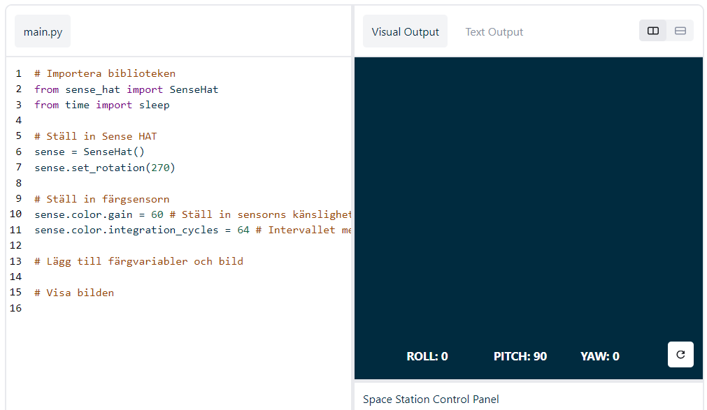

## Visa en bild

Astro Pis LED-matris kan visa färger. I det här steget kommer du att visa bilder från naturen på Astro Pis LED-matris.

<p style="border-left: solid; border-width:10px; border-color: #0faeb0; background-color: aliceblue; padding: 10px;">
En <span style="color: #0faeb0">**LED-matris**</span> är ett rutnät av lysdioder som kan styras individuellt eller som en grupp för att skapa olika ljuseffekter. LED-matrisen på Sense HAT har 64 lysdioder som visas i ett 8 x 8 rutnät. Lysdioderna kan programmeras för att producera ett brett spektrum av färger.
</p>


--- task ---

Öppna [startprojektet Mission Zero](https://missions.astro-pi.org/sv/mz/code_submissions/){:target="_blank"}.

Du kommer att se att några rader kod har lagts till för dig automatiskt.

Den här koden ansluter till Astro Pi, ser till att Astro Pis LED-display visas på rätt sätt och ställer in färgsensorn. Lämna kvar koden där, för du kommer att behöva den.

--- code ---
---
language: python 
filename: main.py 
line_numbers: false 
line_number_start: 1
line_highlights:
---
# Importera biblioteken
from sense_hat import SenseHat 
from time import sleep

# Ställ in Sense HAT
sense = SenseHat() 
sense.set_rotation(270)

# Ställ in färgsensorn
sense.color.gain = 60 # Ställ in sensorns känslighet 
sense.color.integration_cycles = 64 # Intervallet med vilket avläsningen kommer att ske

--- /code ---



--- /task ---

### RGB-färger

Färger kan skapas med olika proportioner av rött, grönt och blått. Du kan läsa mer om RGB färger här:

[[[generic-theory-simple-colours]]]

LED-matrisen är ett 8 x 8 rutnät. Varje lysdiod på nätet kan ställas in på olika färger. Här är en lista med variabler för 24 olika färger. Varje färg har ett värde för rött, grönt och blått:

[[[ambient-colours]]]

### Välj en bild

--- task ---

**Välj:** Välj en bild att visa från alternativen nedan. Python lagrar informationen för en bild i en lista. Koden för varje bild inkluderar de färgvariabler som används och listan.

Du måste **kopiera** hela koden för din valda bild och sedan **klistra in** den i ditt projekt under raden som säger `# Lägg till färgvariabler och bild`.

--- collapse ---

---
title: Räv
---


Skapad av team i_pupi, Italien

```python
c = (0, 0, 0) # Svart
a = (255, 255, 255) # Vit
t = (255, 140, 0) # Mörkorange

bild = [
t, a, t, c, c, t, a, t,
t, a, t, c, c, t, a, t,
t, t, t, t, t, t, t, t,
t, a, c, t, t, c, a, t,
t, t, t, t, t, t, t, t,
a, a, a, c, c, a, a, a,
c, a, a, a, a, a, a, c,
c, c, a, a, a, a, c, c]
```

--- /collapse ---

--- collapse ---

---
title: Elefant
---


Skapad av team ILiFanT, Finland

```python
c = (0, 0, 0) # Svart
b = (105, 105, 105) # Mörkgrå
a = (255, 255, 255) # Vit

bild = [
    c, c, c, c, c, c, c, c,
    c, b, b, b, c, c, c, c,
    c, b, c, b, c, c, b, b,
    c, b, c, c, c, b, b, b,
    c, b, b, c, c, b, c, b,
    c, b, b, b, b, b, b, b,
    c, c, b, b, a, b, b, b,
    c, c, c, c, a, b, b, b]
```

--- /collapse ---

--- collapse ---
---
title: Kaktus
---


Skapad av team 6TETHASI, Nederländerna

```python
a = (255, 255, 255) # Vit
c = (0, 0, 0) # Svart
n = (154, 205, 50) # Gulgrön
q = (255, 255, 0) # Gul
t = (255, 140, 0) # Mörkorange

bild = [   
  q, q, c, n, c, c, a, c,
  q, c, c, n, c, a, a, a,
  c, n, c, n, c, c, c, c,
  c, n, n, n, c, n, c, c,
  c, a, n, n, n, n, c, c,
  a, a, a, n, c, a, a, a,
  c, c, c, n, a, a, a, c,
  t, t, t, t, t, t, t, t]

```

--- /collapse ---


--- collapse ---
---
title: Krokodil
---


```python

a = (255, 255, 255) # Vit
c = (0, 0, 0) # Svart
f = (25, 25, 112) # Midnattsblå
m = (34, 139, 34) # Skogsgrön

bild = [
  m, m, m, m, m, c, c, c,
  m, f, m, f, m, m, m, m,
  m, m, m, m, m, m, m, m,
  m, m, c, a, c, c, c, a,
  m, m, c, c, c ,c ,c ,c,
  m, m, c, c, c, a, c, c,
  m, m, m, m, m, m, m, m,
  m, m, m, m, m, m, m, m]

```


--- /collapse ---

--- collapse ---
---
title: Regnbåge
---


Skapad av team camrus_6, Storbritannien

```python

c = (100, 149, 237) # Blåklintblå
a = (255, 255, 255) # Vit
v = (255, 0, 0) # Röd
t = (255, 140, 0) # Mörkorange
q = (255, 255, 0) # Gul
l = (0, 255, 127) # Vårgrön
e = (0, 0, 205) # Mediumblå

regnbage = [
  c, c, c, c, c, c, c, c, 
  v, v, v, v, c, c, c, c,
  t, t, t, t, v, v, c, c,
  q, q, q, q, t, v, c, c,
  l, l, l, l, q, t, v, c,
  e, e, e, l, q, t, v, c,
  c, c, e, a, a, a, a, c,
  c, a, a, a, a, a, a, a
]

```

--- /collapse ---

--- collapse ---
---
title: Drake
---


Skapat av team hwplucyr, Storbritannien

```python

b = (105, 105, 105) # Dimgrå
c = (0, 0, 0) # Svart
d = (100, 149, 237) # Blåklintblå
v = (255, 0, 0) # Röd
z = (153, 50, 204) # Mörkorkidé

bild = [
    c, c, v, c, v, c, c, c,
    c, z, z, z, z, v, c, c,
    z, b, z, b, z, c, c, c,
    z, z, z, z, z, v, c, c,
    c, c, d, d, d, c, c, z,
    c, z, d, z, z, z, z, c,
    c, c, d, d, z, c, c, c,
    c, c, z, c, z, c, c, c]

```

--- /collapse ---

--- /task ---

--- task ---

**Hitta:** raden som säger `# Visa bilden` och lägg till en kodrad för att visa din bild på LED-matrisen:

```python
a = (255, 255, 255) # Vit
c = (0, 0, 0) # Svart
f = (25, 25, 112) # Midnattsblå
m = (34, 139, 34) # Skogsgrön

bild = [
  m, m, m, m, m, c, c, c,
  m, f, m, f, m, m, m, m,
  m, m, m, m, m, m, m, m,
  m, m, c, a, c, c, c, a,
  m, m, c, c, c ,c ,c ,c,
  m, m, c, c, c, a, c, c,
  m, m, m, m, m, m, m, m,
  m, m, m, m, m, m, m, m]

# Visa bilden
sense.set_pixels(bild)

```

--- /task ---

--- task ---

Tryck på **Run** längst ner i editorn för att se din bild visas på LED-matrisen.

--- /task ---

--- task ---

**Felsökning**

Min kod har ett syntaxfel:

- Kontrollera att din kod matchar koden i exemplen ovan
- Kontrollera att du har dragit in koden i din lista
- Kontrollera att din lista är omgiven av `[` och `]`
- Kontrollera att varje färgvariabel i listan är avgränsad med ett kommatecken

Min bild visas inte:

- Kontrollera att din `sense.set_pixels(bild)` inte är indragen

--- /task ---


--- task ---

**Spara dina framsteg**

Nu när du har visat en bild kan du spara ditt program i Mission Starter-projektet genom att ange ditt teamnamn, teammedlemmarnas namn och klassrumskoden som du fått. Du kan ladda om programmet på vilken enhet som helst med en internetanslutning genom att ange teamets namn och klassrumskod.


--- /task --- 
