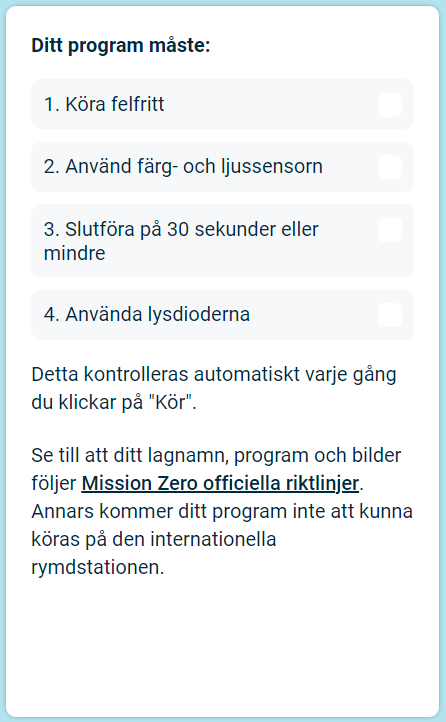

## Skicka ditt bidrag

Du kan nu gå in i [Astro Pi Mission Zero](https://astro-pi.org/mission-zero){:target="_blank"}-utmaningen med koden du har skrivit.

Det finns några regler som din kod måste följa för att du ska kunna skicka den så att den körs på den internationella rymdstationen. Om din kod följer dem kommer reglerna längst ner i **Sense HAT-emulator** att lysa grönt när du kör programmet.

**Tips:** Testa din kod med några olika färginställningar (med väljaren) för att se till att den alltid fungerar korrekt.

Se till att ditt bidrag följer de [officiella riktlinjerna](https://astro-pi.org/mission-zero/guidelines){:target="_blank"} för Mission Zero. Om det inte följer riktlinjerna kommer ditt program inte att kunna köras på den internationella rymdstationen.

Vänligen inkludera inte något av följande i ditt lagnamn eller kod:

+ Allt som kan tolkas som olagligt, politiskt eller känsligt
+ Flaggor, eftersom de kan anses vara politiskt känsliga
+ Allt som hänvisar till obehag eller skada på en annan person
+ Personuppgifter såsom telefonnummer, användarnamn till sociala medier och e-postadresser
+ Obscena bilder
+ Specialtecken eller emojis
+ Dåligt språk eller svordomar

--- task ---

Ange din klassrumskod och lagnamn i rutan längst ner - din mentor kommer att berätta vad din kod är.

**Noteringar för lärare och mentorer** finns i steget [Introduktion](https://projects.raspberrypi.org/en/projects/astro-pi-mission-zero/0).

--- /task ---

--- task ---

Tryck på knappen **Lägg till ditt lag** för att ange din kod. Observera att ett program inte kan ändras när det väl har skickats in.

Din mentor kommer att få ett e-postmeddelande för att bekräfta din anmälan.

--- /task ---

--- task ---

Om du vill kan du dela länken till din kod på sociala medier för att berätta för människor att den kod som du skrev kommer att köras i rymden!

--- /task ---
