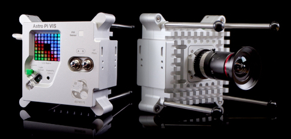

## Wat is een Astro Pi?

Een Astro Pi is een Raspberry Pi-computer in een behuizing die speciaal ontworpen werd voor de omstandigheden in de ruimte.

Bij een Astro Pi-computers zitten er een aantal sensoren en gadgets die gebruikt kunnen worden om geweldige wetenschappelijke experimenten uit te voeren. Deze set sensoren heet een 'Sense HAT' (dat staat voor 'Hardware Attached on Top'). De Sense HAT biedt de Astro Pi de mogelijkheid om te 'voelen' en vele verschillende metingen te doen, van temperatuur tot beweging en om informatie te delen door gebruik te maken van een LED matrix-scherm van 8 x 8. The Astro Pi's hebben ook een joystick en knoppen, net als een spelconsole!

{:breedte="400px"}

Voor deze missie zal je de Sense HAT-emulator gebruiken die de belangrijkste funcite van de Astro Pi in je webbrowser zal simuleren.

