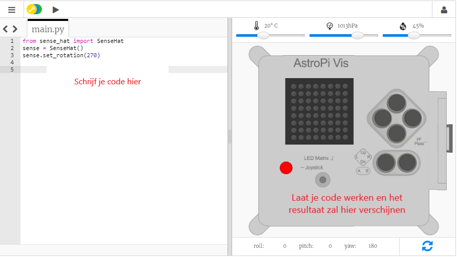

## Wat is een Astro Pi?

Een Astro Pi is een Raspberry Pi-computer in een behuizing die speciaal ontworpen werd voor de omstandigheden in de ruimte. Het heeft ook een toegevoegd bord, genaamd Sense HAT, speciaal ontworpen voor de Astro Pi-missie. De Sense HAT heeft een joystick, een LED-scherm en sensors voor het registreren van licht, temperatuur, vochtigheid, druk en oriëntatie.

Dit is een originele Mark I Astro Pi op het internationaal ruimtestation, waarop wat code werkt die geschreven werd door studenten. Je code zal uiteindelijk werken op een nieuwe versie van de Astro Pi-computers!

<iframe width="560" height="315" src="https://www.youtube.com/embed/4ykbAJeGPMM" frameborder="0" allow="accelerometer; autoplay; encrypted-media; gyroscope; picture-in-picture" allowfullscreen mark="crwd-mark"></iframe>>

Voor deze missie zal je de Sense HAT-emulator gebruiken. De emulator is een stukje software dat alle functies van de Astro Pi in je webbrowser zal simuleren.

Er zijn een paar verschillen tussen de echte en de geëmuleerde Sense HAT:

- Op de emulator kun je de temperatuur, druk en vochtigheidsgraad zelf instellen door gebruik te maken van de regelaars, terwijl de werkelijke Sense HAT in de Astro Pi de sensors gebruikt om deze parameters in hun milieu te meten.

- Je kunt de muis gebruiken door op de geëmuleerde Sense HAT te klikken en te slepen, het te verplaatsen en verdraaien, veranderingen te simuleren in hun oriëntatie; de echte Astro Pi (en zijn Sense HAT) kan in de echte wereld bewegen en de Sense HAT's orientatiesensors detecteren wanneer en hoe hij zich heeft verplaatst.
