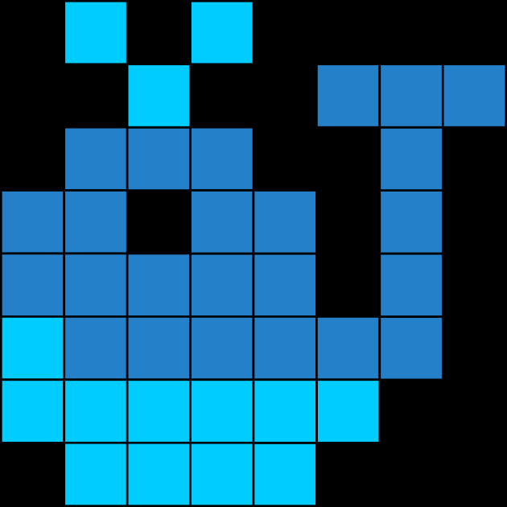

## Wat is een Astro Pi?

Een Astro Pi is een Raspberry Pi computer die speciaal ontworpen is om in de ruimte te werken.

Astro Pi computers hebben een set sensoren die 'Sense HAT' heten en die jongeren kunnen gebruiken om wetenschappelijke experimenten uit te voeren. Een sensor is een apparaat dat kan detecteren of meten wat er in de omgeving gebeurt. De sensoren op de Sense Hat kunnen dingen meten zoals de kleur en helderheid van voorwerpen die ervoor staan. De Sense Hat heeft ook een 8 x 8 LED Matrix die eenvoudige afbeeldingen en informatie kan tonen.

Een **LED matrix** is een raster met LED's (lichtgevende diodes) die apart of in groep gecontrolleerd kunnen worden of verschillende lichteffecten te maken. De LED matrix op de Sense HAT heeft 64 LEDs, afgebeeld in een raster van 8 x 8.  De LEDs kunnen geprogrammeerd worden om een breed gamma kleuren te produceren.

