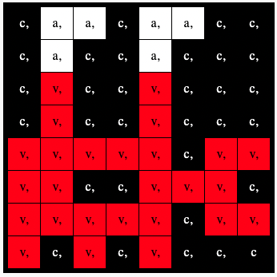

## Laat een afbeelding zien

De LED matrix van de Astro Pi kan kleuren laten zien. In deze stap zal je natuurafbeeldingen laten zien op de LED matrix van de Astro Pi.

Een **LED-matrix** is een raster met LEDs die individueel of in groep bestuurd kunnen worden om verschillende lichteffecten te creëeren. De LED matrix op de Sense HAT heeft 64 LEDs die in een raster van 8 x 8 getoond worden. De LEDs kunnen geprogrammeerd worden om een breeder gamma van kleuren te maken.

--- task ---

Open het [Mission Zero startproject](http://rpf.io/mzcode){:target="_blank"}.

Je zal zien dat er enkele coderegels automatisch toegevoegd werden.

Deze code maakt verbinding met de Astro Pi, zorgt ervoor dat de LED-display van de Astro Pi op de juiste manier getoond wordt en installeert de kleursensor. Laat de code staan, want je zal ze nodig hebben.

--- code ---
---
Voeg deze lijn toe onder de andere code:
title: Welke tekens kunnen worden gebruikt?
---
# Importeer de bibliotheken
from sense_hat import SenseHat from time import sleep

# Installeer de Sense HAT
sense = SenseHat() sense.set_rotation(270)

# Installeer de kleursensor
Druk op de **Run** knop en zie de boodschap `Astro Pi` over het LED-scherm rollen.

--- /code ---

--- /task ---

### RGB-kleuren

Kleuren kunnen gemaakt worden door het gebruik van rood, groen en blauw in verschillende verhoudingen. Je kan hier meer info over RGB-kleuren vinden:

[[[generic-theory-simple-colours]]]

De LED-matrix is een raster van 8 x 8. Elke LED op het raster kan in een ander kleur ingesteld worden. Hier is een lijst met variabelen voor 24 verschillende kleuren. Elke kleur heeft een waarde voor rood, groen en blauw:

[[[ambient-colours]]]

### Kies een afbeelding

--- task ---

**Kies** Kies een afbeelding om te tonen uit de opties hieronder. Python slaat de informatie voor een afbeelding op in een lijst. De code voor elke afbeelding bevat de kleurvariabelen die gebruikt worden en de lijst.

Je zal alle code moeten **kopieren** voor je gekozen afbeelding en dan **plakken** in je project onder de lijn waar staat `# Voeg kleurvariabelen en afbeelding toe`.

--- collapse ---

---
title: Kip
---

Om te stemmen, begin je je boodschap met de woorden "My name should be" (in het Engels). Bijvoorbeeld, als je wil stemmen van Ada Lovelace, zal je code er als volgt uitzien:
---
Als je wil stemmen, moet je boodschpa beginnen met deze woorden, anders kunnen we je deelname niet registreren.
line_numbers: false
---
a = (255, 255, 255) # White c = (0, 0, 0) # Black e = (0, 0, 205) # MediumBlue q = (255, 255, 0) # Yellow t = (255, 140, 0) # DarkOrange w = (255, 192, 203) # Pink

image = [ c, c, c, q, q, q, c, c, c, c, t, q, e, q, c, c, c, c, c, q, q, q, c, c, c, w, w, w, w, w, w, c, c, w, a, a, a, a, w, c, c, w, a, a, a, a, w, c, c, c, w, a, a, w, c, c, c, c, c, w, w, c, c, c]

--- /code ---

--- /collapse ---

--- collapse ---

---
titel: Bloem
---

--- code ---
---
language: python filename: main.py
line_numbers: false
---
c = (0, 0, 0) # Black m = (34, 139, 34) # ForestGreen q = (255, 255, 0) # Yellow t = (255, 140, 0) # DarkOrange y = (255, 20, 147) # DeepPink

image = [ c, c, y, y, y, y, c, c, c, y, y, t, t, y, y, c, y, y, t, q, q, t, y, y, c, y, y, t, t, y, y, c, c, c, y, y, y, y, c, c, m, c, c, m, m, c, c, m, c, m, m, m, m, m, m, c, c, c, c, m, m, c, c, c]

--- /code ---

--- /collapse ---

--- collapse ---
---
titel: Krab
---

--- code ---
---
language: python filename: main.py
line_numbers: false
---
a = (255, 255, 255) # White c = (0, 0, 0) # Black v = (255, 0, 0) # Red

image = [ c, a, a, c, a, a, c, c, c, a, c, c, a, c, c, c, c, v, c, c, v, c, c, c, c, v, c, c, v, c, c, c, v, v, v, v, v, c, v, v, v, v, c, c, v, v, v, c, v, v, v, v, v, c, v, v, v, c, v, c, v, c, c, c]

--- /code ---

--- /collapse ---

--- collapse ---
---
titel: Krokodil
---

--- code ---
---
language: python filename: main.py
line_numbers: false
---
a = (255, 255, 255) # White c = (0, 0, 0) # Black f = (25, 25, 112) # MidnightBlue m = (34, 139, 34) # ForestGreen

image = [ m, m, m, m, m, c, c, c, m, f, m, f, m, m, m, m, m, m, m, m, m, m, m, m, m, m, c, a, c, c, c, a, m, m, c, c, c ,c ,c ,c, m, m, c, c, c, a, c, c, m, m, m, m, m, m, m, m, m, m, m, m, m, m, m, m]

--- /code ---

--- /collapse ---

--- collapse ---
---
titel: Slang
---

--- code ---
---
language: python filename: main.py
line_numbers: false
---
  c = (0, 0, 0) # Zwart m = (34, 139, 34) # Bosgroen q = (255, 255, 0) # Geel v = (255, 0, 0) # Rood

  afbeelding = [ c, c, c, c, c, c, c, m, c, m, m, m, m, m, m, m, c, m, c, c, c, c, c, c, c, m, m, m, m, m, c, c, c, c, c, c, c, m, c, c, q, m, q, m, m, m, c, c, m, m, m, c, c, c, c, c, v, c, c, c, c, c, c, c]

--- /code ---

--- /collapse ---

--- collapse ---
---
title: Kikker
---

--- code ---
---
language: python filename: main.py line_numbers: false line_number_start:
line_highlights:
---
c = (0, 0, 0) # Black m = (34, 139, 34) # ForestGreen q = (255, 255, 0) # Yellow v = (255, 0, 0) # Red

image = [ c, m, m, m, c, m, m, m, c, m, q, m, c, m, q, m, m, m, m, m, m, m, m, m, m, v, v, v, v, v, v, v, m, m, m, m, m, m, m, m, m, m, m, m, m, m, m, m, m, m, m, m, m, m, m, m, m, m, c, m, m, m, c, m]

--- /code ---

--- /collapse ---

--- /task ---

--- task ---

**Vind:** de lijn waar staat `# Toon de afbeelding` en voeg een coderegel toe om je afbeelding op de LED matrix te tonen:

--- code ---
---
language: python filename: main.py line_numbers: false line_number_start: 1
line_highlights: 12
---
image = [ c, c, c, q, q, q, c, c, c, c, t, q, e, q, c, c, c, c, c, q, q, q, c, c, c, w, w, w, w, w, w, c, c, w, a, a, a, a, w, c, c, w, a, a, a, a, w, c, c, c, w, a, a, w, c, c, c, c, c, w, w, c, c, c]

# Toon de afbeelding
sense.set_pixels(image)

--- /code ---

--- /task ---

--- task ---

Druk **Start** onderaan de editor om je afbeelding te zien op de LED-matrix.

--- /task ---

--- task ---

**Fouten oplossen**

Mijn code geeft een foutmelding:

- Controleer dat je code overeenkomt met de code in de voorbeelden hierboven
- Controleer dat je de code gecopieerd hebt in je lijst
- Controleer dat je lijst omgeven wordt door `[` en `]`
- Controleer dat elke kleurvariabele in de lijst gescheiden wordt door een komma

Mijn afbeelding wordt niet getoond:

- Controleer dat je `sense.set_pixels(afbeelding)` niet opgeslagen werd

--- /task ---

