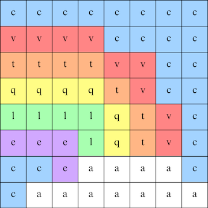

## Laat een afbeelding zien

De LED matrix van de Astro Pi kan kleuren laten zien. In deze stap zal je natuurafbeeldingen laten zien op de LED matrix van de Astro Pi.

<p style="border-left: solid; border-width:10px; border-color: #0faeb0; background-color: aliceblue; padding: 10px;">
Een <span style="color: #0faeb0">**LED-matrix**</span> is een raster met LEDs die individueel of in groep bestuurd kunnen worden om verschillende lichteffecten te creëeren. De LED matrix op de Sense HAT heeft 64 LEDs die in een raster van 8 x 8 getoond worden. De LEDs kunnen geprogrammeerd worden om een breeder gamma van kleuren te maken.
</p>


--- task ---

Open het [Mission Zero startproject](https://missions.astro-pi.org/nl/mz/code_submissions/){:target="_blank"}.

Je zal zien dat er enkele coderegels automatisch toegevoegd werden.

Deze code maakt verbinding met de Astro Pi, zorgt ervoor dat de LED-display van de Astro Pi op de juiste manier getoond wordt en installeert de kleursensor. Laat de code staan, want je zal ze nodig hebben.

--- code ---
---
language: python
filename: main.py
line_numbers: false
line_number_start: 1
line_highlights: 
---
# Importeer de bibliotheken
from sense_hat import SenseHat
from time import sleep

# Installeer de Sense HAT
sense = SenseHat()
sense.set_rotation(270)

# Installeer de kleursensor
sense.color.gain = 60 # Stel de gevoeligheid van de sensor in
sense.color.integration_cycles = 64 # Het interval waarin het uitlezen gebeurt

--- /code ---


--- /task ---

### RGB-kleuren

Kleuren kunnen gemaakt worden door het gebruik van rood, groen en blauw in verschillende verhoudingen. Je kan hier meer info over RGB-kleuren vinden:

[[[generic-theory-simple-colours]]]

De LED-matrix is een raster van 8 x 8. Elke LED op het raster kan in een andere kleur ingesteld worden. Hier is een lijst met variabelen voor 24 verschillende kleuren. Elke kleur heeft een waarde voor rood, groen en blauw:

[[[ambient-colours]]]

### Kies een afbeelding

--- task ---

**Kies** Kies een afbeelding om te tonen uit de opties hieronder. Python slaat de informatie voor een afbeelding op in een lijst. De code voor elke afbeelding bevat de kleurvariabelen die gebruikt worden en de lijst.

Je zal alle code moeten **kopieren** voor je gekozen afbeelding en dan **plakken** in je project onder de lijn waar staat `# Voeg kleurvariabelen en afbeelding toe`.

--- collapse ---

---
title: Vos
---


Gemaakt door team i_pupi, Italië

```python
c = (0, 0, 0) # Zwart
a = (255, 255, 255) # Wit
t = (255, 140, 0) # Donkeroranje

afbeelding = [
t, a, t, c, c, t, a, t,
t, a, t, c, c, t, a, t,
t, t, t, t, t, t, t, t,
t, a, c, t, t, c, a, t,
t, t, t, t, t, t, t, t,
a, a, a, c, c, a, a, a,
c, a, a, a, a, a, a, c,
c, c, a, a, a, a, c, c]
```

--- /collapse ---

--- collapse ---

---
title: Olifant
---


Gemaakt door team ILiFanT, Finland

```python
c = (0, 0, 0) # Zwart
b = (105, 105, 105) # Donkergrijs
a = (255, 255, 255) # Wit

afbeelding = [
    c, c, c, c, c, c, c, c,
    c, b, b, b, c, c, c, c,
    c, b, c, b, c, c, b, b,
    c, b, c, c, c, b, b, b,
    c, b, b, c, c, b, c, b,
    c, b, b, b, b, b, b, b,
    c, c, b, b, a, b, b, b,
    c, c, c, c, a, b, b, b]
```

--- /collapse ---

--- collapse ---
---
title: Cactus
---


Gemaakt door team 6TETHASI, Nederland

```python
a = (255, 255, 255) # Wit
c = (0, 0, 0) # Zwart
n = (154, 205, 50) # Geelgroen
q = (255, 255, 0) # Geel
t = (255, 140, 0) # Donkeroranje

afbeelding = [   
  q, q, c, n, c, c, a, c,
  q, c, c, n, c, a, a, a,
  c, n, c, n, c, c, c, c,
  c, n, n, n, c, n, c, c,
  c, a, n, n, n, n, c, c,
  a, a, a, n, c, a, a, a,
  c, c, c, n, a, a, a, c,
  t, t, t, t, t, t, t, t]

```

--- /collapse ---


--- collapse ---
---
title: Krokodil
---


```python

a = (255, 255, 255) # Wit
c = (0, 0, 0) # Zwart
f = (25, 25, 112) # Middernachtblauw
m = (34, 139, 34) # Bosgroen

afbeelding = [
  m, m, m, m, m, c, c, c,
  m, f, m, f, m, m, m, m,
  m, m, m, m, m, m, m, m,
  m, m, c, a, c, c, c, a,
  m, m, c, c, c ,c ,c ,c,
  m, m, c, c, c, a, c, c,
  m, m, m, m, m, m, m, m,
  m, m, m, m, m, m, m, m]

```


--- /collapse ---

--- collapse ---
---
title: Regenboog
---



Gemaakt door team camrus_6, Verenigd Koninkrijk

```python

c = (100, 149, 237) # Korenbloemblauw
a = (255, 255, 255) # Wit
v = (255, 0, 0) # Rood
t = (255, 140, 0) # Donkeroranje
q = (255, 255, 0) # Geel
l = (0, 255, 127) # Lentegroen
e = (0, 0, 205) # Middenblauw

regenboog = [
  c, c, c, c, c, c, c, c, 
  v, v, v, v, c, c, c, c,
  t, t, t, t, v, v, c, c,
  q, q, q, q, t, v, c, c,
  l, l, l, l, q, t, v, c,
  e, e, e, l, q, t, v, c,
  c, c, e, a, a, a, a, c,
  c, a, a, a, a, a, a, a
]

```

--- /collapse ---

--- collapse ---
---
title: Draak
---


Gemaakt door team hwplucyr, Verenigd Koninkrijk

```python

b = (105, 105, 105) # Vaalgrijs
c = (0, 0, 0) # Zwart
d = (100, 149, 237) # Korenbloemblauw
v = (255, 0, 0) # Rood
z = (153, 50, 204) # Donkerorchidee

afbeelding = [
    c, c, v, c, v, c, c, c,
    c, z, z, z, z, v, c, c,
    z, b, z, b, z, c, c, c,
    z, z, z, z, z, v, c, c,
    c, c, d, d, d, c, c, z,
    c, z, d, z, z, z, z, c,
    c, c, d, d, z, c, c, c,
    c, c, z, c, z, c, c, c]

```

--- /collapse ---

--- /task ---

--- task ---

**Vind:** de lijn waar staat `# Toon de afbeelding` en voeg een coderegel toe om je afbeelding op de LED matrix te tonen:

```python
a = (255, 255, 255) # Wit
c = (0, 0, 0) # Zwart
f = (25, 25, 112) # Middernachtblauw
m = (34, 139, 34) # Bosgroen

afbeelding = [
  m, m, m, m, m, c, c, c,
  m, f, m, f, m, m, m, m,
  m, m, m, m, m, m, m, m,
  m, m, c, a, c, c, c, a,
  m, m, c, c, c ,c ,c ,c,
  m, m, c, c, c, a, c, c,
  m, m, m, m, m, m, m, m,
  m, m, m, m, m, m, m, m]

# Toon de afbeelding 
sense.set_pixels(afbeelding)

```

--- /task ---

--- task ---

Druk **Run** onderaan de editor om je afbeelding te zien op de LED-matrix.

--- /task ---

--- task ---

**Fouten oplossen**

Mijn code geeft een foutmelding:

- Controleer dat je code overeenkomt met de code in de voorbeelden hierboven
- Controleer dat je de code gecopieerd hebt in je lijst
- Controleer dat je lijst omgeven wordt door `[` en `]`
- Controleer dat elke kleurvariabele in de lijst gescheiden wordt door een komma

Mijn afbeelding wordt niet getoond:

- Controleer dat je `sense.set_pixels(afbeelding)` niet opgeslagen werd

--- /task ---

--- task ---

**Sla je voortgang op**

Nu dat je een beeld getoond hebt, kan je je programma opslaan op het Mission Starter project door de naam van je team, de namen van de teamleden en de klascode die je ontving in te geven. Je kan je programma nu opnieuw laden op eender welk apparaat met een internetverbinding door je teamnaam en klascode in te geven.


--- /task --- 
