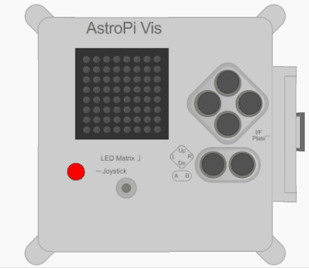

## Laat een boodschap zien

--- task ---

Open de [Sense HAT emulator](https://trinket.io/mission-zero){:target="_blank"} voor het Mission Zero project.

Je zult zien dat drie lijnen code automatisch voor je werden toegevoegd:

```python
from sense_hat import SenseHat
sense = SenseHat()
sense.set_rotation(270)
```


Deze code verbindt met de Astro Pi en zorgt ervoor dat het Astro Pi's led-kleurenbeeldscherm op de juiste manier wordt weergegeven. Laat de code daar staan, omdat je hem later nodig hebt.

--- /task ---

--- task ---

Misschien kun je een leuke begroeting achterlaten voor de astronauten op het ISS die dichtbij de Astro Pi werken? Laten we een boodschap scrollen op het beeldscherm.

Voeg deze lijn toe onder de andere code:

```python
sense.show_message("Astro Pi")
```

--- /task ---

--- task ---

Druk op de **Run** knop en zie de boodschap `Astro Pi` scrollen op het led-kleurenbeeldscherm.


--- /task ---



Om een andere boodschap te tonen, kun je schrijven wat je wil tussen de aanhalingstekens (`""`).

--- collapse ---
---
title: Welke tekens kunnen worden gebruikt?
---

De Sense HAT kan slechts 1 Latijnse tekenset tonen, wat betekent dat alleen de volgende tekens verkrijgbaar zullen zijn. Andere tekens worden getoond als `?`.

    +-*/!"#$><0123456789.=)(
    
    ABCDEFGHIJKLMNOPQRSTUVWXYZ
    
    abcdefghijklmnopqrstuvwxyz
    
    ?,;:|@%[&_']\~
    

--- /collapse ---

--- task ---

Je kunt ook de snelheid van het scrollen van de boodschap veranderen. Voeg een `scroll_speed` toe aan de lijn van de code die je reeds hebt, zoals dit:

```python
sense.show_message("Astro Pi", scroll_speed=0.05)
```

De startsnelheid van de boodschap is `0.1`. Door het getal kleiner te maken gaat het scrollen van de boodschap sneller en bij het groter maken van het getal gaat de boodschap langzamer scrollen.

--- /task ---