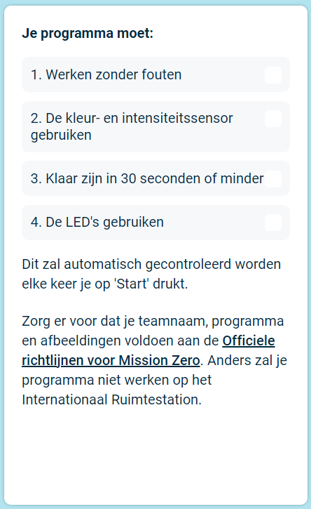
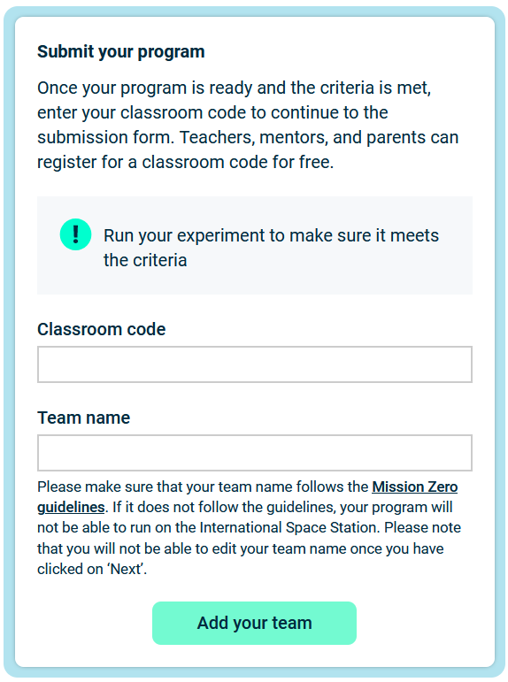

## Dien je project in

Er zijn enkele regels die je code moet volgen zodat je ze kan indienen om te werken op het internationaal ruimtestation. Als je code hieraan voldoet, zullen de regels onderaan de **Sense HAT-emulator** groen oplichten als je het programma laat werken.

**Tip:** Test je code met een aantal verschillende kleurinstellingen (gebruik de kiezer) om ervoor te zorgen dat het altijd juist werkt.

Zorg ervoor dat je project voldoet aan de [officiele richtlijnen](https://astro-pi.org/mission-zero/guidelines){:target="_blank"} voor Mission Zero. Als het niet voldoet aan de richtlijnen, zal je programma niet kunnen werken in het Internationaal Ruimtestation.

Gelieve geen van de onderstaande te gebruiken in de naam van je team of in je code:

+ Alles wat geïnterpreteerd zou kunnen worden als iets van illegale, politieke of gevoelige aard
+ Vlaggen, omdat die als politiek gevoelig beschouwd kunnen worden
+ Alles wat verwijst naar onaangenaamheden of iemand anders kwetst
+ Persoonlijke gegevens zoals telefoonnummers, links naar sociale media en mailadressen
+ Obscene afbeeldingen
+ Speciale tekens of emoji's
+ Slecht taalgebruik of vloeken

--- task ---

Voeg je klascode en teamnaam in het vakje onderaan in - je begeleider zal je vertellen wat je code is.

**Opmerkingen voor begeleiders** kunnen teruggevonden worden in de [Introductie](https://projects.raspberrypi.org/en/projects/astro-pi-mission-zero/0) stap.

--- /task ---

--- task ---

Klik op de **Voeg je team toe** knop om je code in te dienen. Merk op dat een programma niet meer aangepast kan worden als het ingediend werd.

Je begeleider ontvangt een mail om je deelname te bevestigen.

--- /task ---

--- task ---

Als je wilt, kun je de link naar je code delen op sociaal media om aan mensen te zeggen dat de code die je hebt geschreven in de ruimte zal werken!

--- /task ---
