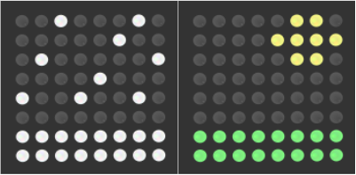

## Laat de temperatuur zien

Je kunt je temperatuur combineren met een tekening om de temperatuur ook aan te wijzen op een grafische manier. Bijvoorbeeld, je kunt een sneeuwstorm laten zien voor koude temperaturen, en een zonnige dag voor hete temperaturen:



--- task ---

Onderaan je programma, kun je meer kleurvariabelen definiëren voor kleuren die je wil gebruiken in je tekeningen. Misschien heb je al sommige gedefinieerd in een voorgaande stap. In onze voorbeelden zullen wij wit gebruiken (`w`), geel (`y`), groen (`g`), en zwart/blank (`b`).

```python
w = (255, 255, 255)
y = (255, 255, 0)
g = (0, 255, 0)
b = (0, 0, 0)
```

--- /task ---

--- task ---

Net zoals eerder, teken je tekeningen door eerst een lijst aan te maken voor elk van hen, en zet dan de items met de kleuren op de lijst die je voor je pixels wilt gebruiken.

```python
hot = [
  b, b, b, b, b, y, y, b,
  b, b, b, b, y, y, y, y,
  b, b, b, b, b, y, y, b,
  b, b, b, b, b, b, b, b,
  b, b, b, b, b, b, b, b,
  b, b, b, b, b, b, b, b,
  g, g, g, g, g, g, g, g,
  g, g, g, g, g, g, g, g
]


cold = [
  b, b, w, b, b, b, w, b,
  b, b, b, b, b, w, b, b,
  b, w, b, b, b, b, b, w,
  b, b, b, b, w, b, b, b,
  w, b, b, w, b, b, w, b,
  b, b, b, b, b, b, b, b,
  w, w, w, w, w, w, w, w,
  w, w, w, w, w, w, w, w
]
```

--- /task ---

--- task ---

Voeg een code toe om de temperatuur te verkrijgen:

```python
temp = sense.temperature
```

--- /task ---

--- task ---

Beslis nu welke tekening je wilt tonen. Voor dit voorbeeld, zullen wij het `hot` (heet) beeld tentoonstellen indien de temperatuur 20 graden of meer is, en het `cold` (koud) beeld indien de temperatuur lager is dan 20 graden.

```python
temp = sense.temperature
if temp >= 20:
    sense.set_pixels(hot)
else:
    sense.set_pixels(cold)
```

--- /task ---

--- task ---

Gebruik de temperatuurschuifknop om de temperatuur op de emulator in te stellen. Start je programma en controleer dat het beeld dat je hebt gekozen voor deze temperatuur op de juiste wijze wordt weergegeven.

--- /task ---

--- task ---

Verander je code zodat je programma de temperatuur weergeeft aan de astronauten op je eigen gekozen manier.

--- /task ---