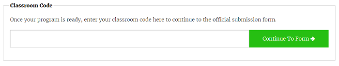

## Je project indienen

Er zijn enkele regels die je code moet volgen zodat je ze kan indienen om te werken op het internationaal ruimtestation. Als je code hieraan voldoet, zullen de regels onderaan de [Sense HAT-emulator](https://trinket.io/mission-zero) groen oplichten als je het programma laat werken.

1. Doe een vochtigheidsmeting.
1. Laat de LED's oplichten.
1. Zorg ervoor dat je code helemaal tot het einde werkt zonder dat er fouten optreden. Je mag geen `while True` lussen in je code zetten omdat dit ervoor zorgt dat je code blijft werken en voorkomt dat ze zal stoppen.
1. Test je code met een aantal andere vochtigheidsinstellingen (gebruik de schuifknop) om ervoor te zorgen dat ze altijd correct zal werken.

Zorg er ook voor dat je aan de volgende voorwaarden voldoet:

1. Zorg ervoor dat je boodschap aan de astronauten niet langer duurt dan 30 seconden, omdat dit de looptijd is dat je code zal werken in het ISS
1. Vermijd het gebruiken van methodes die invoer nodig hebben
1. Importeer uitsluitend van de `sense_hat`, `time`, en `random` modules
1. Zorg ervoor dat je er geen vloek bij doet

Zodra de regels allemaal groen zijn, ben je klaar om in te dienen.

--- task ---

Vul je klascode in het vakje onderaan in - je leraar of mentor zal je vertellen wat je code is.

**Opmerkingen voor leraars of mentors** kunnen gevonden worden in de [Introductie](https://projects.raspberrypi.org/vls-BE/projects/astro-pi-mission-zero/1) stap.

--- /task ---

--- task ---

De naam van je leraar zal verschijnen. Als het de juiste naam is, klik dan op de groene **Continue to form** knop.

--- /task ---

--- task ---

Typ de naam van je team en de namen van de teamleden. Deze worden afgedrukt op het certificaat nadat je code in de ruimte werkte, dus zorg ervoor dat je ze juist spelt!

--- /task ---

--- task ---

Druk op de **Submit** knop om je code in te dienen. Je leraar of mentor zal een email ontvangen om je deelname te bevestigen.

--- /task ---

--- task ---

Als je wilt, kun je de link naar je code delen op social media om aan mensen te laten weten dat de code die je hebt geschreven in de ruimte zal werken!

--- /task ---
