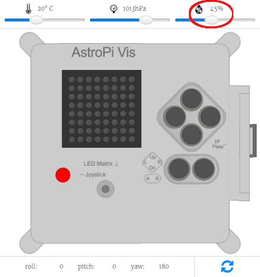

## Measure the humidity

The humidity sensor in the Astro Pi can measure the humidity in the air around it, a useful feature to help you gather data about the conditions in space.


The Astro Pi measures the humidity in the ISS in percentage water concentration in the air.

Part of your mission is to contribute to the daily lives of the crew aboard the ISS, so letting them know that the humidity aboard the space station is within a normal range will reassure them.

[[[generic-theory-what-is-humidity]]]

\--- task \---

Add this code to take a humidity reading:

```python
humid = sense.humidity
```

This line will measure the current humidity, and store the measured value in the variable `humid`.

\--- /task \---

\--- task \---

The humidity is recorded very precisely, i.e. the stored value will have a large number of decimal places. You can round the value to any number of decimal places. In the example we have rounded to one decimal place, but for a different level of precision, change the number `1` to the number of decimal places you would like to see.

```python
humid = round( sense.humidity, 1 )
```

\--- /task \---

\--- task \---

To display the current humidity as a scrolling message on the display, add this line of code:

```python
sense.show_message( str(humid) )
```

The `str()` part converts the humidity from a number into text so that the Astro Pi can display it.

\--- /task \---

\--- task \---

You can also display the humidity as part of another message by joining the parts of your message together with a `+`.

```python
sense.show_message( "It is " + str(humid) + " %" )
```

\--- /task \---

The real Astro Pi will measure the humidity around it, but you can move the humidity slider on the Sense HAT emulator to simulate humidity changes and test your code.



**Note:** You might be wondering why the humidity slider displays the humidity as a whole number, but the reading you get is a decimal. The emulator simulates the slight inaccuracy of the real sensor, so the humidity measurement you see may be very slightly larger or smaller than the value you've set with the slider.